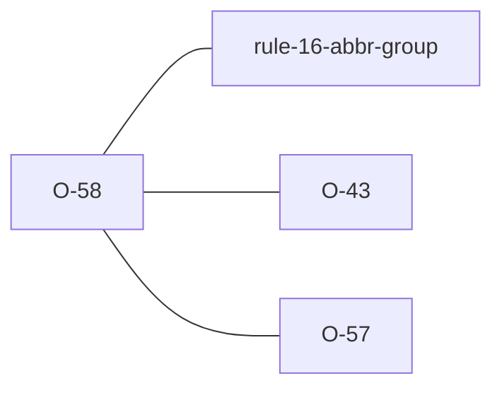

# O-58 — case-only ABBR code collision → FYI (Related to Rule 16), WARNING under 4.2

> Source-of-truth is `repo:observations.json` (record O-58), rendered to
> `repo:OBSERVATIONS.md#o-58` — never hand-edit the Markdown.
> This page links + cross-references only — it never copies the 5 fields.

## Summary
> [!variance] **VARIANCE — laterite-originated, no python-ags4 equivalent.** Two ABBR rows under one heading whose codes differ only by letter case (`"Undisturbed"` and `"UNDISTURBED"`) break no rule, because Rule 16 looks codes up exactly, but an importer that keys ABBR case-insensitively rejects the second as a duplicate, and the spec's own guidance on the ABBR list (see [[pa-not-case-sensitive-pt-pu-are]]) asks for consistent use. laterite names the heading and every spelling in one finding, whose tier follows the edition the file is judged against: from 4.2, the first edition to say ABBR codes are case-insensitive, a WARNING shown by default; under 4.0.x and 4.1.x, which are silent on it, an opt-in FYI. Never both. It fires whether or not the spellings are standard, and neither tier changes the verdict ([[dec-verdict-severity-split]]).

Source-of-truth (never pasted): `repo:observations.json`, record O-58 — rendered at `repo:OBSERVATIONS.md#o-58`.

## Rules affected
[[rule-16-abbr-group]] — the check is `rule_16_case_collision` in `repo:rust-packages/laterite-ags4-validator/src/rules/groups.rs`, and `abbr_list_is_case_insensitive` beside it picks the tier from the resolved edition. It compares the file's own ABBR rows with each other, never with the standard list.

## Cross-observation graph

- [[O-43]] — judges each declared code against the standard picklist, and now names the standard case variant of a non-standard code. A file with `"Undisturbed"` and `"UNDISTURBED"` gets both FYIs: this one for the pair, O-43 for the non-standard spelling. The case-insensitive picklist lookup it uses is `abbr_codes_ignoring_case` in `repo:rust-packages/laterite-ags4-reference/src/dict.rs`.
- [[O-57]] — the other way a code can look present and still miss: surrounding whitespace rather than case.
- [[parity-model]] — the 4.2 `Warning (Related to Rule 16)` label is rust-only by construction, and `classify` in `repo:rust-packages/laterite-ags4-parity/src/verdict.rs` reconciles it to this record. The pre-4.2 FYI rides a label python-ags4 also emits. `compat` runs the FYI tier and not the warning tier, so through it a 4.2 file gets neither.

## Upstream status
> [!note] Upstream-reportable: **[NO]** — an additive laterite advisory, not a python-ags4 defect or a spec ambiguity.

## Related
[[rule-16-abbr-group]] · [[parity-model]] · [[O-43]] · [[O-57]] · [[pa-not-case-sensitive-pt-pu-are]] · [[dec-verdict-severity-split]]
