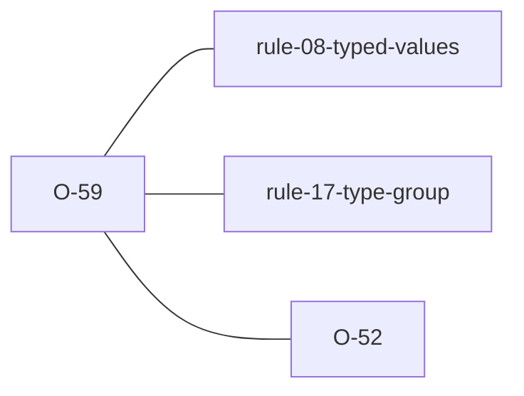

# O-59 — declared TYPE differs from the dictionary → FYI (Related to Rule 8), WARNING on a KEY heading

> Source-of-truth is `repo:observations.json` (record O-59), rendered to
> `repo:OBSERVATIONS.md#o-59` — never hand-edit the Markdown.
> This page links + cross-references only — it never copies the 5 fields.

## Summary
> [!variance] **VARIANCE — laterite-originated, no python-ags4 equivalent.** A file may declare a standard heading with a data type other than its edition's dictionary type (`LNMC_MC` as `1DP` where 4.1.1 says `X`). Rule 8 reads the file's own TYPE row, so nothing fails until the file is combined with one typed the dictionary's way. With FYIs on, laterite names each such heading once, with the edition and the dictionary's type. Since 2026-10-09 a **KEY** heading's departure is a **WARNING** instead, shown by default: a KEY column typed its own way is where a child's TYPE row comes to differ from its parent's, and python-ags4's Rule 10c then rejects that child on its TYPE line ([[O-52]]) — a delivery laterite had passed, with the cause behind `--show-fyi`. Neither tier changes the verdict.

Source-of-truth (never pasted): `repo:observations.json`, record O-59 — rendered at `repo:OBSERVATIONS.md#o-59`.

## Rules affected
- [[rule-08-typed-values]] — the check is `declared_type` in `repo:rust-packages/laterite-ags4-validator/src/rules/typed_values.rs`, run beside Rule 8 rather than inside it. Rule 8 still judges values against the declared type.
- [[rule-17-type-group]] — still requires only that every code used is defined. No rule requires the declared type to equal the dictionary's; this FYI reports the difference without making it one.

## Cross-observation graph

- [[dec-ags4-merge-semantics]] — merge's `on_type_clash` settles clashes between the TYPE rows the inputs declare and never compares them with the dictionary; this FYI is the per-file view of what such a clash will be.
- [[parity-model]] — the label is rust-only by construction, and `classify` in `repo:rust-packages/laterite-ags4-parity/src/verdict.rs` reconciles it to this record.

## Surfaces
Native surfaces only, by owner decision on #1013: `laterite.validate()`, `lat`, Node and wasm emit it, and `check_file` in `repo:packages/laterite/python/laterite/compat/_impl.py` withholds both labels — the FYI and the KEY heading's warning — while every other FYI and warning passes through. In the drop-in it would be noise python-ags4 users never asked for, and it trips one of python-ags4's own tests, so the parity known-failures set stays as it was.

## Upstream status
> [!note] Upstream-reportable: **[NO]** — an additive laterite advisory, not a python-ags4 defect or a spec ambiguity.

## Related
[[rule-08-typed-values]] · [[rule-17-type-group]] · [[dec-ags4-merge-semantics]] · [[parity-model]] · [[O-52]]
