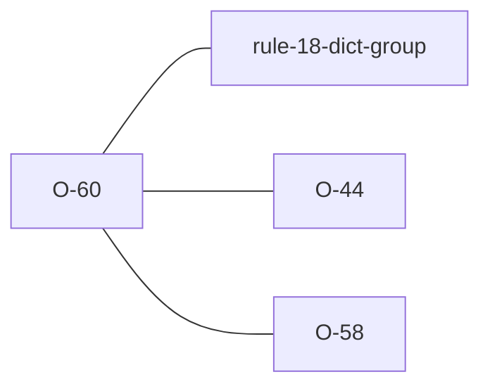

# O-60 — DICT redeclares a standard name → FYI / WARNING (Related to Rule 18)

> Source-of-truth is `repo:observations.json` (record O-60), rendered to
> `repo:OBSERVATIONS.md#o-60` — never hand-edit the Markdown.
> This page links + cross-references only — it never copies the 5 fields.

## Summary
> [!variance] **VARIANCE — laterite-originated, no python-ags4 equivalent.** Exporters often write a DICT row for every heading, standard ones included, and a merge piles those rows up. The effective dictionary reads the standard entry first, so the rows change nothing either engine checks, but a reader that takes DICT literally can be misled. laterite names each such row: a WARNING when it drops KEY from a standard KEY heading or re-parents a standard group, an FYI otherwise. `build_ags4` and `merge` can drop the rows with `dict_rows="prune"`.

Source-of-truth (never pasted): `repo:observations.json`, record O-60 — rendered at `repo:OBSERVATIONS.md#o-60`.

## Rules affected
- [[rule-18-dict-group]] — the check is `rule_18_redeclaration` in `repo:rust-packages/laterite-ags4-validator/src/rules/groups.rs`, beside the error-tier Rule 18 check and the [[O-44]] structural warnings. Rule 18 itself is unchanged.

## Cross-observation graph

- [[O-44]] — the structural DICT warnings share the `Warning (Related to Rule 18)` label; a row that check covers is never also named here.
- [[O-58]] — the same raise-the-tier-never-remove-it fallback: with warnings off but FYIs on, a warning-tier row is reported as the FYI.
- [[dec-ags4-merge-semantics]] — merge unions the inputs' DICT rows; `dict_rows="prune"` is the option that thins them, applied by the emitter that merge ends in (`DictRows` in `repo:rust-packages/laterite-ags4-emit/src/emit.rs`).
- [[parity-model]] — `FYI (Related to Rule 18)` is rust-only by construction, and `classify` in `repo:rust-packages/laterite-ags4-parity/src/verdict.rs` reconciles it to this record.

## Surfaces
Every surface emits the advisory, `laterite.compat` included; the python-ags4 suite's known-failures set is unchanged. `dict_rows` is on Python's `build_ags4` and `merge`, Node's `buildAgs4` and `merge`, the wasm `build_ags4`/`build_ags4_ipc` and `merge`, and `lat merge --dict-rows`.

## Upstream status
> [!note] Upstream-reportable: **[NO]** — an additive laterite advisory, not a python-ags4 defect or a spec ambiguity.

## Related
[[rule-18-dict-group]] · [[O-44]] · [[O-58]] · [[dec-ags4-merge-semantics]] · [[parity-model]]
