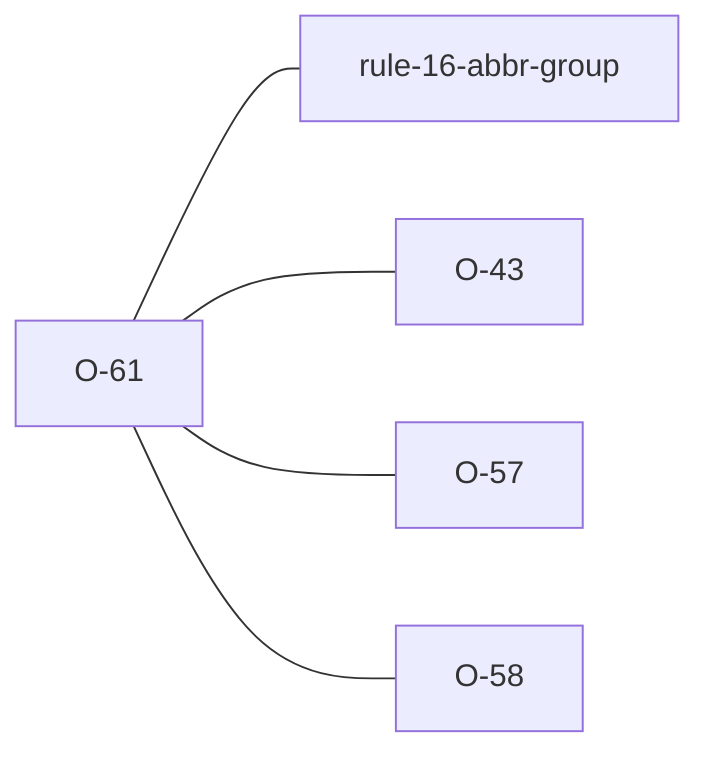

# O-61 — undefined PA value near a known code → "did you mean" FYI (Related to Rule 16)

> Source-of-truth is `repo:observations.json` (record O-61), rendered to
> `repo:OBSERVATIONS.md#o-61` — never hand-edit the Markdown.
> This page links + cross-references only — it never copies the 5 fields.

## Summary
> [!variance] **VARIANCE — laterite-originated, no python-ags4 equivalent.** A `PA` value that fails Rule 16 is often a near miss of a code the file declares or the dictionary lists. The Rule 16 error is unchanged; with FYIs on, laterite adds one FYI naming up to three close codes, the file's own first, each labelled with where it comes from. It suggests only: `fix` never acts on it.

Source-of-truth (never pasted): `repo:observations.json`, record O-61 — rendered at `repo:OBSERVATIONS.md#o-61`.

## Rules affected
[[rule-16-abbr-group]] — the FYI is raised beside the error in `rule_16`, by `suggestions` in `repo:rust-packages/laterite-ags4-validator/src/rules/groups.rs`. What counts as close is one shared definition, `repo:rust-packages/laterite-ags4-reference/src/closeness.rs`, which the [[O-43]] hint uses too.

## Cross-observation graph

- [[O-43]] — the same closeness, applied to a code the file declares but the standard does not list.
- [[O-57]] — when surrounding whitespace explains the value, that FYI is raised and this one is not.
- [[O-58]] — the rewrite a caller can ask `fix` for (`recode`, `on_code_case="standard"`); this FYI never triggers one.
- [[parity-model]] — the FYI rides a label python-ags4 also emits, so `compat` passes it through and the known-failures set is unchanged.

## Upstream status
> [!note] Upstream-reportable: **[NO]** — an additive laterite advisory, not a python-ags4 defect or a spec ambiguity.

## Related
[[rule-16-abbr-group]] · [[parity-model]] · [[O-43]] · [[O-57]] · [[O-58]]
