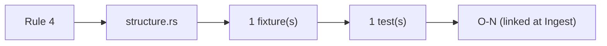
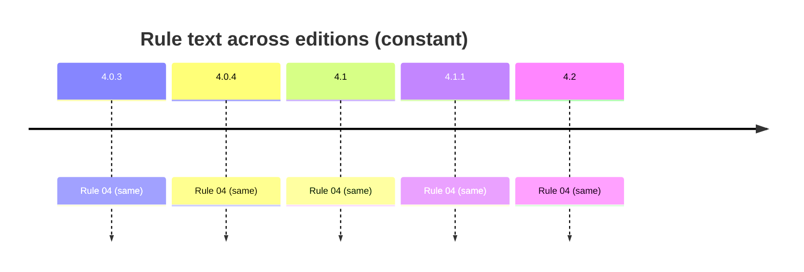

# Rule 4 — field count

## Statement
> [!quote] AGS4 Rule 04 — `spec:AGS4-4.2-2025.pdf §4.1.1 Rule 04`
> Within each GROUP, the DATA items are contained in data FIELDs. Each data FIELD contains a single data VARIABLE in each row. Each DATA row will contain one or more data FIELDs. The GROUP row contains only one DATA item, the GROUP name, in addition to the Data Descriptor (Rule 3). All other rows in the GROUP have a number of DATA items defined by the HEADING row.

Rule **normative content is unchanged across AGS 4.0.3 → 4.2** — verified by reading §8.1 (4.0.3/4.0.4 prose) and §4.1.1 (4.1/4.1.1/4.2 table) of *all five* PDFs, not by trusting a foreword. The text is *not* byte-identical: 4.1 reorganised prose→table, dropped Section-cross-ref parentheticals (Rules 7/10c/11), and changed Rule 15's example `ERES_RUNI`→`ELRG_RUNI` tracking the dictionary's ERES→ELRG replacement. Cross-edition rule variation is thus a *presentation + interpretation/implementation* axis, not a normative-text axis — see [[ags4-rules-frozen-dictionary-evolves]] and [[rule15-example-tracks-eres-elrg-removal]].

## Rule family
`structure` — implemented in `repo:rust-packages/laterite-ags4-validator/src/rules/structure.rs`. See [[rule-families]].

## Implementation (this repo)
> [!quote] Implemented in `repo:rust-packages/laterite-ags4-validator/src/rules/structure.rs`

Field-count: UNIT/TYPE/DATA field count == HEADING; GROUP row = descriptor + name only.

*Clean-room: rule logic derived from the spec; python-ags4 (LGPL) read only for behavioural parity, never copied (see the module header).*

## Traceability chain

- Fixtures: `rule4_field_count.ags`
- Regression: `rule4_data_field_count_mismatch_flagged`

## Variations
> [!note] **Rule prose is frozen across editions.** The 4.2 Foreword states the AGS 4 Rules are unchanged and live in §4.1.1 (`spec:AGS4-4.2-2025.pdf §4.1.1`). So a rule's *spec text* does not vary 4.0.3→4.2 — cross-edition variation enters via the **Data Dictionary** (groups/types this rule operates over) and via **implementation/interpretation** (the Rust↔python axis, wired from Phase B/C as `[[O-NN]]`).

- Edition deltas (spec text): **none** — see [[ags4-rules-frozen-dictionary-evolves]].
- Divergence (Rust↔python): wired in Phase B/C — `[[O-NN]]` or _none_.

## Related
[[rule-families]] · [[traceability-chain]] · [[parity-model]] · [[ags-4.2]]
