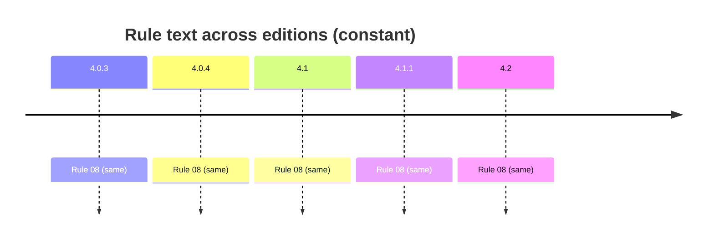

# Rule 8 — typed values

## Statement
> [!quote] AGS4 Rule 08 — `spec:AGS4-4.2-2025.pdf §4.1.1 Rule 08`
> Data VARIABLEs shall be presented in the units of measurement and type that are described by the appropriate data field UNIT and data field TYPE defined at the start of the GROUP within the GROUP HEADER rows.

Rule **normative content is unchanged across AGS 4.0.3 → 4.2** — verified by reading §8.1 (4.0.3/4.0.4 prose) and §4.1.1 (4.1/4.1.1/4.2 table) of *all five* PDFs, not by trusting a foreword. The text is *not* byte-identical: 4.1 reorganised prose→table, dropped Section-cross-ref parentheticals (Rules 7/10c/11), and changed Rule 15's example `ERES_RUNI`→`ELRG_RUNI` tracking the dictionary's ERES→ELRG replacement. Cross-edition rule variation is thus a *presentation + interpretation/implementation* axis, not a normative-text axis — see [[ags4-rules-frozen-dictionary-evolves]] and [[rule15-example-tracks-eres-elrg-removal]].

## Rule family
`typed` — implemented in `repo:rust-packages/laterite-ags4-validator/src/rules/typed_values.rs`. See [[rule-families]].

## Implementation (this repo)
> [!quote] Implemented in `repo:rust-packages/laterite-ags4-validator/src/rules/typed_values.rs`

Value vs declared UNIT/TYPE. Structural per-char matcher + chrono semantic check; DT/datetime bounded to pandas Timestamp range (O-33); empty-UNIT DT flags (O-31); unrecognised UNIT lenient (O-12); ID-uniqueness is Rule 10a's job not 8's (O-11).

`laterite-ags4-merge`'s `promote` mode (the TYPE-clash lattice, [[dec-ags4-merge-semantics]]) is this rule's other consumer: promoting a heading's TYPE (e.g. `2DP`→`5DP`) without rewriting the values would yield a Rule-8-invalid merged file, which is exactly why `promote` is the one merge mode that rewrites a cell (zero-padding, string-only, never rounding).

The `n` in a parametric TYPE (`nDP`/`nSF`/`nSCI`) is read straight off the file's TYPE row with no upper bound and feeds a format width when this rule renders a value to its expected form — a crafted count was an OOM/DoS on both validators, hardened by a clamp; see [[O-49]] / [[numeric-type-count-uncapped-format-width]].

A separate, narrower issue lives one step further along the same `0DP` path: Rule 8's strict grammar check (`is_ndp(s, 0)`) already flags an out-of-range/fractional integer cell on both validators, but the *conversion* of that cell to a number diverged — laterite's pre-#611 `f as i64` saturated to a fabricated `i64::MAX` where python-ags4's `int(float(s))` preserves full precision. #611 range-guards the conversion to Null instead; see [[O-50]] / [[0dp-integer-conversion-precision-loss]].

*Clean-room: rule logic derived from the spec; python-ags4 (LGPL) read only for behavioural parity, never copied (see the module header).*

## Traceability chain

- Fixtures: `rule8_dp_wrong_precision.ags`, `rule8_dt_bad.ags`, `rule8_dt_empty_unit.ags`, `rule8_dt_out_of_range.ags`
- Regression: `rule8_wrong_decimal_precision_flagged`, `rule8_invalid_date_flagged`, `rule8_empty_unit_dt_flags_like_python`, `rule8_date_out_of_pandas_range_flagged`

## Variations
> [!note] **Rule prose is frozen across editions.** The 4.2 Foreword states the AGS 4 Rules are unchanged and live in §4.1.1 (`spec:AGS4-4.2-2025.pdf §4.1.1`). So a rule's *spec text* does not vary 4.0.3→4.2 — cross-edition variation enters via the **Data Dictionary** (groups/types this rule operates over) and via **implementation/interpretation** (the Rust↔python axis, wired from Phase B/C as `[[O-NN]]`).

- Edition deltas (spec text): **none** — see [[ags4-rules-frozen-dictionary-evolves]].
- Divergence (Rust↔python): none on pandas-range dates — dogfood-confirmed by [[strat-rule8-pandas-range]] (both flag Rule 8 on pre-1678/post-2262 dates). A separate DT/`yyyy-mm` precision bug was tracked and fixed — see [[rule8-dt-yyyy-mm-false-positive]] (refuted/resolved).

## Related
[[rule-families]] · [[traceability-chain]] · [[parity-model]] · [[ags-4.2]] · [[dec-ags4-merge-semantics]] · [[O-49]] · [[O-50]] · [[numeric-type-count-uncapped-format-width]] · [[0dp-integer-conversion-precision-loss]]
