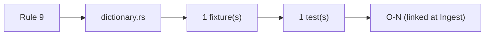
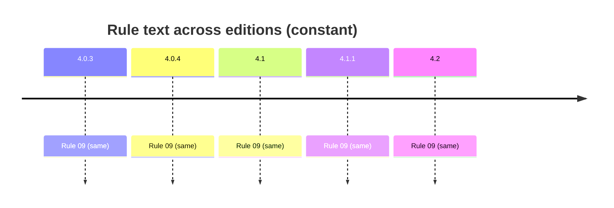

# Rule 9 — unknown headings

## Statement
> [!quote] AGS4 Rule 09 — `spec:AGS4-4.2-2025.pdf §4.1.1 Rule 09`
> Data HEADING and GROUP names shall be taken from the AGS FORMAT DATA DICTIONARY. In cases where there is no suitable entry, a user-defined GROUP and/or HEADING may be used in accordance with Rule 18. Any user-defined HEADINGs shall be included at the end of the HEADING row after the standard HEADINGs in the order defined in the DICT group (see Rule 18a).

Rule **normative content is unchanged across AGS 4.0.3 → 4.2** — verified by reading §8.1 (4.0.3/4.0.4 prose) and §4.1.1 (4.1/4.1.1/4.2 table) of *all five* PDFs, not by trusting a foreword. The text is *not* byte-identical: 4.1 reorganised prose→table, dropped Section-cross-ref parentheticals (Rules 7/10c/11), and changed Rule 15's example `ERES_RUNI`→`ELRG_RUNI` tracking the dictionary's ERES→ELRG replacement. Cross-edition rule variation is thus a *presentation + interpretation/implementation* axis, not a normative-text axis — see [[ags4-rules-frozen-dictionary-evolves]] and [[rule15-example-tracks-eres-elrg-removal]].

## Rule family
`dictionary` — implemented in `repo:rust-packages/laterite-ags4-validator/src/rules/dictionary.rs`. See [[rule-families]].

## Implementation (this repo)
> [!quote] Implemented in `repo:rust-packages/laterite-ags4-validator/src/rules/dictionary.rs`

HEADING/GROUP names from effective dict (standard ∪ in-file DICT); unknown → Rule 9 unless Rule-18 user-defined.

*Clean-room: rule logic derived from the spec; python-ags4 (LGPL) read only for behavioural parity, never copied (see the module header).*

## Traceability chain

- Fixtures: `rule9_unknown_heading.ags`
- Regression: `rule9_unknown_heading_flagged`

## Variations
> [!note] **Rule prose is frozen across editions.** The 4.2 Foreword states the AGS 4 Rules are unchanged and live in §4.1.1 (`spec:AGS4-4.2-2025.pdf §4.1.1`). So a rule's *spec text* does not vary 4.0.3→4.2 — cross-edition variation enters via the **Data Dictionary** (groups/types this rule operates over) and via **implementation/interpretation** (the Rust↔python axis, wired from Phase B/C as `[[O-NN]]`).

- Edition deltas (spec text): **none** — see [[ags4-rules-frozen-dictionary-evolves]].
- Divergence (Rust↔python): none confirmed — [[strat-elrg-recognition]] probed a proposed ELRG-recognition gap (Rule 9 on ELRG_* headings) and refuted it; the Rust validator bundles its own per-edition dictionaries (projected from `ags_dictionary.json`), independent of the core registry.

## Related
[[rule-families]] · [[traceability-chain]] · [[parity-model]] · [[ags-4.2]]
