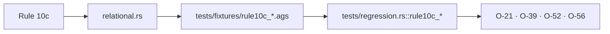
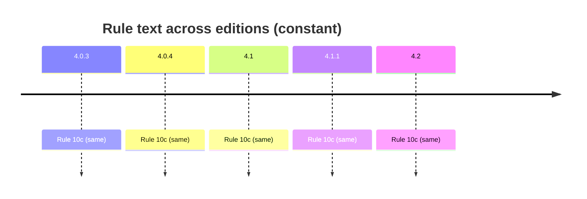

# Rule 10c — parent child

## Statement
> [!quote] AGS4 Rule 10c — `spec:AGS4-4.2-2025.pdf §4.1.1 Rule 10c`
> Links are made between data rows in GROUPs by the KEY fields. Every entry made in the KEY fields in any GROUP must have an equivalent entry in its PARENT GROUP. The PARENT GROUP must be included within the data file.

Rule **normative content is unchanged across AGS 4.0.3 → 4.2** — verified by reading §8.1 (4.0.3/4.0.4 prose) and §4.1.1 (4.1/4.1.1/4.2 table) of *all five* PDFs, not by trusting a foreword. The text is *not* byte-identical: 4.1 reorganised prose→table, dropped Section-cross-ref parentheticals (Rules 7/10c/11), and changed Rule 15's example `ERES_RUNI`→`ELRG_RUNI` tracking the dictionary's ERES→ELRG replacement. Cross-edition rule variation is thus a *presentation + interpretation/implementation* axis, not a normative-text axis — see [[ags4-rules-frozen-dictionary-evolves]] and [[rule15-example-tracks-eres-elrg-removal]].

## Rule family
`relational` — implemented in `repo:rust-packages/laterite-ags4-validator/src/rules/relational.rs`. See [[rule-families]].

## Implementation (this repo)
> [!quote] Implemented in `repo:rust-packages/laterite-ags4-validator/src/rules/relational.rs::rule_10c`

Every child KEY-tuple has an equivalent parent row. Skips a hardcoded PARENTLESS set of 11 (incl. LOCA) — see [[non-hierarchy-ten-vs-parentless-list]]; parentless list hardcoded not dict-derived (O-21).

The rule asks exactly ONE question per group — does this row's copy of the **declared** parent's KEY tuple exist in that parent? — and two of its labels exist to say where that question was not asked:

- `Warning (Related to Rule 10c)` — a row whose parent-KEY cells are all empty claims no parent, so the check is **declined** rather than passed ([[O-52]], on the reading [[O-39]] settled).
- `FYI (Related to Rule 10c)` — a KEY heading owned by a group off the declared parent chain is not in the tuple at all, so its link is one the rule **cannot** ask about ([[O-56]]). Emitted only where the owner's whole KEY tuple is contained in the child's, since otherwise that group could never have been the parent.

Neither moves the verdict, and both are off at `CheckOptions::default()`.

*Clean-room: rule logic derived from the spec; python-ags4 (LGPL) read only for behavioural parity, never copied (see the module header).*

## Traceability chain

- Fixtures: `repo:rust-packages/laterite-ags4-validator/tests/fixtures/rule10c_orphan_child.ags` ·
  `repo:rust-packages/laterite-ags4-validator/tests/fixtures/rule10c_standalone_child.ags` ·
  `repo:rust-packages/laterite-ags4-validator/tests/fixtures/rule10c_foreign_key_link.ags`
- Regression: `repo:rust-packages/laterite-ags4-validator/tests/regression.rs::rule10c_orphan_child_flagged` ·
  `repo:rust-packages/laterite-ags4-validator/tests/regression.rs::rule10c_standalone_child_is_warned_about_not_silently_skipped` ·
  `repo:rust-packages/laterite-ags4-validator/tests/regression.rs::rule10c_reports_the_link_it_cannot_ask_about`
- Each non-error label also has a tier test asserting it stays off at `CheckOptions::default()`.

## Variations
> [!note] **Rule prose is frozen across editions.** The 4.2 Foreword states the AGS 4 Rules are unchanged and live in §4.1.1 (`spec:AGS4-4.2-2025.pdf §4.1.1`). So a rule's *spec text* does not vary 4.0.3→4.2 — cross-edition variation enters via the **Data Dictionary** (groups/types this rule operates over) and via **implementation/interpretation** (the Rust↔python axis, wired from Phase B/C as `[[O-NN]]`).

- Edition deltas (spec text): **none** — see [[ags4-rules-frozen-dictionary-evolves]].
- Divergence (Rust↔python): [[O-21]] · [[O-24]] · [[O-39]] · [[O-42]] · [[O-51]] · [[O-52]] · [[O-56]].

## Related
[[rule-families]] · [[traceability-chain]] · [[parity-model]] · [[ags-4.2]] · [[O-52]] · [[O-56]]
