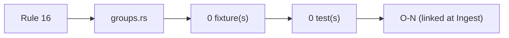
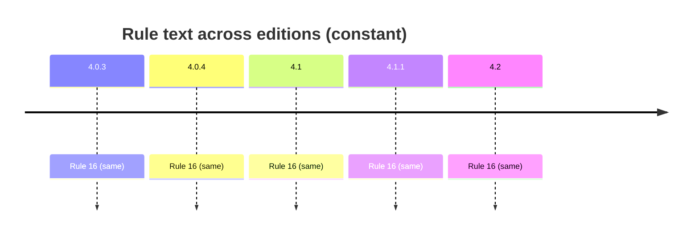

# Rule 16 — abbr group

## Statement
> [!quote] AGS4 Rule 16 — `spec:AGS4-4.2-2025.pdf §4.1.1 Rule 16`
> Each data file shall contain the ABBR GROUP when abbreviations have been included in the data file. The abbreviations listed in the ABBR GROUP shall include definitions for all abbreviations entered in a FIELD where the data TYPE is defined as "PA" or any abbreviation needing definition used within any other heading data type.

Rule **normative content is unchanged across AGS 4.0.3 → 4.2** — verified by reading §8.1 (4.0.3/4.0.4 prose) and §4.1.1 (4.1/4.1.1/4.2 table) of *all five* PDFs, not by trusting a foreword. The text is *not* byte-identical: 4.1 reorganised prose→table, dropped Section-cross-ref parentheticals (Rules 7/10c/11), and changed Rule 15's example `ERES_RUNI`→`ELRG_RUNI` tracking the dictionary's ERES→ELRG replacement. Cross-edition rule variation is thus a *presentation + interpretation/implementation* axis, not a normative-text axis — see [[ags4-rules-frozen-dictionary-evolves]] and [[rule15-example-tracks-eres-elrg-removal]].

## Rule family
`groups` — implemented in `repo:rust-packages/laterite-ags4-validator/src/rules/groups.rs`. See [[rule-families]].

## Implementation (this repo)
> [!quote] Implemented in `repo:rust-packages/laterite-ags4-validator/src/rules/groups.rs`

[[ABBR]] group defines all PA-typed (and abbreviation-bearing) values; PA is NOT case-sensitive (§3.3) — see [[pa-not-case-sensitive-pt-pu-are]].

*Clean-room: rule logic derived from the spec; python-ags4 (LGPL) read only for behavioural parity, never copied (see the module header).*

## Traceability chain

- Fixtures: _none yet — Lint gap_
- Regression: _none yet — Lint gap_

## Variations
> [!note] **Rule prose is frozen across editions.** The 4.2 Foreword states the AGS 4 Rules are unchanged and live in §4.1.1 (`spec:AGS4-4.2-2025.pdf §4.1.1`). So a rule's *spec text* does not vary 4.0.3→4.2 — cross-edition variation enters via the **Data Dictionary** (groups/types this rule operates over) and via **implementation/interpretation** (the Rust↔python axis, wired from Phase B/C as `[[O-NN]]`).

- Edition deltas (spec text): **none** — see [[ags4-rules-frozen-dictionary-evolves]].
- Divergence (Rust↔python): [[O-43]] — laterite adds an FYI for a self-declared but **non-standard** PA abbreviation (a typo'd / invented code that is in the file's ABBR but not the standard picklist); python-ags4 has no equivalent.

## Related
[[rule-families]] · [[traceability-chain]] · [[parity-model]] · [[ags-4.2]] · [[O-43]]
