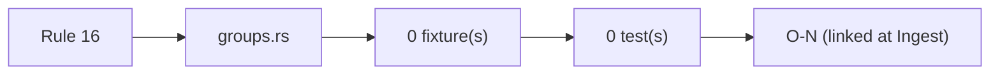
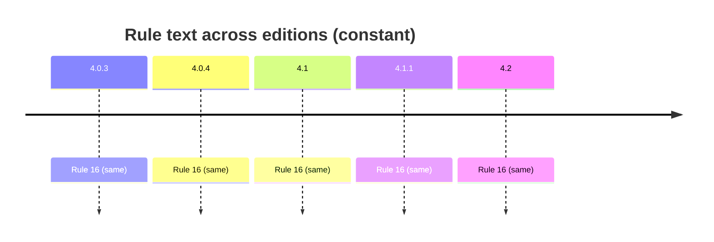

# Rule 16 — abbr group

## Statement
> [!quote] AGS4 Rule 16 — `spec:AGS4-4.2-2025.pdf §4.1.1 Rule 16`
> Each data file shall contain the ABBR GROUP when abbreviations have been included in the data file. The abbreviations listed in the ABBR GROUP shall include definitions for all abbreviations entered in a FIELD where the data TYPE is defined as "PA" or any abbreviation needing definition used within any other heading data type.

Rule **normative content is unchanged across AGS 4.0.3 → 4.2** — verified by reading §8.1 (4.0.3/4.0.4 prose) and §4.1.1 (4.1/4.1.1/4.2 table) of *all five* PDFs, not by trusting a foreword. The text is *not* byte-identical: 4.1 reorganised prose→table, dropped Section-cross-ref parentheticals (Rules 7/10c/11), and changed Rule 15's example `ERES_RUNI`→`ELRG_RUNI` tracking the dictionary's ERES→ELRG replacement. Cross-edition rule variation is thus a *presentation + interpretation/implementation* axis, not a normative-text axis — see [[ags4-rules-frozen-dictionary-evolves]] and [[rule15-example-tracks-eres-elrg-removal]].

## Rule family
`groups` — implemented in `repo:rust-packages/laterite-ags4-validator/src/rules/groups.rs`. See [[rule-families]].

## Implementation (this repo)
> [!quote] Implemented in `repo:rust-packages/laterite-ags4-validator/src/rules/groups.rs`

[[ABBR]] group defines all PA-typed (and abbreviation-bearing) values; PA is NOT case-sensitive (§3.3) — see [[pa-not-case-sensitive-pt-pu-are]].

The lookup is exact: nothing is trimmed, so `" D"` fails where `"D"` is defined. With FYIs on, such a value (or concatenated part) also gets an `FYI (Related to Rule 16)` naming the code it matches once trimmed, and `fix` trims it in the safe tier when every failing part of the cell is rescued that way ([[O-57]]). The error text itself never changes — `laterite.compat` rewrites it into python-ags4's wording by an end-anchored pattern. When whitespace does not explain the value but a declared or standard code is close to it, the FYI names up to three instead ([[O-61]]); that is a suggestion only.

`fix` makes three Rule 16 repairs: the whitespace trim above, and, only when the caller names them, `merge`'s `recode` and `on_code_case="standard"` code rewrites ([[O-58]]). The rewrites are explicit instructions, so they are safe-tier, and a set whose rewrite would give two rows one KEY is left as written and reported as skipped.

*Clean-room: rule logic derived from the spec; python-ags4 (LGPL) read only for behavioural parity, never copied (see the module header).*

## Traceability chain

```mermaid
flowchart LR
  R["Rule 16"] --> I["groups.rs"] --> F["0 fixture(s)"] --> T["0 test(s)"] --> O["O-N (linked at Ingest)"]
```

- Fixtures: _none yet — Lint gap_
- Regression: _none yet — Lint gap_

## Variations
> [!note] **Rule prose is frozen across editions.** The 4.2 Foreword states the AGS 4 Rules are unchanged and live in §4.1.1 (`spec:AGS4-4.2-2025.pdf §4.1.1`). So a rule's *spec text* does not vary 4.0.3→4.2 — cross-edition variation enters via the **Data Dictionary** (groups/types this rule operates over) and via **implementation/interpretation** (the Rust↔python axis, wired from Phase B/C as `[[O-NN]]`).

```mermaid
timeline
  title Rule text across editions (constant)
  4.0.3 : Rule 16 (same)
  4.0.4 : Rule 16 (same)
  4.1   : Rule 16 (same)
  4.1.1 : Rule 16 (same)
  4.2   : Rule 16 (same)
```

- Edition deltas (spec text): **none** — see [[ags4-rules-frozen-dictionary-evolves]].
- Divergence (Rust↔python): [[O-43]] — laterite adds an FYI for a self-declared but **non-standard** PA abbreviation (a typo'd / invented code that is in the file's ABBR but not the standard picklist), and names the standard code when one matches it ignoring case; python-ags4 has no equivalent.
- Divergence (Rust↔python): [[O-57]] — laterite adds an FYI when a PA value fails only because of whitespace around a defined code, and `fix` trims it; python-ags4 has no equivalent.
- Divergence (Rust↔python): [[O-58]] — laterite reports a file whose ABBR declares codes under one heading that differ only by letter case: a `Warning (Related to Rule 16)` when the file is judged against 4.2, which says ABBR codes are case-insensitive, and an opt-in FYI under earlier editions; python-ags4 has no equivalent.
- Divergence (Rust↔python): [[O-61]] — laterite adds an FYI naming the codes close to an undefined PA value, the file's own first; python-ags4 has no equivalent.

## Related
[[rule-families]] · [[traceability-chain]] · [[parity-model]] · [[ags-4.2]] · [[O-43]] · [[O-57]] · [[O-58]] · [[O-61]]
