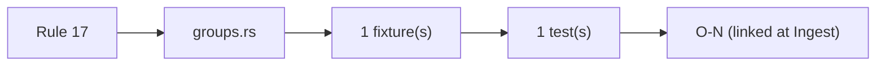
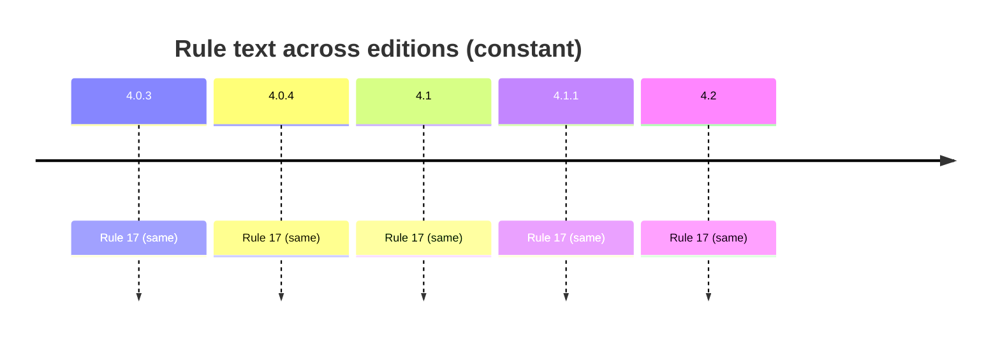

# Rule 17 — type group

## Statement
> [!quote] AGS4 Rule 17 — `spec:AGS4-4.2-2025.pdf §4.1.1 Rule 17`
> Each data file shall contain the TYPE GROUP to define the field TYPEs used within the data file. Every data type entered in the TYPE row of a GROUP shall be listed and defined in the TYPE GROUP.

Rule **normative content is unchanged across AGS 4.0.3 → 4.2** — verified by reading §8.1 (4.0.3/4.0.4 prose) and §4.1.1 (4.1/4.1.1/4.2 table) of *all five* PDFs, not by trusting a foreword. The text is *not* byte-identical: 4.1 reorganised prose→table, dropped Section-cross-ref parentheticals (Rules 7/10c/11), and changed Rule 15's example `ERES_RUNI`→`ELRG_RUNI` tracking the dictionary's ERES→ELRG replacement. Cross-edition rule variation is thus a *presentation + interpretation/implementation* axis, not a normative-text axis — see [[ags4-rules-frozen-dictionary-evolves]] and [[rule15-example-tracks-eres-elrg-removal]].

## Rule family
`groups` — implemented in `repo:rust-packages/laterite-ags4-validator/src/rules/groups.rs`. See [[rule-families]].

## Implementation (this repo)
> [!quote] Implemented in `repo:rust-packages/laterite-ags4-validator/src/rules/groups.rs`

[[TYPE]] group defines all used field types. An empty TYPE cell is skipped by Rust; python would flag it (O-19).

`laterite-ags4-merge`'s `promote` mode (the TYPE-clash lattice, [[dec-ags4-merge-semantics]]) is Rule 17-adjacent: a promoted code (e.g. `5DP`) is always one an input file already declared, so its `TYPE`-group row rides in free with merge's group union, and this rule is satisfied without merge doing anything extra for it. A declared-but-now-unused leftover code (the coarser `2DP` row, once every cell is promoted to `5DP`) validates clean too — this rule only requires every code *used* to be *declared*, never the reverse, and there is no separate rule requiring a heading's declared TYPE to equal the *dictionary's* TYPE for that heading.

*Clean-room: rule logic derived from the spec; python-ags4 (LGPL) read only for behavioural parity, never copied (see the module header).*

## Traceability chain

- Fixtures: `rule17_no_type.ags`
- Regression: `rule17_missing_type_group_flagged`

## Variations
> [!note] **Rule prose is frozen across editions.** The 4.2 Foreword states the AGS 4 Rules are unchanged and live in §4.1.1 (`spec:AGS4-4.2-2025.pdf §4.1.1`). So a rule's *spec text* does not vary 4.0.3→4.2 — cross-edition variation enters via the **Data Dictionary** (groups/types this rule operates over) and via **implementation/interpretation** (the Rust↔python axis, wired from Phase B/C as `[[O-NN]]`).

- Edition deltas (spec text): **none** — see [[ags4-rules-frozen-dictionary-evolves]].
- Divergence (Rust↔python): wired in Phase B/C — `[[O-NN]]` or _none_.

## Related
[[rule-families]] · [[traceability-chain]] · [[parity-model]] · [[ags-4.2]] · [[dec-ags4-merge-semantics]]
