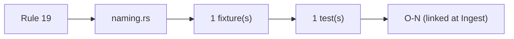
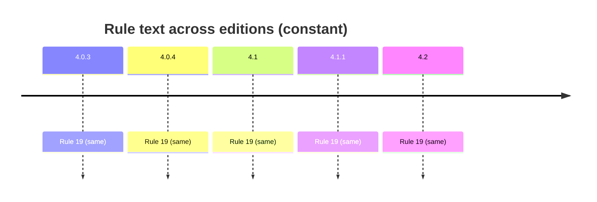

# Rule 19 — group name format

## Statement
> [!quote] AGS4 Rule 19 — `spec:AGS4-4.2-2025.pdf §4.1.1 Rule 19`
> A GROUP name shall not be more than 4 characters long and shall consist of uppercase letters and numbers only.

Rule **normative content is unchanged across AGS 4.0.3 → 4.2** — verified by reading §8.1 (4.0.3/4.0.4 prose) and §4.1.1 (4.1/4.1.1/4.2 table) of *all five* PDFs, not by trusting a foreword. The text is *not* byte-identical: 4.1 reorganised prose→table, dropped Section-cross-ref parentheticals (Rules 7/10c/11), and changed Rule 15's example `ERES_RUNI`→`ELRG_RUNI` tracking the dictionary's ERES→ELRG replacement. Cross-edition rule variation is thus a *presentation + interpretation/implementation* axis, not a normative-text axis — see [[ags4-rules-frozen-dictionary-evolves]] and [[rule15-example-tracks-eres-elrg-removal]].

## Rule family
`naming` — implemented in `repo:rust-packages/laterite-ags4-validator/src/rules/naming.rs`. See [[rule-families]]. Sibling sub-rules: [[rule-19a-heading-name-format]] (HEADING name format) · [[rule-19b-heading-prefix]] (GROUP-code heading prefix).

## Implementation (this repo)
> [!quote] Implemented in `repo:rust-packages/laterite-ags4-validator/src/rules/naming.rs::rule_19`

Enforces EXACTLY 4 UPPERCASE LETTERS — STRICTER than 4.2 spec ('≤4, letters and numbers'). A digit in a GROUP name IS flagged (test naming.rs:193). Confirmed spec↔Rust divergence — see [[rule19-spec-allows-numbers-validator-may-not]], O-6.

*Clean-room: rule logic derived from the spec; python-ags4 (LGPL) read only for behavioural parity, never copied (see the module header).*

## Traceability chain

- Fixtures: `rule19_bad_group_name.ags`
- Regression: `rule19_bad_group_name_flagged`

## Variations
> [!note] **Rule prose is frozen across editions.** The 4.2 Foreword states the AGS 4 Rules are unchanged and live in §4.1.1 (`spec:AGS4-4.2-2025.pdf §4.1.1`). So a rule's *spec text* does not vary 4.0.3→4.2 — cross-edition variation enters via the **Data Dictionary** (groups/types this rule operates over) and via **implementation/interpretation** (the Rust↔python axis, wired from Phase B/C as `[[O-NN]]`).

- Edition deltas (spec text): **none** — see [[ags4-rules-frozen-dictionary-evolves]].
- Known/!suspected gap: [[rule19-spec-allows-numbers-validator-may-not]] (Phase A spec-vs-impl candidate).
- Divergence (Rust↔python): wired in Phase B/C — `[[O-NN]]` or _none_.

## Related
[[rule-families]] · [[traceability-chain]] · [[parity-model]] · [[ags-4.2]]
