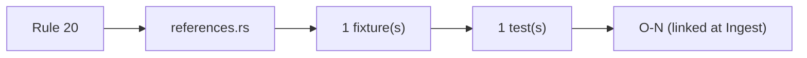
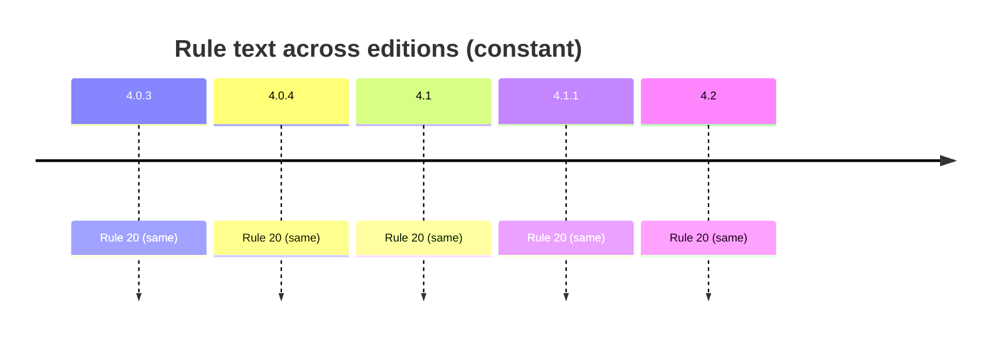

# Rule 20 — file fset

## Statement
> [!quote] AGS4 Rule 20 — `spec:AGS4-4.2-2025.pdf §4.1.1 Rule 20`
> Additional computer files (e.g. digital images) can be included within a data submission. Each such file shall be defined in a FILE GROUP. The additional files shall be transferred in a sub-folder named FILE, containing sub-folders each named by the FILE_FSET reference. Each FILE_FSET named folder will contain the files listed in the FILE GROUP.

Rule **normative content is unchanged across AGS 4.0.3 → 4.2** — verified by reading §8.1 (4.0.3/4.0.4 prose) and §4.1.1 (4.1/4.1.1/4.2 table) of *all five* PDFs, not by trusting a foreword. The text is *not* byte-identical: 4.1 reorganised prose→table, dropped Section-cross-ref parentheticals (Rules 7/10c/11), and changed Rule 15's example `ERES_RUNI`→`ELRG_RUNI` tracking the dictionary's ERES→ELRG replacement. Cross-edition rule variation is thus a *presentation + interpretation/implementation* axis, not a normative-text axis — see [[ags4-rules-frozen-dictionary-evolves]] and [[rule15-example-tracks-eres-elrg-removal]].

## Rule family
`references` — implemented in `repo:rust-packages/laterite-ags4-validator/src/rules/references.rs`. See [[rule-families]].

## Implementation (this repo)
> [!quote] Implemented in `repo:rust-packages/laterite-ags4-validator/src/rules/references.rs::rule_20`

DATA-LEVEL only: every used FILE_FSET defined in FILE group. On-disk/sidecar-folder checks are opt-in (`CheckOptions::check_files`, see [[O-27]]), **not out of scope** — they live in a separate module, `repo:rust-packages/laterite-ags4-validator/src/world.rs::rule_20_on_disk`, moved out of this file in the `cert-trust-v2` arc's PR 2 (2026-07-14) so the CONTENT-only rule engine (this file) cannot reach anything that reads the filesystem; see [[cert-trust-v2]].

*Clean-room: rule logic derived from the spec; python-ags4 (LGPL) read only for behavioural parity, never copied (see the module header).*

## Traceability chain

- Fixtures: `rule20_undefined_fset.ags`
- Regression: `rule20_undefined_file_fset_flagged`

## Variations
> [!note] **Rule prose is frozen across editions.** The 4.2 Foreword states the AGS 4 Rules are unchanged and live in §4.1.1 (`spec:AGS4-4.2-2025.pdf §4.1.1`). So a rule's *spec text* does not vary 4.0.3→4.2 — cross-edition variation enters via the **Data Dictionary** (groups/types this rule operates over) and via **implementation/interpretation** (the Rust↔python axis, wired from Phase B/C as `[[O-NN]]`).

- Edition deltas (spec text): **none** — see [[ags4-rules-frozen-dictionary-evolves]].
- Divergence (Rust↔python): wired in Phase B/C — `[[O-NN]]` or _none_.

## Related
[[rule-families]] · [[traceability-chain]] · [[parity-model]] · [[ags-4.2]] · [[cert-trust-v2]] · [[O-27]]
