# AGS Wiki — Start Here

The map of content for this knowledge base. See [[AGS-WIKI]] for the
operating manual. Scaffold state: every page is `status: stub` —
content arrives via the Ingest workflow.

## The AGS4 data model (generated from the dictionary)

```mermaid
graph TD
  ABBR
  SAMP --> ASDI
  LOCA --> BKFL
  SAMP --> CBRG
  CBRG --> CBRT
  LOCA --> CDIA
  LOCA --> CHIS
  SAMP --> CHOC
  SAMP --> CMPG
  CMPG --> CMPT
  SAMP --> CONG
  SAMP --> CONL
  CONG --> CONS
  LOCA --> CORE
  LOCA --> DCPG
  DCPG --> DCPT
  LOCA --> DETL
  DICT
  LOCA --> DISC
  LOCA --> DOBS
  DPRG --> DPRB
  LOCA --> DPRG
  LOCA --> DREM
  SAMP --> ECTN
  SAMP --> ERES
  LOCA --> FLSH
  LOCA --> FRAC
  SAMP --> GCHM
  LOCA --> GEOL
  SAMP --> GRAG
  GRAG --> GRAT
  LOCA --> HDIA
  LOCA --> HDPH
  LOCA --> HORN
  LOCA --> IPEN
  LOCA --> IPID
  LOCA --> IPRG
  LOCA --> IPRT
  LOCA --> ISAG
  ISAG --> ISAT
  LOCA --> ISPT
  LOCA --> IVAN
  LBSG --> LBST
  SAMP --> LDEN
  SAMP --> LLIN
  SAMP --> LLPL
  SAMP --> LNMC
  PROJ --> LOCA
  SAMP --> LPDN
  SAMP --> LRES
  SAMP --> LVAN
  SAMP --> MCVG
  MCVG --> MCVT
  MONG --> MOND
  LOCA --> MONG
  LOCA --> PIPE
  LOCA --> PLTG
  PLTG --> PLTT
  PMTG --> PMTD
  LOCA --> PMTG
  PMTG --> PMTL
  LOCA --> PTIM
  SAMP --> PTST
  SAMP --> RDEN
  SAMP --> RELD
  SAMP --> RPLT
  SAMP --> RUCS
  SAMP --> RWCO
  LOCA --> SAMP
  SCPG --> SCDG
  SCDG --> SCDT
  LOCA --> SCPG
  SCPG --> SCPT
  SAMP --> SHBG
  SHBG --> SHBT
  TRAN
  SAMP --> TREG
  TRET --> TREL
  SAMP --> TREM
  TREG --> TRET
  SAMP --> TRIG
  TRIT --> TRIL
  TRIG --> TRIT
  TYPE
  UNIT
  SAMP --> WADD
  LOCA --> WETH
  SAMP --> WINS
  WSTG --> WSTD
  LOCA --> WSTG
```



## Sections

- **[[parent-child-graph]]** — full group hierarchy · **[[rule-families]]** · **[[traceability-chain]]** · **[[parity-model]]** · **[[edition-resolution]]**
- **[[evolutionary-dogfooding]]** — manufacture & prove divergences · **[[parity-confidence-model]]** — adaptive oracle gating · **[[agent-first-cli-contract]]** — the CLI lineage/contract · **[[testing-strategy]]** — invariant-first hardening doctrine
- **[[validator-site]]** — the browser AGS4 validator + data-explorer roadmap (wasm) · **[[dec-laterite-ags4-types-leaf]]** — shared wasm-safe typing crate · **cli-cloud-workflow** — handing off work between CLI & cloud sessions
- **[[crate-map]]** — the 20-crate / 1-wheel workspace map · **[[tech-stack-wasm]]** — the browser wasm + typed-Arrow path · **[[pyo3-boundary]]** — where Rust drives Python
- **Rules** — `rules/` (28 pages, Rules 1–20 + sub-rules)
- **Groups** — `groups/` (92 pages — a bootstrap-era subset; the shipped
  AGS4 union dictionary has grown to 174 groups, see [[ags-dictionary-json]])
- **Types** — `types/` (17 AGS data types)
- **Observations** — `observations/` (36 O-N divergence entries)
- **Tools** — `tools/` (13 CLIs/crates/packages/scripts)
- **Editions** — `editions/` (4.0.3 → 4.2) · **Sources** — `sources/` · **Comparisons** — `comparisons/`
- **Campaign registers** — [[insights/_README|Insights & Gaps]] · [[strategies/_README|Test Strategies]] · [[design/_README|AGS5 Design]] (see `.bootstrap/INGEST-PLAN.md`)
- Full catalog: [[index]] · Activity: [[log]]

## Example Dataview rollups (need the Dataview plugin; degrade gracefully)

```dataview
TABLE obs_tag, phase, status FROM "observations" WHERE obs_tag = "VARIANCE" SORT observation_id
```

```dataview
TABLE parent, is_high_volume FROM "groups" WHERE parent = "" SORT file.name
```

```dataview
TABLE rule_family, status FROM "rules" WHERE varies_between_editions SORT rule_number
```

## Related
[[AGS-WIKI]] · [[index]] · [[log]] · [[parent-child-graph]]
