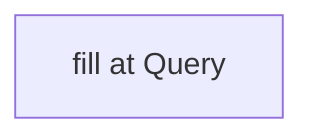

# <A> vs <B>

> Query output. Created/refreshed by the QUERY workflow, not bootstrap.

## Question
> [!todo] The query this answers.

## Dimensions compared
<!-- TODO -->

## Findings

<!-- TODO: synthesis with [[wikilinks]] + repo:/spec: citations -->

## Caveats / open
<!-- TODO -->

## Related
<!-- pages compared + supporting concepts -->
