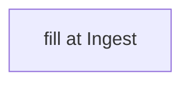

# <concept>

## Definition
> [!todo] Ingest: what it is, in this repo's terms.

## Why it matters
<!-- TODO -->

## Diagram

## Where it shows up
<!-- TODO: rules/groups/tools that depend on it -->

## Related
<!-- typed wikilinks -->
