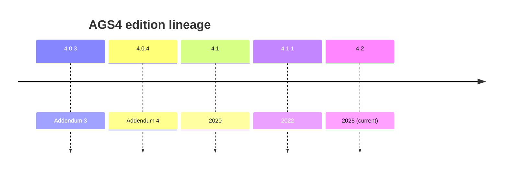

# AGS <version>

## Overview
> [!todo] Ingest: what this edition is; status (current/deprecated).

## Support in this repo
<!-- TODO: how the validator resolves/handles it. Link [[edition-resolution]], [[O-30]]. -->

## Deltas vs adjacent editions

- Changed vs previous: <!-- TODO -->

## Related
<!-- [[edition-resolution]] · [[ags-4.1]] · [[O-30]] -->
