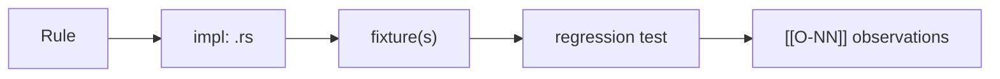
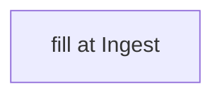

# Rule <NN> — <short name>

## Statement
> [!todo] Ingest: one-line normative statement. Cite `spec:` — never paste spec prose.

## Rule Family
<!-- TODO: which of the 8 families + why. Link [[rule-families]]. -->

## Implementation (this repo)
<!-- TODO: cite repo: impl symbol; summarise, don't duplicate logic. -->

## Traceability Chain

## Variations
> [!note] Cross-edition deltas (4.0.3 → 4.2) and Rust↔python-ags4 divergence.

- Edition deltas: <!-- TODO -->
- Divergence: <!-- > [!divergence] link [[O-NN]] or "none" -->

## Related
<!-- [[rule-families]] · [[traceability-chain]] · [[O-NN]] · [[<GROUP>]] · [[ags-4.2]] -->
