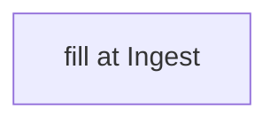

# <name>

## What it is
> [!todo] Ingest: one-line role.

## Inputs / outputs
<!-- TODO -->

## Where it lives
<!-- TODO: cite repo: root path -->

## Relationship to other components

## Related
<!-- [[parity-model]] · [[laterite-ags4-check]] · [[<other tool>]] -->
