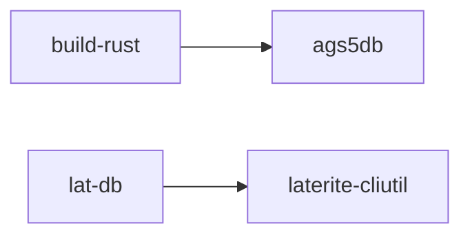

# build-rust

## What it is
> [!quote] Compiles `rust-packages/ags5db` in release mode and copies the `lat-db` binary into `dist/` — the **sole shipped artefact**. `.ps1` (Windows) + `.sh` (macOS/Linux) siblings.

## Inputs / outputs
> [!quote] In: the Rust workspace + a `cargo`/`rustup` toolchain. Out: `dist/ags5db` (statically-linked native binary, ~34 MB arm64 Mach-O; `dist/` gitignored). First build compiles bundled libduckdb (~5-10 min); incremental ~10-20 s.

## Where it lives
`repo:tools/build-rust.ps1` (+ `repo:tools/build-rust.sh`)

## Why it is the only packager
The Python `ags5-*` packages are a library + parity oracle, never a
shipped CLI — see [[dec-rust-drives-python]]. The former PyInstaller /
Nuitka / PyApp / make-dist scripts were removed once laterite-ags5-db
reached read+write parity; maintaining a second shipped binary was
redundant.

## Relationship to other components

See [[crate-map]] for the workspace dependency graph.

`ags5db` is read+write feature-complete (every documented command
implemented, not stubbed); NDJSON output is parity-verified against
the Python `ags5db-py` reference. See [[dec-rust-drives-python]] for
the distribution + language strategy and its "Known gaps".

## Related
laterite-ags5-db · [[dec-rust-drives-python]] · [[crate-map]]
