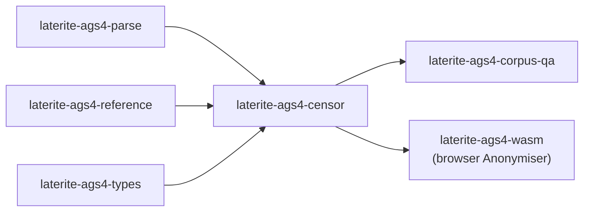

# laterite-ags4-censor

<!-- BEGIN GENERATED: crate-card — DO NOT EDIT BY HAND. Regenerate: uv run --no-project python tools/gen_crate_graph.py -->
> [!note] **Not published** — `laterite-ags4-censor` is a workspace crate, internal to this repo, versioned with the workspace.
> **Used by** — [[laterite-ags4-corpus-qa]], [[laterite-ags4-wasm]].
<!-- END GENERATED: crate-card -->

> [!note] The user-facing face is the browser **Anonymiser**
> ([[laterite-ags4-wasm]]) and the corpus-QA scrub
> ([[laterite-ags4-corpus-qa]]); both drive this one engine.

## What it is

The shared AGS4 **anonymisation / redaction** engine — one copy of the scrub
logic, extracted (laterite-dev#581) out of `laterite-ags4-corpus-qa`'s `censor.rs` so the
browser Anonymiser drives the *same* engine (through the engine wasm) instead of a
hand-written TypeScript reimplementation. It is part of the laterite-dev#527 cross-surface
convergence arc and the sibling of the laterite-dev#533 tokenizer/quoter work: the scrub reads
fields through the shared [[laterite-ags4-parse]] leaf (`scan_line`) and re-quotes
through [[laterite-ags4-types]] (`quote_field`), so there is **no fourth AGS4
tokenizer**. The design rationale is [[dec-ags4-censor-leaf]].

**Cell-surgical, defect-preserving.** Only DATA cells that actually change are
rewritten; every other byte — GROUP/HEADING/UNIT/TYPE rows, blank lines, line
endings, and even format *defects* (a Rule-2a CRLF breach, stray whitespace) —
passes through verbatim. Within a changed row, untouched cells keep their original
bytes; a scrubbed sibling never re-quotes them. The one exception is a row whose
columns are *dropped* (custom-column removal), which necessarily re-emits its kept
fields canonically because its structure changed.

## Inputs / outputs

In: the AGS4 text, a `file_id` (the source file's content hash, used by the
`filehash` action), a resolved `Policy`, and `CensorOptions`. Out: the scrubbed
text plus a `Tally` of what was touched. The `Policy` is resolved from the SSOT
`scrub_policy` (`Policy::from_sensitive_json`), and each heading's action is one
of:

- **`filehash`** (project IDs) — the cell becomes the caller-provided `file_id`,
  so `PROJ_ID` is stable and non-identifying.
- **`pseudonym`** (location IDs) — each distinct value maps to a stable token
  (`ID0001`…), the **same map reused wherever that column appears**, so
  cross-group references survive and the file still validates.
- **`blank`** (coordinates) — emptied.
- **`token`** (names / labs / accreditation) — replaced with the options' token.
- **`brackets`** (free-text) — each `[LONDON CLAY]` bracketed unit becomes
  `[<token>]`, the rest of the description kept.
- **`skip`** (free-text remarks) — left intact unless `include_freetext`
  promotes it to `token`.

## Where it lives

`repo:rust-packages/laterite-ags4-censor`. Deps [[laterite-ags4-parse]] (the line
tokenizer), [[laterite-ags4-reference]] (standard group/heading codes for
`drop_custom`, from the dictionary SSOT), and [[laterite-ags4-types]] (`quote_field`),
plus `serde`/`serde_json`. Default features keep arrow off, so it stays a light,
wasm-clean leaf. Consumers: [[laterite-ags4-corpus-qa]] and
[[laterite-ags4-wasm]].

## Relationship to other components

The full workspace graph is in [[crate-map]] (dependency form in
[[crate-dependency-graph]]):

## Related

[[crate-map]] · [[crate-dependency-graph]] · [[laterite-ags4-parse]] · [[laterite-ags4-types]] · [[laterite-ags4-reference]] · [[laterite-ags4-corpus-qa]] · [[laterite-ags4-wasm]] · [[laterite-ags4-tokenizer-wasm]] · [[dec-ags4-censor-leaf]]
