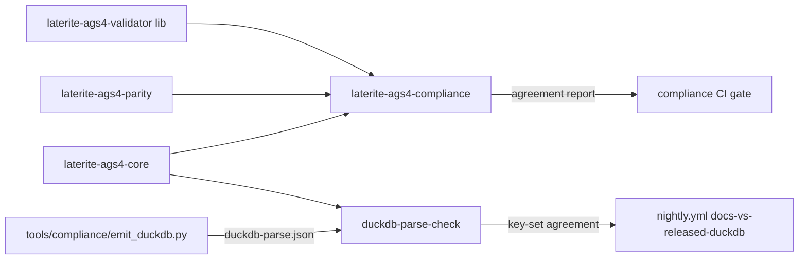

# laterite-ags4-compliance

<!-- BEGIN GENERATED: crate-card — DO NOT EDIT BY HAND. Regenerate: uv run --no-project python tools/gen_crate_graph.py -->
> [!note] **Not published** — `laterite-ags4-compliance` is a workspace crate, internal to this repo, at v0.11.0 (inherited from the workspace).
> **Used by** — nothing else in this workspace.
<!-- END GENERATED: crate-card -->

## What it is
> [!quote] **Implemented** (`repo:rust-packages/laterite-ags4-compliance`, #169).
> The cross-surface **findings-agreement** harness: it reads one finding-set
> JSON per validation surface (emitted by the per-surface runners) and checks
> the findings-emitting AGS4 surfaces agree over python-ags4's fixtures.

Two invariants:
1. the four laterite surfaces (rust / python-laterite / node / wasm) wrap
   **one** engine → they must be byte-identical on the numbered-rule floor;
2. python-ags4 is the O-N-aware reference, compared via [[laterite-ags4-parity]]'s
   `classify` **verbatim** — no parity logic re-derived, so no clean-room drift.

## Inputs / outputs
> [!quote] In: one findings JSON per surface. Out: a pass/fail agreement
> report; non-zero exit on any unexplained divergence.

Three bins:
- `laterite-ags4-compliance` — the comparator (the primary bin).
- `emit-rust` — the rust-surface runner; drives the validator engine directly
  and emits `rust.json` in the schema the comparator reads.
- `duckdb-parse-check` (laterite-dev#458) — the duckdb *read/parse-agreement* leg: proves
  the read-only extension's `read_ags` produces the same content-addressed key
  set as the core reference (it compares a pre-computed JSON against the core
  reader — it does **not** link the duckdb crate).

  This bin was public and correct for a long time and **never ran**: its input
  producer lived only in the dev satellite, so there was nothing here for it to
  read (#719). The producer is now `repo:tools/compliance/emit_duckdb.py`, which
  installs the extension from the DuckDB **community repository** rather than
  building one beside the checkout — a local build can agree with the engine
  while the published artefact does not. Both halves run in
  `repo:.github/workflows/nightly.yml`'s `docs-vs-released-duckdb` job, the leg
  that already checked the documented SQL examples still execute; what it could
  not check before was whether the answers were right.

  **Its scope, which is the interesting part (#742):** it key-checks groups the
  bundled registry knows and skips the rest. That skip is not incidental — it is
  the extension's own premise. Both sides equate "dictionary group" with
  "registry group", and AGS4 Rule 18 does not: a group declared in a file's own
  `DICT` is a dictionary group, with its parent and KEY status in `DICT_PGRP`
  and `DICT_STAT`. A check sharing the premise that produces a bug cannot fail
  on that bug, so full agreement and a live read defect can hold at once. The
  run therefore names every skipped group and says which of them the file
  declared, rather than printing a count.

  It self-skips (exit 0) when there is no community build for the current DuckDB
  version — a real state after a DuckDB release, not a failure of either engine.

## Relationship to laterite-ags4-xcheck
Distinct concern, deliberately a **separate** crate. The **output-value gate**
(`xcheck` / `emit-cases` + the case manifest) lives in the lean
[[laterite-ags4-xcheck]] crate so the gate builds on just `validator + emit +
parse`. This harness is about *findings agreement*, not output values, and its
kept bins never touch the case manifest — so the two stay decoupled and the
gate stays slim.

## Where it lives
`repo:rust-packages/laterite-ags4-compliance`. Deps only [[laterite-ags4-parity]]
+ `laterite-ags4-validator` + `laterite-ags4-core` + serde — no heavy dep, no
duckdb crate. Depends **on** parity/validator, never the reverse.

## Relationship to other components

See [[parity-model]] for the verdict semantics the reference comparison carries.

## Related
[[laterite-ags4-parity]] · [[laterite-ags4-xcheck]] · [[parity-model]] · [[crate-map]]
