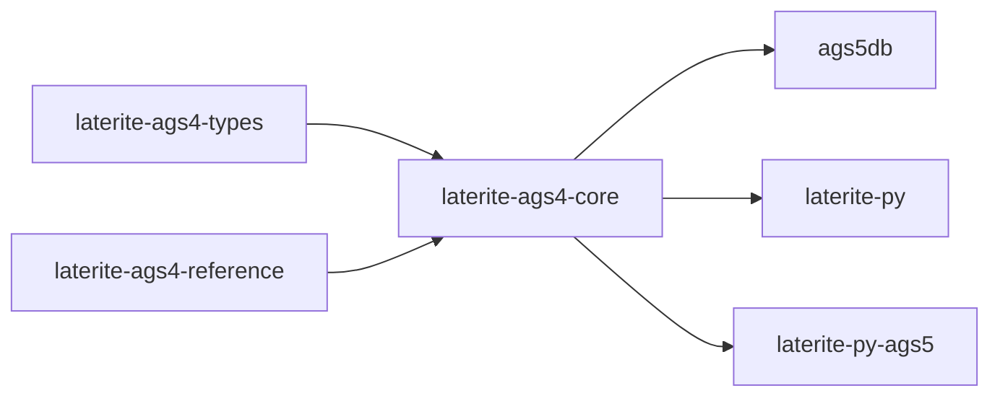

# laterite-ags4-core

<!-- BEGIN GENERATED: crate-card — DO NOT EDIT BY HAND. Regenerate: uv run --no-project python tools/gen_crate_graph.py -->
> [!note] **Cleared for crates.io** — `laterite-ags4-core` declares `publish = true`, so it is a public API under semver, not an internal detail. It is versioned on its own line.
> **Used by** — [[laterite]], [[laterite-ags4-compliance]], [[laterite-ags4-excel]], [[laterite-ags4-trust]], [[laterite-ags4-wasm]], [[laterite-ags4-xcheck]], [[laterite-cli]], [[laterite-node]], [[laterite-py]].
<!-- END GENERATED: crate-card -->

> [!note] Its modules are surfaced through the [[laterite]] wheel; Rust
> consumers can also depend on the crate directly, per the card above.

## What it is

The **DuckDB-free pure-string** core of the AGS toolchain: every module
that manipulates AGS data as strings without needing a database
connection. Originally extracted from the AGS5 DuckDB strand (now dormant,
satellite-resident) precisely so the light AGS4 wheel ([[laterite-py]], no
DuckDB) could share its logic; today the shipped AGS4 toolchain is its
consumer.

Modules (`repo:rust-packages/laterite-ags4-core/src/lib.rs`): `registry` (the
174-group AGS4 union dictionary loaded at build time + group-tree
descriptors — 92 is the dormant AGS5-only count, a different dictionary
entirely; since laterite-dev#475 this module is a flat `pub use` re-export of
[[laterite-ags4-reference]]'s `union`, so this path is unchanged for every
consumer), `effective_dict`
(the Rule 18 standard ∪ file-DICT union — the shared implementation homed in
[[laterite-ags4-reference]] since #777, re-exported here with an adapter for
the read codec so a reader can bind a file-declared group's columns; see
[[effective-dictionary]]), `ags4_codec` (the tolerant AGS4 read codec —
see "The read projection" below), `index` (the `.ags.idx` certificate +
byte-offset index), `keychain` (deterministic content-addressed row keys,
SHA-256 → UUIDv8; the implementation moved to [[laterite-ags4-reference]] and
this module is a path-preserving re-export, mirroring `registry`),
`read_render` (the ONE `lat read` CSV/JSON renderer every surface shares,
laterite-dev#530), `transport` (a thin `CliError`-returning face over
[[laterite-transport]]'s zstd + age envelope, behind the default-on
`transport` feature), and `error` (the shared `CliError`). What is NOT here
any more: Excel I/O left for [[laterite-ags4-excel]] (2026-06-18), emission
lives in [[laterite-ags4-emit]], and no DDL emitter exists in the workspace —
the `.ags5db` DDL story left with the dormant strand.

## The read projection (since #900)

`ags4_codec`'s `AgsGroup` no longer owns a `String` per cell: the group keeps
the parse leaf's span arena (the M6 layout,
[[dec-parse-structure-layout]]) and **lends** cells through borrowing
accessors — `cell` / `cell_named` / `row_cells` / `padded_row`, trimmed on
read — with exactly one owned shape (`Vec<Vec<String>>`) behind whole-group
copy-on-write: the first `set_cell` / `push_row` materialises that group,
and nothing else does. Construction is fully private (`from_owned_rows`,
`ParsedAgs4::from_groups` are the doors), so the next layout change is not
another break. The shape's record — including the eager `ExcessFields`
refusal moving to read time and the no-hybrid mutation decision — is
[[dec-read-projection-representation]]; the price that bought it is the
campaign ledger's M8 row ([[perf-campaign]]).

One consequence to know when holding groups long-term: a borrowed cell ties
the group to the file's decoded buffer. A consumer that wants one group
without the whole file's buffer held should take the **sliced `.ags.idx`
path** (`repo:rust-packages/laterite-ags4-core/src/index.rs` — the cert's
byte-offset index reads one group's bytes alone), which parses just that
slice and holds just that slice's buffer.

## Inputs / outputs

In: AGS4 byte streams and pure-string heading values. Out: parsed group
structures, rendered `lat read` output (CSV/JSON), `.ags.idx` certificates,
and packed/encrypted envelopes (behind `transport`). No Excel I/O
([[laterite-ags4-excel]]'s job), no emission ([[laterite-ags4-emit]]'s), and
no database I/O — DuckDB enters only in downstream consumers.

## Where it lives

`repo:rust-packages/laterite-ags4-core` — depends on the typing leaf
[[laterite-ags4-types]], which it **re-exports as `laterite_ags4_core::ags_types`**
(`pub use laterite_ags4_types as ags_types;` in
`repo:rust-packages/laterite-ags4-core/src/lib.rs`) so every downstream consumer
keeps the old `ags_types` path working unchanged. Beyond that leaf it takes
the parse and reference leaves plus a small host set (serde / serde_json,
thiserror, sha2 + uuid on the keychain path) — the wasm-hostile crypto
(age / zstd) rides one level down in [[laterite-transport]], behind core's
default-on `transport` feature, so a wasm-safe consumer drops it with
`default-features = false`.

## Where it fits

Full graph in [[crate-map]]; immediate edges:

## Related

[[crate-map]] · [[laterite-ags4-types]] · [[laterite-ags4-reference]] · [[laterite-transport]] · laterite-ags5-db · [[laterite-py]] · laterite-py-ags5 · [[dec-dictionary-single-source]]
