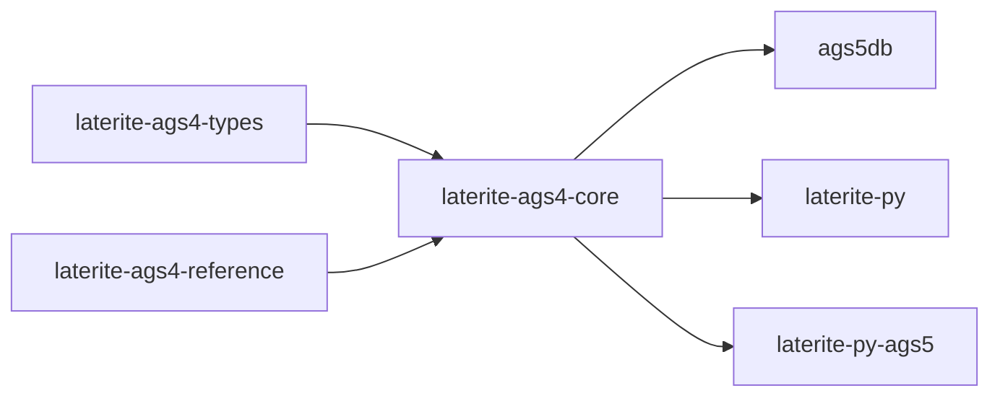

# laterite-ags4-core

<!-- BEGIN GENERATED: crate-card — DO NOT EDIT BY HAND. Regenerate: uv run --no-project python tools/gen_crate_graph.py -->
> [!note] **Cleared for crates.io** — `laterite-ags4-core` v0.10.0 (inherited from the workspace) declares `publish = true`, so it is a public API under semver, not an internal detail.
> **Used by** — [[laterite]], [[laterite-ags4-compliance]], [[laterite-ags4-excel]], [[laterite-ags4-trust]], [[laterite-ags4-wasm]], [[laterite-ags4-xcheck]], [[laterite-cli]], [[laterite-node]], [[laterite-py]].
<!-- END GENERATED: crate-card -->

> [!note] Its modules are surfaced through the [[laterite]] wheel; Rust
> consumers can also depend on the crate directly, per the card above.

## What it is

The **DuckDB-free pure-string** core of the AGS toolchain: every module
that manipulates AGS data as strings without needing a database
connection. Extracted from laterite-ags5-db so the same logic feeds both the
light AGS4 wheel ([[laterite-py]], no DuckDB) and the DuckDB-bound AGS5
wheel (laterite-py-ags5).

Modules (`repo:rust-packages/laterite-ags4-core/src/lib.rs`): `registry` (the
174-group AGS4 union dictionary loaded at build time + group-tree
descriptors — 92 is the dormant AGS5-only count, a different dictionary
entirely; since laterite-dev#475 this module is a flat `pub use` re-export of
[[laterite-ags4-reference]]'s `union`, so this path is unchanged for every
consumer), `ddl`
(pure-string DDL emitter — no DuckDB connection), `ags4_codec` (CRLF /
double-quoted CSV reader), `ags4_writer` (spec-correct AGS4 emitter),
`excel` (AGS4 ↔ XLSX via calamine + rust_xlsxwriter), `transport`
(zstd + age envelope for `pack`/`unpack`/`lock`/`unlock`), and `error`
(the shared `CliError`).

## Inputs / outputs

In: AGS4 byte streams, `.xlsx` workbooks, and pure-string heading values.
Out: parsed group structures, emitted AGS4 / DDL text, packed/encrypted
envelopes. No database I/O lives here — that is added on top by
laterite-ags5-db.

## Where it lives

`repo:rust-packages/laterite-ags4-core` — depends on the typing leaf
[[laterite-ags4-types]], which it **re-exports as `laterite_ags4_core::ags_types`**
(`pub use laterite_ags4_types as ags_types;` in
`repo:rust-packages/laterite-ags4-core/src/lib.rs`) so every downstream consumer
keeps the old `ags_types` path working unchanged. Beyond that leaf it
carries the wasm-hostile deps (age / zstd / calamine / rpassword / csv)
that kept them *out* of [[laterite-ags4-types]].

## Where it fits

Full graph in [[crate-map]]; immediate edges:

## Related

[[crate-map]] · [[laterite-ags4-types]] · [[laterite-ags4-reference]] · [[laterite-transport]] · laterite-ags5-db · [[laterite-py]] · laterite-py-ags5 · [[dec-dictionary-single-source]]
