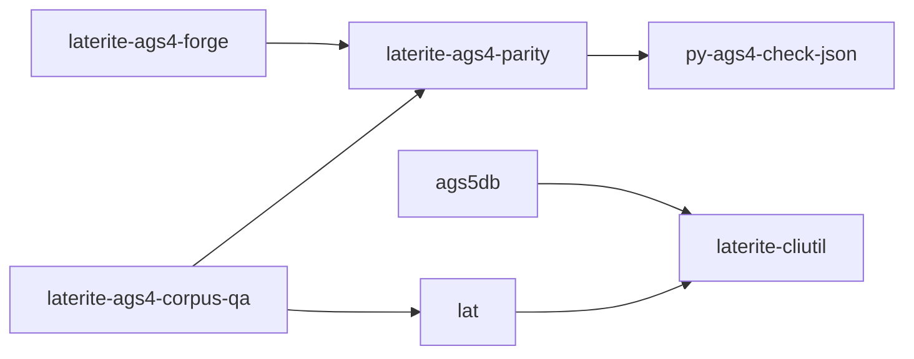

# laterite-ags4-corpus-qa

<!-- BEGIN GENERATED: crate-card — DO NOT EDIT BY HAND. Regenerate: uv run --no-project python tools/gen_crate_graph.py -->
> [!note] **Not published** — `laterite-ags4-corpus-qa` is a workspace crate, internal to this repo, at v0.9.0 (inherited from the workspace).
> **Used by** — nothing else in this workspace.
<!-- END GENERATED: crate-card -->

## What it is
> [!quote] Dogfooding/QA harness: crawl real corpora → validate → parity-cross-check vs python-ags4 (parity.rs). Run-versioned artifacts (runs/<id>/, runs/latest last-write-under-runs wins). The engine that produced the O-32/O-33/O-34 findings.

Six subcommands: `crawl`, `validate`, `parity`, `run` (the original
gather→check→cross-check), plus two added 2026-06-21:
- **`baseline`** — freeze (`--out`) or drift-check (`--check`) a
  deterministic, privacy-scrubbed snapshot of the validator's findings
  over a manifest. Keyed by content sha256; structural `(rule, line,
  group, field_index, severity)` tuples only (no paths/filenames/finding
  text), so it's commit-safe. `--check` exits 1 on drift. It reuses
  `validate`'s `judge` verbatim, so the snapshot reflects the real tool.
  The finding-drift gate for the [[reliquary|parser convergence]] — now
  also **wired per-PR**: a committed baseline over the vendored corpus
  (`repo:rust-packages/laterite-ags4-corpus-qa/baselines/pyags4-vendor.json`, regen
  note beside it) is `--check`ed in the dev satellite's `compliance.yml`
  gate — that tree runs the compliance harness, not this one — pinning the
  engine's absolute finding VALUES where the sibling
  floor-identity check only proves the surfaces agree with each other.
- **`censor`** — anonymise harvested files for sharing (gather →
  **clean** → check): per the generated `sensitive_headings.json` SSOT it
  pseudonymises IDs (refs intact), sets `PROJ_ID` to the file hash
  (== cleaned filename), blanks coordinates, tokenises
  names/labs/accreditation/methods/remarks + named geological formations
  (`GEOL_FORM`/`GEOL_BGS`, location-revealing offshore), strips
  `[GEOLOGICAL UNITS]` from descriptions, deletes non-standard columns/groups
  + their orphaned `DICT`/`ABBR` definitions, and applies any `--redact`
  keyword. Writes hash-named files + a source-stripped manifest (a
  drop-in for `validate`/`baseline`). The SSOT is registered in
  [[data-single-source-audit]]. **The scrub engine itself moved out (#581,
  2026-07-18)** into the shared `laterite-ags4-censor` leaf — this
  subcommand (`repo:rust-packages/laterite-ags4-corpus-qa/src/censor.rs`) is now just
  the crawler/manifest wrapper: resolve the SSOT into a `Policy`, run each
  manifest entry through the leaf's `censor()` in parallel, name outputs by
  source hash. **The browser `Anonymiser` now drives the same leaf too**
  (#581 Phase 2, 2026-07-18) via a `censor` export on the engine wasm
  ([[laterite-ags4-wasm]]) — the two tools are independent callers of one
  engine, not two implementations. See [[crate-map]] ·
  [[dec-ags4-censor-leaf]].

`validate.rs::parse_dict_version` asks the generated `DictVersion::from_edition`
(fixed 2026-07-14) rather than its own hand-written `match` on the five edition
strings — one of three such copies found across the tree; see
[[edition-resolution]] and [[data-single-source-audit]] (row 2).

## Inputs / outputs
> [!quote] In: a corpus dir (--corpus-dir) → crawl→manifest, validate→report.json, parity→parity.json under runs/<id>/ (runs/latest = last write under runs/). Out: per-file Rust vs python verdicts (Agree/…/KnownDivergence{O-N}); the dogfood engine behind O-30..O-34. baseline→a sha-keyed findings snapshot (--out/--check); censor→an anonymised, hash-named corpus + scrubbed manifest.

## Where it lives
`repo:rust-packages/laterite-ags4-corpus-qa`

## Relationship to other components

See [[crate-map]] for the workspace dependency graph.

See [[parity-model]] for the lat ↔ py-ags4-check-json
cross-check. `parity.rs` is being extracted into [[laterite-ags4-parity]]
so [[laterite-ags4-forge]] shares the identical `classify`/`reconcile` without
duplication (behaviour-neutral refactor).

## Related
[[parity-model]] · [[laterite-cli]] · [[laterite-ags4-parity]] · [[laterite-ags4-forge]] · [[crate-map]] · [[data-single-source-audit]] · [[edition-resolution]] · [[dec-ags4-censor-leaf]] · [[laterite-ags4-wasm]]
