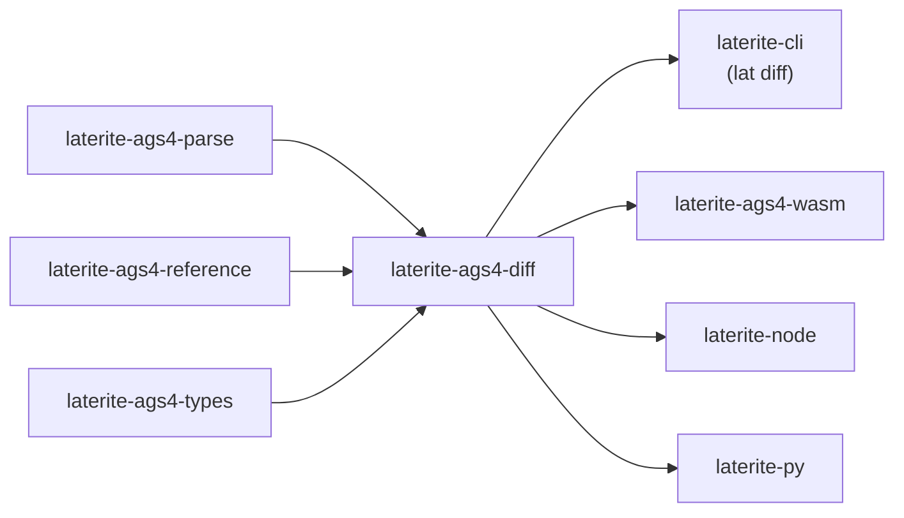

# laterite-ags4-diff

<!-- BEGIN GENERATED: crate-card — DO NOT EDIT BY HAND. Regenerate: uv run --no-project python tools/gen_crate_graph.py -->
> [!note] **Cleared for crates.io** — `laterite-ags4-diff` v0.11.0 (inherited from the workspace) declares `publish = true`, so it is a public API under semver, not an internal detail.
> **Used by** — [[laterite]], [[laterite-ags4-wasm]], [[laterite-cli]], [[laterite-node]], [[laterite-py]].
<!-- END GENERATED: crate-card -->

> [!note] It ships as the `lat diff` verb ([[laterite-cli]]) and the diff
> surface on every binding ([[laterite-py]], [[laterite-node]],
> [[laterite-ags4-wasm]]).

## What it is

A **KEY-aware, type-aware** comparison of two AGS4 files (a baseline `a` and a
revision `b`) — the diff a plain line diff structurally cannot be, because it
understands the data model:

- **Rows are matched by the group's *dictionary* KEY headings, not by line
  order.** A re-sorted or re-numbered file still pairs the same
  boreholes/samples, so moving a row does not read as delete-plus-add. Row
  identity comes from [[laterite-ags4-reference]]'s keychain — the same
  definition [[laterite-ags4-merge]] consumes, so "what identifies a row" is
  defined once.
- **Matched cells are compared through `laterite_ags4_types::parse_value.`** A
  formatting-only change — `"1.0" → "1.00"`, trailing whitespace, an equivalent
  datetime spelling — is **not** reported; only a genuine *typed* change is.

Fallback: a group with no dictionary KEY headings present in both files (a
custom/passthrough group) is matched on its whole row tuple, so a changed row
there surfaces as a remove + add pair and the group's `keyed` flag is `false` —
the limit is made visible rather than hidden.

## Inputs / outputs

In: two `ParsedFile`s (from [[laterite-ags4-parse]]). Out: a `RevisionDelta` —
`GroupDelta`s of `RowDelta`s of `CellDelta`s — that serialises to JS/JSON
unchanged across hosts (`serde`). No DuckDB, no rules engine; it is **wasm-safe**.

## Where it lives

`repo:rust-packages/laterite-ags4-diff`. Deps [[laterite-ags4-parse]] (the
tokenised rows it walks), [[laterite-ags4-reference]] (KEY headings + types), and
[[laterite-ags4-types]] (`parse_value`, the cast that suppresses formatting-only
noise). Consumers: [[laterite-cli]], [[laterite-ags4-wasm]],
[[laterite-node]], [[laterite-py]].

## Relationship to other components

The full workspace graph is in [[crate-map]] (dependency form in
[[crate-dependency-graph]]):

## Related

[[crate-map]] · [[crate-dependency-graph]] · [[laterite-ags4-parse]] · [[laterite-ags4-types]] · [[laterite-ags4-reference]] · [[laterite-ags4-merge]] · [[laterite-cli]] · [[laterite-ags4-wasm]] · [[laterite-py]] · [[laterite-node]]
