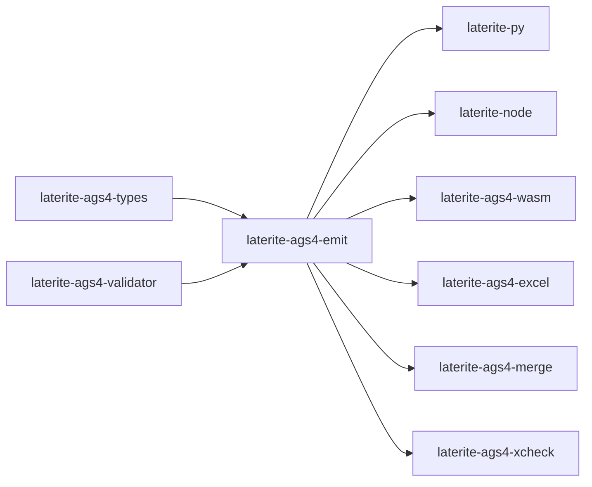

# laterite-ags4-emit

<!-- BEGIN GENERATED: crate-card — DO NOT EDIT BY HAND. Regenerate: uv run --no-project python tools/gen_crate_graph.py -->
> [!note] **Cleared for crates.io** — `laterite-ags4-emit` declares `publish = true`, so it is a public API under semver, not an internal detail. It is versioned on its own line.
> **Used by** — [[laterite]], [[laterite-ags4-excel]], [[laterite-ags4-merge]], [[laterite-ags4-perf]], [[laterite-ags4-wasm]], [[laterite-ags4-xcheck]], [[laterite-node]], [[laterite-py]].
<!-- END GENERATED: crate-card -->

> [!note] The published faces are the wheel's `build_ags4` ([[laterite]]),
> the Node binding's emit verb ([[laterite-node]]) and the browser's writer
> ([[laterite-ags4-wasm]]) — all three over this one crate.

## What it is

The AGS4 **producer**: typed or string cell data in, valid AGS4 plaintext out.
It is the write-side counterpart to the validator's reader, and the reason it is
its own crate is the wasm host — the byte writer used to live inside
`laterite-ags4-core`, whose age/zstd/calamine deps are wasm-hostile, so the
browser could parse AGS4 but not produce it. Extracting the writer (and, with
it, the shared orchestrator) let all four surfaces emit through *one*
implementation instead of one per host. Same leaf-extraction reasoning as
[[dec-laterite-ags4-types-leaf]].

Two layers, both public:

- **`write_ags4` / `write_ags4_matrix`** (`repo:rust-packages/laterite-ags4-emit/src/writer.rs`)
  — the byte-level writer. Emits `GROUP`/`HEADING`/`UNIT`/`TYPE`/`DATA` rows in
  AGS4 file order, every cell double-quote-wrapped with embedded `"` doubled
  (Rule 5), CRLF line ends (Rule 2a), a blank line between sections. UNIT and
  TYPE rows are padded to the heading count so the column count is stable, TYPE
  defaulting to `X`.
- **`emit_ags4`** (`repo:rust-packages/laterite-ags4-emit/src/emit.rs`) — the
  host-agnostic orchestrator every surface actually calls: resolve UNIT/TYPE per
  heading (**hybrid** — the caller's explicit value wins, else the per-edition
  standard dictionary fills, else `""` / `"X"`), format each cell
  (`laterite_ags4_types::ags4_str` for typed values, verbatim for strings), write the
  sections, then apply the chosen `EmitMode`.

The pipeline **streams and judges its own writing**
([[dec-emit-streamed-verdict]]): each group's section is formatted, written
and dropped before the next formats — on both doors — so no whole-file
formatted slab exists, and metadata synthesis derives from accumulators
filled as the groups pass. The verdict is **writer-built**: the recording
writer notes every line and cell span as it writes, and the parse leaf's
`builder::ParsedFileBuilder` ([[laterite-ags4-parse]]) assembles the
validating-profile `ParsedFile` over the emitted bytes adopted as the
verdict's buffer — no `parse_bytes` runs on the happy path, and the bytes
leave zero-copy. Two permanent differentials enforce this: the recorded
section writer is pinned byte-identical to `write_ags4`, and the
constructed verdict is pinned equal to a real parse of the same bytes on
both definitions (findings equality, and field equality on the
read-inventory), with a corpus leg in `examples/verdict_differential.rs`.
Only `AutoFix`'s rare actual-fixes branch still parses — its own rewritten
output, a genuinely different document.

`EmitMode` is the crate's one policy knob: **Strict** refuses to emit output that
violates an error-severity rule, **Report** emits and hands back the findings, and
**AutoFix** (the default) applies the *safe* mechanical fixes and returns the
compliant-where-fixable bytes plus whatever findings remained. The fix machinery
is not new code — it is the validator's shipped `compute_fixes`/`apply_fixes`, the
same pair behind the web app's "fix all safe" button, so a fix means the same
thing wherever it is applied.

## Inputs / outputs

In, via two doors that join at the formatted group ([[dec-emit-cell-representation]]):
one `GroupInput` per group — code, headings, optional per-heading UNIT/TYPE
overrides, and rows of [[laterite-ags4-types]] `Cell` cells (typed values, or
strings from browser JSON — deliberately *not* a `serde_json::Value`); or,
behind the optional `arrow` feature, one `ArrowGroup` per group into
`emit_ags4_from_arrow`, which streams each `RecordBatch` cell straight off its
array into the formatted string — no row-major intermediate — shared by the
native, node and browser hosts rather than reimplemented per host. A
differential test holds the doors byte-identical where they should agree, and
pins the one intended divergence (a typed temporal renders at its heading's
declared UNIT precision; a caller's string emits verbatim).

Out: `EmitResult` — the AGS4 bytes plus any residual findings; or `EmitError`
(`Invalid` under Strict). Everything is UTF-8, and the findings are on the
very bytes returned: the verdict's buffer IS the output buffer
([[dec-emit-streamed-verdict]]), so what is judged is what is handed back —
byte for byte, with no re-read in between.

## Where it lives

`repo:rust-packages/laterite-ags4-emit`. Deps [[laterite-ags4-types]] (`ags4_str` +
the quoting primitive), [[laterite-ags4-validator]] (the per-edition
dictionary, `check_parsed`, the fix machinery) and [[laterite-ags4-parse]]
directly (the `builder` seam the writer-built verdict is assembled through),
plus `encoding_rs` — no `serde_json` (dropped with the `Cell` rewrite, #790,
and its absence is the ratchet), no DuckDB, no `laterite-ags4-core`, so it
stays wasm-clean. It re-exports the validator's `DictVersion` so a caller can
choose an edition without taking a validator dependency of its own.

Consumers: [[laterite-py]], [[laterite-node]], [[laterite-ags4-wasm]],
`laterite-ags4-excel`, `laterite-ags4-merge`, and [[laterite-ags4-xcheck]] — which
matters, because xcheck's authority leg drives *this* crate directly rather than
through a binding, making it the reference column every surface's emitted values
are held to.

## Relationship to other components

The full workspace graph is in [[crate-map]]; this crate's immediate edges:

## Related

[[crate-map]] · [[laterite-ags4-types]] · [[laterite-ags4-validator]] · [[laterite-ags4-xcheck]] · [[dec-laterite-ags4-types-leaf]]
