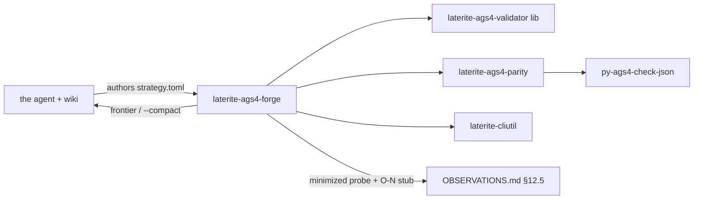

# laterite-ags4-forge

<!-- BEGIN GENERATED: crate-card — DO NOT EDIT BY HAND. Regenerate: uv run --no-project python tools/gen_crate_graph.py -->
> [!note] **Not published** — `laterite-ags4-forge` is a workspace crate, internal to this repo, versioned with the workspace.
> **Used by** — nothing else in this workspace.
<!-- END GENERATED: crate-card -->

## What it is
> [!quote] **Implemented** (`repo:rust-packages/laterite-ags4-forge`, P0–P5
> complete + tested; rationale + phasing in
> [[dec-ags4-forge-evolutionary-dogfood]]). First result:
> [[strat-forge-rule10a-relational]] retired the Rule-10a parity
> blind spot (AGREE) and independently reproduced O-35.
> Evolutionary AGS4 dual-validation dogfood CLI: it **synthesizes**
> realistic, spec-valid AGS4 files (always varied — values sampled from
> the bundled dictionary, seed controls only reproducibility), then
> either injects targeted rule violations (`gen --inject` single /
> `gen --combine` multi-fault, each landing at a seeded *placement*) or
> **evolves** toward novel divergences (`run`). It runs every candidate
> through the in-process Rust validator and (confidence-gated)
> python-ags4. The search has three axes: **rule** (small, enumerable),
> **placement** (large, sampled), and **type** — the AGS TYPE a value is
> declared as. Type behaves like rule rather than placement (small,
> enumerable), and was collapsed into placement until
> [[dec-forge-type-axis-instrument]] named it; what a scaffold can actually
> reach is pinned by `scaffolds_reach_a_pinned_set_of_ags_types` in
> `repo:rust-packages/laterite-ags4-forge/src/synth/mod.rs`, so it cannot
> widen unnoticed. `mine` exploits the rule axis — it
> synthesizes *every* rule-combination across a placement-seed sweep,
> subtracts the rule-break shapes the python-ags4 fixture corpus already
> covers, and spends the oracle only on the novel **divergence-prone**
> signatures (`--always-validate` for all gaps). A combination's true
> rule-set is always *read from the validator*, never assumed from the
> injectors' targets (faults interact/mask/cascade). The injector set
> covers AGS Format Rules 5/8/10a/10b/10c/13/14/16/17/19 — `rule10b`
> (`empty-required`, dictionary-driven) is a *multi-rule* injector: a realistic
> AGS file's only REQUIRED-non-KEY fields are structural (`TRAN_AGS` drives
> edition detection; the `ABBR/UNIT/TYPE` `*_DESC` definitions), so blanking
> them cascades rather than isolating Rule 10b (a real property of AGS
> structure, not a fixture quirk). `catalog` prints the injector→rule map
> (token, target, scaffold, mutation) plus the documented record of which
> canonical rules aren't single-injectable (1/2a/3/6 byte-level, 2b
> descriptor-order, 4 field-count, 9/18/19a/19b heading-name co-trip, 15
> candidate-future, 11a/11b/11c record-link, 20 FILE). The staged, matrix-driven plan for running `mine` over time to
> systematically harvest new divergences is [[strat-forge-divergence-mining-campaign]].
> the agent (armed with this wiki) authors a declarative strategy;
> the binary is the
> deterministic synthesize/inject/evolve/mine/catalog/report muscle and
> embeds **no LLM**. `describe` previews the **BS 5930** soil-description
> engine ([[bs5930-soil-descriptions]]) — the constraint-valid `GEOL_DESC`
> source for realistic strata. `describe --organic` opens the third
> (organic/peat) lane; it is off by default because turning it on re-rolls
> every seed, which re-bases our benches **and** a downstream consumer's
> committed output ([[dec-forge-audience-boundary]]). `--principal <SOIL>`
> and `--lane <coarse|fine|peat>` filter the drawn pool rather than steering
> the draw, so `--seed` keeps its meaning and each row still reports the seed
> that produced it; asking for peat implies `--organic`, since the alternative
> is silently returning nothing. The synthesizer has three scaffolds:
> `minimal` (PROJ/TRAN), `loca-samp` (the LOCA→SAMP→GEOL borehole core),
> and `wide` — a **dictionary-driven** fill of every *safe* LOCA-child group
> (breadth) **plus the lab-test depth below SAMP**: the ~30 SAMP-child result
> groups (LLPL, TRIG, GRAG, …), their own safe children (the **3rd relational
> level** — TREG→TRET, CONG→CONS, so `LOCA→SAMP→test→spec` joins), and the
> LBSG/LBST test schedule — a ~120-group wide-and-deep file with ABBR/UNIT/TYPE
> scanned from whatever those groups use, so Rule 15/16/17 stay clean by
> construction. `gen --scaffold wide --lab-test-rate 
` makes the per-sample
> test matrix sparse (default 1.0 = dense; seeded → deterministic). `scale --size
> <500KB…1GB>` is the **scale ladder**: it calibrates the borehole count
> (a cheap two-point byte measurement, id-width-corrected) to land near a
> target size and streams the clean `wide` file to disk — the sized fixtures
> the perf/compliance matrix consumes. `scale --inject <token> --density 
`
> is the **fault-density mode**: it spreads a per-row/per-cell injector
> (`rule10b|rule10c|rule8|rule5|rule16`) across that fraction of applicable
> sites (deterministic, reservoir-sampled; `1.0` = every site), so a
> size-scaled *densely-dirty* twin of a clean rung prices the validator's
> error-emission path at scale (T5) — e.g. `--inject rule16 --density 1.0`
> is ~314k Rule-16 findings on a 25 MB file.
> `edit` is the one command that does not synthesize: it applies **structured
> edits to a file that already exists** — set/blank a cell, rewrite the UNIT or
> the TYPE a heading declares, add a column, add or insert a row, delete a row,
> drop a column or a whole group, several at once from a `--patch` file. Rewriting a UNIT is what gives the tool a
> **Rule 15** injection at all: the synthesizer scans UNIT from whatever the
> groups use, so a synthetic file is clean by construction and nothing could
> introduce a unit the UNIT group never defined. Note that the injection is an
> *undeclared* unit, not an absent one — both engines skip an empty unit, so
> emptying one leaves a file that still dual-validates clean.
> Rewriting a TYPE is how the **type axis** gets closed: the scaffolds reach a
> handful of the AGS types (pinned by a test in `synth`), so a question like
> *do the two engines agree on a `3SF` column?* had no file to ask it with.
> `--set-type` re-formats the column to satisfy the new declaration, delegating
> the numeric families and the precision-aware `DT` renderer to
> [[laterite-ags4-types]] rather than reimplementing them; `--set-type-raw`
> moves the declaration and leaves every value alone, which is how a cell that
> contradicts its own type is made on purpose. **Re-formatting alone does not
> leave a spec-valid file**: a type code absent from the file's TYPE group is a
> Rule 17 finding, so a clean projection is `--set-type` *plus* an `add-row`
> into TYPE — one `--patch` does both, and the result dual-validates with no
> findings on either engine.
> `--add-column` gives a group a heading it does not have, empty in every data
> row and present in every descriptor row the group carries, so the arity stays
> consistent. A heading the group already has is refused; one the **dictionary**
> has never heard of is accepted, because that fault is the tool's job to make.
> Left undeclared the new column is not neutral — its empty TYPE cell is a Rule
> 17 finding on python-ags4 and not on laterite, which is [[O-19]] reached
> directly — so a clean column is `--add-column` with `--set-unit` and
> `--set-type`, which one `--patch` applies in a single pass whatever order they
> were written in.
> It exists because the investigation behind the Rule 10c parentage warning
> produced three wrong results in a row from hand-manipulating AGS text (a
> value containing a comma torn in half, line endings converted by a text
> reader, a ragged row that made one validator bail and read as a divergence),
> and none of those were interesting. Untouched lines are written back
> **byte-verbatim** — the difference between input and output IS the edit —
> which is a property of the line-oriented splice, not of re-emitting: a
> parse→[[laterite-ags4-emit|emit]] round-trip is a *construction* API and
> normalises what it did not change. A line an operation names is rebuilt
> canonically, because splicing a comma-bearing value into a field that was
> not quoted is one of the three failures above. Operations resolve against the
> file **as it arrived** — a row number always counts the original data rows —
> and then apply in a canonical order rather than the order they were listed,
> so a patch cannot mean two things: asking to delete a group and also to edit
> a row in it can only mean the delete. `--insert-row` places a row AT a
> position rather than appending it, so a fault can be planted mid-group; a
> position past the last row is refused rather than quietly appended, because a
> typo that becomes an append gives a reproducer that does not reproduce.
> `--patch-template` prints a worked **projection** rather than a pair of
> unrelated edits: create a column, declare its UNIT and TYPE, fill it, and add
> the type code to the TYPE group — the combination that dual-validates with no
> findings on either engine.
> Seven shapes are refused by name rather
> than edited into something worse: a group, row or heading that is not there;
> a file declaring one GROUP code **twice** (every locator would mean two
> things, and the parse leaf resolves the halves inconsistently — rows
> first-seen-wins, headings last-seen-wins); a row too short to carry a
> column being dropped; and a group with no descriptor row to declare anything
> on — writing the row would be a different operation, and writing it silently
> would make the patch mean something its author never asked for; a TYPE token
> the type system cannot read at all; and a value that cannot be rendered to
> satisfy the type being declared, named by group, heading and row, with
> nothing written, because half a projected column is worse than none of one;
> and a heading a group already has. The **minimizer's field pass
> runs on this layer too**: it used to split a DATA line on `,` with no quote
> awareness, so shrinking a value like `"north, then east"` cut it in half and
> left the quote open — at the same field count, so no arity rule noticed, and
> a reproducer came out that was not a smaller version of its input.

## Inputs / outputs
> [!quote] In: a declarative `strategy.toml` (the executable twin of a
> [[strategies/_README\|strategies]] page) + seeds (Mode-B synthesizer,
> the 24 rule fixtures, `test_data.ags`, optional vendored upstream
> python-ags4 `tests/` corpus). Out: run-versioned
> `forge-runs/runs/<id>/` — `report.json`, `frontier.json` (emitted on
> deep staleness → the agent authors the next strategy), `repros/<sig>/`
> ddmin-minimized reproducers + drafted insight/O-N stubs, and the
> parity-confidence ledger. `mine` writes its `mine_<combo>_s<seed>.ags`
> candidates + a `report.json` (corpus gaps, divergence-prone count,
> per-candidate signatures) into the same run-versioned dir; its
> divergence-prone rule set is derived from the [[laterite-ags4-parity]]
> `classify` arms (Rules 4/5/6/19b) + OBSERVATIONS behavioural entries
> (Rules 7/8). `--compact` token-lean output drives the `/loop` agent
> cycle.

## Where it lives
Planned `repo:rust-packages/laterite-ags4-forge` (sibling of
`repo:rust-packages/laterite-ags4-corpus-qa`). Reuses the validator library
`repo:rust-packages/laterite-ags4-validator/src/lib.rs`, the shared
[[laterite-ags4-parity]] (extracted from
`repo:rust-packages/laterite-ags4-corpus-qa/src/parity.rs`), the shared parse
leaf [[laterite-ags4-parse]] (`edit`'s line model + the one tokenizer, see
`repo:rust-packages/laterite-ags4-forge/src/edit.rs`), the python bridge
`tools/py_ags4_check_json.py`, and [[laterite-cliutil]] per the
[[agent-first-cli-contract]].

## Relationship to other components

See [[evolutionary-dogfooding]] for the loop and
[[parity-confidence-model]] for the adaptive oracle gating.

## Related
[[parity-model]] · [[laterite-ags4-corpus-qa]] · [[laterite-ags4-parity]] · laterite-ags4-compliance · [[agent-first-cli-contract]] · [[evolutionary-dogfooding]] · [[parity-confidence-model]] · [[dec-ags4-forge-evolutionary-dogfood]] · [[strat-forge-rule10a-relational]] · [[bs5930-soil-descriptions]] · [[crate-map]] · [[demo-state-sweep]]
