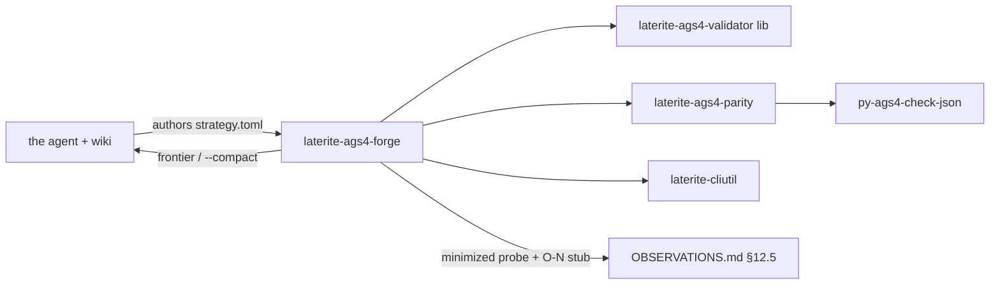

# laterite-ags4-forge

<!-- BEGIN GENERATED: crate-card — DO NOT EDIT BY HAND. Regenerate: uv run --no-project python tools/gen_crate_graph.py -->
> [!note] **Not published** — `laterite-ags4-forge` is a workspace crate, internal to this repo, at v0.9.0 (inherited from the workspace).
> **Used by** — nothing else in this workspace.
<!-- END GENERATED: crate-card -->

## What it is
> [!quote] **Implemented** (`repo:rust-packages/laterite-ags4-forge`, P0–P5
> complete + tested; rationale + phasing in
> [[dec-ags4-forge-evolutionary-dogfood]]). First result:
> [[strat-forge-rule10a-relational]] retired the Rule-10a parity
> blind spot (AGREE) and independently reproduced O-35.
> Evolutionary AGS4 dual-validation dogfood CLI: it **synthesizes**
> realistic, spec-valid AGS4 files (always varied — values sampled from
> the bundled dictionary, seed controls only reproducibility), then
> either injects targeted rule violations (`gen --inject` single /
> `gen --combine` multi-fault, each landing at a seeded *placement*) or
> **evolves** toward novel divergences (`run`). It runs every candidate
> through the in-process Rust validator and (confidence-gated)
> python-ags4. The search has two axes: **rule** (small, enumerable) and
> **placement** (large, sampled). `mine` exploits the rule axis — it
> synthesizes *every* rule-combination across a placement-seed sweep,
> subtracts the rule-break shapes the python-ags4 fixture corpus already
> covers, and spends the oracle only on the novel **divergence-prone**
> signatures (`--always-validate` for all gaps). A combination's true
> rule-set is always *read from the validator*, never assumed from the
> injectors' targets (faults interact/mask/cascade). The injector set
> covers AGS Format Rules 5/8/10a/10b/10c/13/14/16/17/19 — `rule10b`
> (`empty-required`, dictionary-driven) is a *multi-rule* injector: a realistic
> AGS file's only REQUIRED-non-KEY fields are structural (`TRAN_AGS` drives
> edition detection; the `ABBR/UNIT/TYPE` `*_DESC` definitions), so blanking
> them cascades rather than isolating Rule 10b (a real property of AGS
> structure, not a fixture quirk). `catalog` prints the injector→rule map
> (token, target, scaffold, mutation) plus the documented record of which
> canonical rules aren't single-injectable (1/2a/3/6 byte-level, 2b
> descriptor-order, 4 field-count, 9/18/19a/19b heading-name co-trip, 15
> candidate-future, 11a/11b/11c record-link, 20 FILE). The staged, matrix-driven plan for running `mine` over time to
> systematically harvest new divergences is [[strat-forge-divergence-mining-campaign]].
> the agent (armed with this wiki) authors a declarative strategy;
> the binary is the
> deterministic synthesize/inject/evolve/mine/catalog/report muscle and
> embeds **no LLM**. `describe` previews the **BS 5930** soil-description
> engine ([[bs5930-soil-descriptions]]) — the constraint-valid `GEOL_DESC`
> source for realistic strata. The synthesizer has three scaffolds:
> `minimal` (PROJ/TRAN), `loca-samp` (the LOCA→SAMP→GEOL borehole core),
> and `wide` — a **dictionary-driven** fill of every *safe* LOCA-child group
> (breadth) **plus the lab-test depth below SAMP**: the ~30 SAMP-child result
> groups (LLPL, TRIG, GRAG, …), their own safe children (the **3rd relational
> level** — TREG→TRET, CONG→CONS, so `LOCA→SAMP→test→spec` joins), and the
> LBSG/LBST test schedule — a ~120-group wide-and-deep file with ABBR/UNIT/TYPE
> scanned from whatever those groups use, so Rule 15/16/17 stay clean by
> construction. `gen --scaffold wide --lab-test-rate 
` makes the per-sample
> test matrix sparse (default 1.0 = dense; seeded → deterministic). `scale --size
> <500KB…1GB>` is the **scale ladder**: it calibrates the borehole count
> (a cheap two-point byte measurement, id-width-corrected) to land near a
> target size and streams the clean `wide` file to disk — the sized fixtures
> the perf/compliance matrix consumes. `scale --inject <token> --density 
`
> is the **fault-density mode**: it spreads a per-row/per-cell injector
> (`rule10b|rule10c|rule8|rule5|rule16`) across that fraction of applicable
> sites (deterministic, reservoir-sampled; `1.0` = every site), so a
> size-scaled *densely-dirty* twin of a clean rung prices the validator's
> error-emission path at scale (T5) — e.g. `--inject rule16 --density 1.0`
> is ~314k Rule-16 findings on a 25 MB file.

## Inputs / outputs
> [!quote] In: a declarative `strategy.toml` (the executable twin of a
> [[strategies/_README\|strategies]] page) + seeds (Mode-B synthesizer,
> the 24 rule fixtures, `test_data.ags`, optional vendored upstream
> python-ags4 `tests/` corpus). Out: run-versioned
> `forge-runs/runs/<id>/` — `report.json`, `frontier.json` (emitted on
> deep staleness → the agent authors the next strategy), `repros/<sig>/`
> ddmin-minimized reproducers + drafted insight/O-N stubs, and the
> parity-confidence ledger. `mine` writes its `mine_<combo>_s<seed>.ags`
> candidates + a `report.json` (corpus gaps, divergence-prone count,
> per-candidate signatures) into the same run-versioned dir; its
> divergence-prone rule set is derived from the [[laterite-ags4-parity]]
> `classify` arms (Rules 4/5/6/19b) + OBSERVATIONS behavioural entries
> (Rules 7/8). `--compact` token-lean output drives the `/loop` agent
> cycle.

## Where it lives
Planned `repo:rust-packages/laterite-ags4-forge` (sibling of
`repo:rust-packages/laterite-ags4-corpus-qa`). Reuses the validator library
`repo:rust-packages/laterite-ags4-validator/src/lib.rs`, the shared
[[laterite-ags4-parity]] (extracted from
`repo:rust-packages/laterite-ags4-corpus-qa/src/parity.rs`), the python bridge
`tools/py_ags4_check_json.py`, and [[laterite-cliutil]] per the
[[agent-first-cli-contract]].

## Relationship to other components

See [[evolutionary-dogfooding]] for the loop and
[[parity-confidence-model]] for the adaptive oracle gating.

## Related
[[parity-model]] · [[laterite-ags4-corpus-qa]] · [[laterite-ags4-parity]] · laterite-ags4-compliance · [[agent-first-cli-contract]] · [[evolutionary-dogfooding]] · [[parity-confidence-model]] · [[dec-ags4-forge-evolutionary-dogfood]] · [[strat-forge-rule10a-relational]] · [[bs5930-soil-descriptions]] · [[crate-map]]
