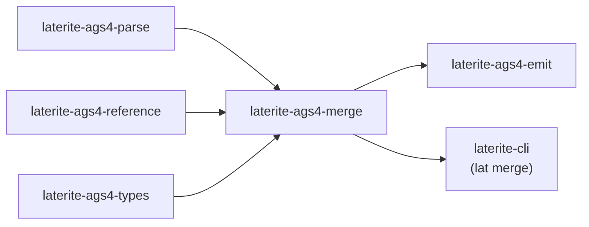

# laterite-ags4-merge

> [!note] **Internal implementation detail** — a workspace crate, not a public
> API. It ships as the `lat merge` verb ([[laterite-cli]]) and the merge
> surface on the bindings. The *semantics* are the decision
> [[dec-ags4-merge-semantics]]; this page is the crate.

## What it is

Reconcile **N deliveries** of one project into a single file. Real geotechnical
delivery is incremental — each AGS4 file carries only the groups/rows captured
that round — and merge folds them, **in caller-given argument order**, into one.
Three load-bearing decisions (the full rationale is
[[dec-ags4-merge-semantics]]):

- **Union, never intersection.** A row or group absent from a later file is
  *silence*, not a deletion — a producer simply expressed no opinion this round.
  Merge only ever *adds*; nothing a later file omits is dropped. (There is
  deliberately no delete/supersede primitive, so a KEY-value correction reads as a
  new row — a documented limit of KEY-based identity, not a silent mishandling.)
- **Argument order is authority; `TRAN_DATE` only cross-checks.** When two files
  carry the same KEY with different content, the later-argument file wins. If its
  file-level `TRAN_DATE` predates an earlier file's, that contradiction is
  *warned* (advisory), never blocking — `TRAN_DATE` is the only machine-orderable
  transmission field, and even it is file-level, blind to a per-row regression.
- **Type disagreement resolves up a lattice, never down.** A heading two files
  typed differently is settled by `TypeClashMode`: `Error` refuses (the default),
  `Widen` falls back to `X` (the top of the AGS type lattice — raw text holds any
  value faithfully), and `Promote` keeps the column numeric by taking the greatest
  precision in the `nDP` family and zero-padding the rest. `Widen` is
  emission-only; `Promote` is the one place merge **rewrites a cell**, confined to
  appending zeros to a decimal (`pad_decimals` — string-only, never via `f64`,
  never rounding).

Row identity comes from the ONE shared definition
(`laterite_ags4_reference::keychain::key_heading_names`) that
[[laterite-ags4-diff]] also consumes — merge never re-derives "what identifies a
row".

## Inputs / outputs

In: a slice of `ParsedFile`s (argument order = authority) and `MergeOpts`
(including the `TypeClashMode`). Out: a `MergeResult` (merged bytes +
`MergeWarning`s + `RevisionNote`s) or a `MergeError`. The merged bytes are written
through [[laterite-ags4-emit]], whose default `EmitMode::AutoFix` repairs
Rule-8-invalid cells exactly as it does for every other writer — that is emit's
contract, not merge's.

## Where it lives

`repo:rust-packages/laterite-ags4-merge`. Deps [[laterite-ags4-parse]],
[[laterite-ags4-reference]] (the keychain), [[laterite-ags4-emit]] (the writer),
and [[laterite-ags4-types]] (`pad_decimals`), plus `serde_json`. DuckDB-free.
Consumers: [[laterite-cli]] and the bindings.

## Relationship to other components

The full workspace graph is in [[crate-map]] (dependency form in
[[crate-dependency-graph]]):

## Related

[[crate-map]] · [[crate-dependency-graph]] · [[laterite-ags4-parse]] · [[laterite-ags4-reference]] · [[laterite-ags4-emit]] · [[laterite-ags4-types]] · [[laterite-ags4-diff]] · [[dec-ags4-merge-semantics]] · [[laterite-cli]]
