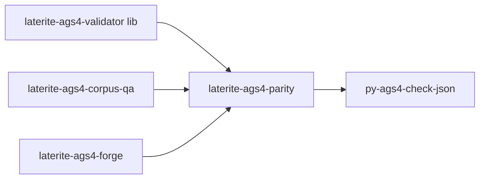

# laterite-ags4-parity

<!-- BEGIN GENERATED: crate-card — DO NOT EDIT BY HAND. Regenerate: uv run --no-project python tools/gen_crate_graph.py -->
> [!note] **Not published** — `laterite-ags4-parity` is a workspace crate, internal to this repo, at v0.9.0 (inherited from the workspace).
> **Used by** — [[laterite-ags4-compliance]], [[laterite-ags4-corpus-qa]], [[laterite-ags4-forge]].
<!-- END GENERATED: crate-card -->

## What it is
> [!quote] **Implemented** (`repo:rust-packages/laterite-ags4-parity`,
> extracted in P1 — laterite-ags4-corpus-qa behaviour-neutral, full suite +
> the real-python parity-matrix dogfood green; see
> [[dec-ags4-forge-evolutionary-dogfood]]). The shared parity
> library extracted out of
> `repo:rust-packages/laterite-ags4-corpus-qa/src/parity.rs` so it is consumed
> by **both** [[laterite-ags4-corpus-qa]] and [[laterite-ags4-forge]] instead of
> duplicated: `RustResult`, `Parity`, `classify`, `reconcile`
> (the documented O-2/O-3/O-26/O-30/O-34 arms), `PyOracle` (the
> `run_py` python bridge + `--selfcheck` version pin), and the
> seedable `Rng`/`reservoir`. The extract-over-duplicate stance is the
> same one that created [[laterite-cliutil]].

## Inputs / outputs
> [!quote] In: a Rust crate dependency (path). Out: the parity verdict
> primitives + python oracle bridge. Depends *on*
> `repo:rust-packages/laterite-ags4-validator` and never the reverse, so
> the validator's lean dep-graph guarantee is untouched (no
> walkdir/rayon/clap). The corpus-qa refactor is behaviour-neutral —
> the existing `classify`/`reconcile` unit tests move with the code
> and must stay green.

## Where it lives
Planned `repo:rust-packages/laterite-ags4-parity`. Today the source-of-truth is
`repo:rust-packages/laterite-ags4-corpus-qa/src/parity.rs` (the [[parity-model]]
authority); the `from_outcome` shim + graceful-degradation/oracle-drift
policy stay at the [[laterite-ags4-corpus-qa]] call site.

## Relationship to other components

See [[parity-model]] for the verdict semantics this crate carries.

## Related
[[parity-model]] · [[laterite-ags4-corpus-qa]] · [[laterite-ags4-forge]] · laterite-ags4-compliance · [[agent-first-cli-contract]] · [[dec-ags4-forge-evolutionary-dogfood]] · [[crate-map]]
