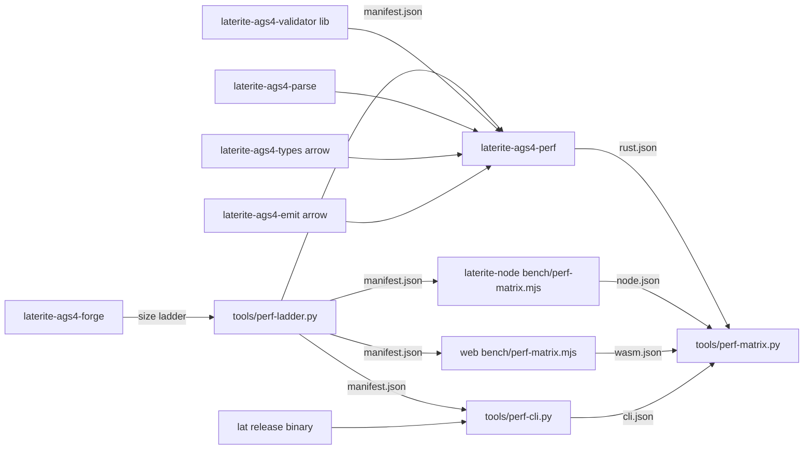

# laterite-ags4-perf

<!-- BEGIN GENERATED: crate-card — DO NOT EDIT BY HAND. Regenerate: uv run --no-project python tools/gen_crate_graph.py -->
> [!note] **Not published** — `laterite-ags4-perf` is a workspace crate, internal to this repo, versioned with the workspace.
> **Used by** — nothing else in this workspace.
<!-- END GENERATED: crate-card -->

## What it is
> [!quote] **Implemented** (`repo:rust-packages/laterite-ags4-perf`). The rust
> leg of the cross-surface performance matrix — a **dev/QA bin, never
> shipped** (`publish = false`). It measures the three operations every
> shipped surface performs — `validate`, `parse-to-typed` and `write` — over
> the [[laterite-ags4-forge]]-generated size ladder, in both of the
> [[perf-campaign]]'s instruments (wall time, and peak RSS of a fresh
> subprocess), so the rust path can be compared like-for-like against the
> python/node/wasm hosts.

It lives in its own crate rather than the validator's `benches/` because a
*bin* pulls regular `[dependencies]` (the data parser + the Arrow typing
leaf + the emit engine) that the validator's deliberately lean runtime
dep-graph must not gain — a Criterion bench's dev-deps wouldn't, but a bin
would. The validator's own `validate_large_fixture` Criterion bench stays
put as the rust *regression* guard; this crate is the *comparison* matrix.

## Inputs / outputs
> [!quote] In: the forge ladder manifest
> (`output/perf-ladder/manifest.json`, written by `tools/perf-ladder.py`,
> which materialises the python lane's SHA-pinned rungs — one fixture set on
> disk serves every harness). Out: the matrix's *uniform* result schema
> (schema 2)
> `{surface, results:[{op, rung, bytes, median_ms, throughput_mb_s, mem?}]}`
> that `tools/perf-matrix.py` merges with the other surfaces — so the
> aggregator is a dumb merger rather than a pile of per-tool format parsers.

`parse-to-typed` reads the file bytes once *outside* the timed loop and
measures parse + materialise-every-group-to-Arrow — the same work the
wasm/node/python hosts do on in-memory bytes. `validate` goes through the
validator's public `check_file(path)` (the OS page cache makes the repeated
read negligible, noted as a caveat in the report). `write` drives the shared
Arrow emit door (`emit_ags4_from_arrow` — the one the py/node/wasm hosts all
drive) with the typed input prepared outside the timed loop, so its time is
the emit engine's, given held input.

The `mem` column is the campaign's cross-surface memory instrument (epic
#820 decision 1): each (op, rung) cell is one fresh `--mem-worker` child —
this same bin — running the operation once end-to-end and reporting its own
`ru_maxrss` at exit. The semantics are the python-lane harness's, shared
deliberately: the same 265 MB rung cap, and a cell the harness vetoes is a
**recorded refusal** (`beyond-mem-cap` / `swapped` / `failed`), never a
silent skip. A write cell's peak includes reading and typing the input — you
cannot write what you do not hold — so it is attributed against the same
rung's `parse-to-typed` cell. `--skip-mem` omits the column entirely.

## Where it lives
`repo:rust-packages/laterite-ags4-perf` (`[[bin]]` `laterite-ags4-perf`).
Deps [[laterite-ags4-validator]] + `laterite-ags4-parse` +
`laterite-ags4-types` (the `arrow` feature) + [[laterite-ags4-emit]] (the
`arrow` door) — all already public, none of them the DuckDB-ingest codec —
so the harness materialises types and emits on the **same paths the shipped
bindings take**.

## Relationship to other components

The Node lane (#823) is this bin's sibling, not a consumer: the same three
ops, the same fresh-child peak-RSS instrument and refusal semantics, driven
through the npm package's public API (napi marshalling and arrow-js decode
included) — see [[laterite-node]]. The wasm lane (#824,
`web/bench/perf-matrix.mjs`) is the next sibling, through the browser
cdylib's public API — same schema, but its memory column is the
**linear-memory high-water instrument**, a separately labelled claim that
the merger never folds into a peak-RSS column ([[perf-campaign]] rule 13).
The CLI lane (#825, `tools/perf-cli.py`) closes the surface set: it drives
an explicitly named release `lat` binary (`--lat-bin` / `$LAT_BIN` / this
checkout's build — never `PATH`, three programs answer to `lat`) with one
fresh subprocess per cell, so the timed child IS the memory child's shape.
Its `validate` shares the axis block; its read and write doors are the
CLI's own (`lat read <bulk-group> --csv --out`, and `lat merge` self-merge
— the one verb that drives the emit engine), so they carry their own op
names (`read`, `merge`) and a per-row `door` string instead of borrowing
`parse-to-typed`/`write` rows they would misrepresent.

The lanes' shared measurement contract — the rung cap, the refusal
vocabulary, the swap watch, the statistics — is held by **each copy's own
unit tests**, the accepted mechanism per #865's decision (owner,
2026-09-02): the rust bin, the node and wasm lanes each pin their copy, and
the CLI lane needs no copy at all — it imports the python harness's
machinery outright, which is also what finally put tests on the python
copy.

## Related
[[laterite-ags4-forge]] · [[laterite-ags4-validator]] · [[perf-campaign]] · [[crate-map]]
