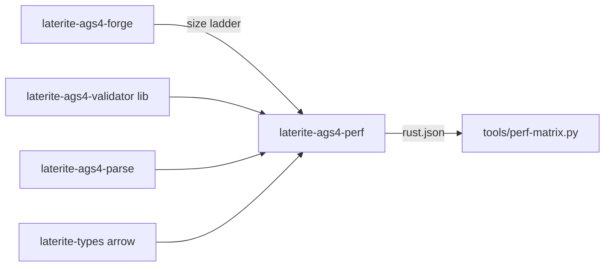

# laterite-ags4-perf

## What it is
> [!quote] **Implemented** (`repo:rust-packages/laterite-ags4-perf`). The rust
> leg of the cross-surface performance matrix — a **dev/QA bin, never
> shipped** (`publish = false`). It times the two read operations every
> shipped surface performs — `validate` and `parse-to-typed` — over the
> [[laterite-ags4-forge]]-generated size ladder, so the rust path can be
> compared like-for-like against the python/node/wasm hosts.

It lives in its own crate rather than the validator's `benches/` because a
*bin* pulls regular `[dependencies]` (the data parser + the Arrow typing
leaf) that the validator's deliberately lean runtime dep-graph must not
gain — a Criterion bench's dev-deps wouldn't, but a bin would. The
validator's own `validate_large_fixture` Criterion bench stays put as the
rust *regression* guard; this crate is the *comparison* matrix.

## Inputs / outputs
> [!quote] In: the forge ladder manifest
> (`output/perf-ladder/manifest.json`, produced by `tools/perf-ladder.py`).
> Out: the matrix's *uniform* result schema
> `{surface, results:[{op, rung, median_ms, throughput_mb_s}]}` that
> `tools/perf-matrix.py` merges with the other surfaces — so the aggregator
> is a dumb merger rather than a pile of per-tool format parsers.

`parse-to-typed` reads the file bytes once *outside* the timed loop and
measures parse + materialise-every-group-to-Arrow — the same work the
wasm/node/python hosts do on in-memory bytes. `validate` goes through the
validator's public `check_file(path)` (the OS page cache makes the repeated
read negligible, noted as a caveat in the report).

## Where it lives
`repo:rust-packages/laterite-ags4-perf` (`[[bin]]` `laterite-ags4-perf`).
Deps only [[laterite-ags4-validator]] + `laterite-ags4-parse` + `laterite-types`
(the `arrow` feature) — all already public, none of them the DuckDB-ingest
codec — so the harness materialises types on the **same path the shipped
bindings take**.

## Relationship to other components

## Related
[[laterite-ags4-forge]] · [[laterite-ags4-validator]] · [[crate-map]]
