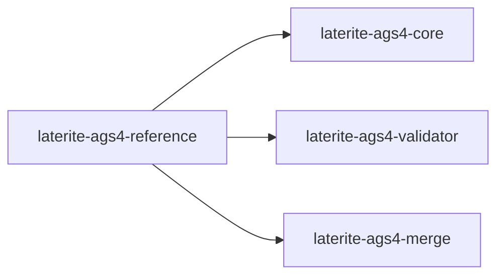

# laterite-ags4-reference

<!-- BEGIN GENERATED: crate-card — DO NOT EDIT BY HAND. Regenerate: uv run --no-project python tools/gen_crate_graph.py -->
> [!note] **Cleared for crates.io** — `laterite-ags4-reference` declares `publish = true`, so it is a public API under semver, not an internal detail. It is versioned on its own line.
> **Used by** — [[laterite]], [[laterite-ags4-censor]], [[laterite-ags4-core]], [[laterite-ags4-diff]], [[laterite-ags4-merge]], [[laterite-ags4-validator]], [[laterite-py]].
<!-- END GENERATED: crate-card -->

> [!note] Its contents reach the outside world only through
> [[laterite-ags4-validator]]'s and [[laterite-ags4-core]]'s re-exports.

## What it is

The AGS4 **reference-data leaf** (laterite-dev#475): everything mechanically derived from
the bundled `ags_dictionary.json` / `rules_meta.json` JSON, single-sourced in
one wasm-safe crate — the multi-edition dictionary registry, the per-edition
`phf`-compiled dictionary projection, and the rules-catalogue data accessors.
Since #777 it also carries `effective_dict`, the one shared implementation of
the Rule 18 standard ∪ file-DICT union ([[effective-dictionary]]) — homed here
beside the dictionary it unions with, consumed by the validator's Rule
7/9/10a-c/19b families and re-exported by [[laterite-ags4-core]] for read-only
consumers.
"Leaf" names its position, not its dep count: it is **not dependency-free** —
it takes `laterite-ags4-types` for `keychain`, which is why laterite-dev#550's engine-fingerprint
walk must recurse *through* it to reach that crate. The page said
"dependency-free" until laterite-dev#557; it was one of six hand-copied copies of a claim
that stopped being true when the types edge landed, and nothing compared any of
them to the manifest. Extracted out of `laterite-ags4-core` and
`laterite-ags4-validator` so a consumer that only wants reference data (the
read-only DuckDB extension, `laterite-ags4-diff`) can depend on this leaf
alone instead of pulling in the rest of core or the whole rule engine.

Landed in two PRs. **PR1** (laterite-dev#488) moved the **union registry projection**
(`GroupDescriptor`/`Heading`/`Registry`/`union_groups`/`ancestor_chain`/
`inherited_key_names`) out of `laterite-ags4-core::registry` into
`repo:rust-packages/laterite-ags4-reference/src/union.rs` — core's
`registry` module became a flat `pub use laterite_ags4_reference::union::*;`
re-export, so `laterite_ags4_core::registry::…` is unchanged for every
consumer. **PR2** (laterite-dev#492, this page) moved the rest: the **per-edition `phf`
projection** — `build.rs` + `repo:rust-packages/laterite-ags4-reference/src/dict.rs`
(`Dictionary`, `DictEntry`, `GroupMeta`, `DictResolution`, `DictVersion`,
`dictionary_dto`) — out of the validator's own `build.rs`/`src/dict.rs`; the
**rules-catalogue data accessors** — `repo:rust-packages/laterite-ags4-reference/src/catalogue.rs`
(`RULE_LABELS` + `rule_metadata_json()`) — out of the validator's
`catalogue.rs`; and the **bundled data itself** (`data/ags_dictionary.json` +
`data/rules_meta.json`, relocated out of `core/data` and `validator/data`
respectively) — the leaf now owns this data outright rather than reading a
sibling crate's `data/` by relative path.

At the time (laterite-dev#475 PR2) the validator lost its `build.rs`/`src/dict.rs` entirely;
it re-exports the `dict` module and the two catalogue accessors unchanged (see
[[laterite-ags4-validator]]), so every existing downstream path
(`laterite_ags4_validator::dict::…`, `laterite_ags4_validator::{RULE_LABELS,
rule_metadata_json}`) keeps resolving for the CLI/py/node/wasm surfaces — only
the Cargo edges moved. (`src/dict.rs` is still gone; **the validator regained a
`build.rs`** in the unrelated `cert-trust-v2` arc's PR 2, 2026-07-14 — a
build-time `ENGINE_FINGERPRINT` hash that at the time covered the rule sources
plus this leaf's two bundled JSON files, nothing to do with the dictionary
projection this page describes. That changed with **laterite-dev#550** (2026-07-16): the
fingerprint now also hashes this leaf's own `build.rs` — the code that
*generates* the per-edition phf tables below, as distinct from the JSON it
reads — because a projection-code change alone (no JSON edit) changes a
verdict too, and the pre-#550 hash missed exactly that. See [[cert-trust-v2]].)
The `#[cfg(test)]` catalogue↔engine faithfulness gate
(does `rules_meta.json` cover exactly `RULE_LABELS`? does `fixable` match the
fix engine?) **stays in the validator** — it needs
`crate::fixes::FIXABLE_RULE_LABELS`, which the leaf deliberately can't see.

Its sibling holds the catalogue's **divergence notes** — the practitioner-voiced
`observations` blocks the webapp renders beside a rule — to the OBSERVATIONS
canon: `repo:tools/check_rule_catalogue_refs.py` (a `repo-gates` step, #658).
Identity only, never prose: the two are written for different readers and are
*meant* to differ. It fails on a note citing a record that does not exist, or one
the canon has marked superseded — which is what it found on arrival, two notes
still telling the story [[O-10]] and [[O-20]] told before [[O-30]] replaced them.
Rule *attachment* it cannot check at all (the canon records no rule per
observation), and it says so on every run.

## Inputs / outputs

In: nothing at runtime — everything is compiled in. At **build time**,
`build.rs` reads the leaf's own `data/ags_dictionary.json` (the consolidated
union, single-sourced by `tools/gen_dictionary.py` from the five official
`.ags` files — see [[dec-dictionary-single-source]]) and projects each of the
five bundled editions (4.0.3/4.0.4/4.1/4.1.1/4.2) into `phf` perfect-hash
static tables (headings, groups, group→heading order, the ABBR pick-list,
`TRAN_AGS`) into `OUT_DIR/dict_data.rs`, `include!`d by `src/dict.rs`. The
projection mirrors `tools/gen_dictionary.reconstruct` exactly, so the emitted
tables are byte-identical to the pre-#475 direct-`.ags` parse (validation
behaviour and python-ags4 parity unchanged). `catalogue.rs` embeds
`data/rules_meta.json` via `include_str!` for the same zero-runtime-parse
reason.

> [!note] "Nothing at runtime" became true only recently
> That claim was aspirational for the `union` module until the duplicate
> dictionary was removed. `union.rs` embedded a SECOND copy of
> `ags_dictionary.json` via `include_str!` — the same 1.4 MB the `phf` tables
> above are projected from — and parsed it on the first `registry()` call to
> rebuild the union. Every artifact that touched the registry carried the
> dictionary twice: the wasm bundle, the wheel's `.so`, `lat`, the Node addon.
>
> `union_groups()` now reconstructs the union from the masked tables
> (`dict::union_view` — group and heading definitions at their newest edition,
> `gen_dictionary.py`'s heading order), so the dictionary is embedded once.
> Measured 2026-08-16:
>
> | artifact | before | after | saved |
> |---|---:|---:|---:|
> | wasm (full engine), raw | 6,722,493 | 5,312,456 | **−21.0%** |
> | `lat` | 7,786,256 | 6,333,200 | −18.7% |
> | node addon | 9,368,144 | 7,915,040 | −15.5% |
> | wheel `.so` | 20,661,360 | 19,191,760 | −7.1% |
>
> The wasm row is a like-for-like pair measured WITHOUT #330's feature gates, so
> that the delta is the dictionary alone; [[tech-stack-wasm]]'s table is the
> shipping figure and reads ~2 KB higher because the gated build adds
> `rows_json()`.
>
> **It is a size win, not a startup win** — `union_groups()` went 2.13 ms →
> 1.56 ms, because both paths allocate the same ~3,500 owned headings and the
> parse was never the dominant cost. And it hid for a long time because JSON
> that repetitive compresses ~18:1: the duplicate was 1.4 MB raw but only ~54 KB
> of what a browser downloads, so every compressed-size check said it was fine.
> Raw size is what found it.
>
> The JSON survives as a **test oracle** — `include_str!` under `#[cfg(test)]`
> in `union.rs`, comparing the table reconstruction against the document it
> replaced across all 174 groups. A second test asserts the source carries no
> `include_str!` of it outside that module, because a re-added one would put
> 1.4 MB back with nothing downstream flagging it.

Out: the `dict` module (`Dictionary`, and the closed edition enum itself —
`DictVersion::{ALL, as_str, from_edition}` + `FALLBACK`, all generated by
`build.rs` — the one authority every consumer is meant to *ask*, not
re-list; see [[edition-resolution]]), the `catalogue` module (`RULE_LABELS`,
`rule_metadata_json()`), the `union` module (the AGS4 parent/child
registry — `union_groups`, `ancestor_chain`, `inherited_key_names`), and the
`keychain` module (`key_heading_names`, the content-addressed `_id`/
`_parent_id` derivation — moved here from `laterite-ags4-core`, see below).

## Where it lives

`repo:rust-packages/laterite-ags4-reference` — a **true leaf**: `serde` +
`serde_json` (`preserve_order`, matching core's own pin, so key order stays
declaration order) + `phf` at runtime, `phf_codegen` + `serde_json` at build
time — **no workspace-crate dependency**, so it stays wasm-safe and
embeddable anywhere. [[laterite-ags4-core]] depends on it for the union
registry; [[laterite-ags4-validator]] depends on it for the dict projection +
catalogue. Nothing in the leaf depends back on either — that's what keeps it
a genuine leaf rather than a re-introduced cycle.

**Payoff partly taken (laterite-dev#475 follow-up, laterite-dev#493)**: `laterite-ags4-diff` now
depends on this leaf directly instead of the whole validator (it only ever
touched `Dictionary`/`DictVersion`, never the rule engine). The same follow-up
repointed [[laterite-py]]'s `build.rs` onto `union_groups()` for its
`#[pyclass]` typed-graph codegen, retiring the **third** independent reader of
`ags_dictionary.json` (`build.rs` used to hand-parse the JSON itself); the
regenerated `.pyi` verified byte-identical, so it hadn't drifted. **Remaining
payoff**: the read-only DuckDB extension (see [[core-emit-layering-inversion]])
could still take the same repoint — a separate, later, owner/mirror-gated
follow-up, since it lives in its own repo (`niko86/laterite-duckdb`).

**Edition-set convergence (2026-07-14)**: `DictVersion::ALL`/`from_edition`
being generated here did not stop three consumers hand-copying the same five
strings anyway — `lat`'s `--dict-version` flag, `laterite-py`'s `emit_typed.rs`,
and `laterite-ags4-corpus-qa`'s `validate.rs` each carried their own `match` table
instead of calling `from_edition`. All three now ask this leaf directly; see
[[edition-resolution]] and [[data-single-source-audit]] (row 2) for the full
finding.

**Row-identity consolidation (2026-07-12)**: the leaf gained a fourth module,
`keychain` (`repo:rust-packages/laterite-ags4-reference/src/keychain.rs`),
moved out of `laterite-ags4-core` (which now re-exports it unchanged as
`laterite_ags4_core::keychain::*`, mirroring the PR1 `registry.rs` shim
precedent). Its `key_heading_names(&GroupDescriptor) -> Vec<&str>` is the ONE
definition of "what KEY headings identify a row", so the new
`laterite-ags4-merge` leaf and `laterite-ags4-diff` (repointed off its own
prior derivation) share it instead of each re-deriving row identity. The
content-addressed `_id`/`_parent_id` golden UUIDs (#303) are unchanged — the
move is behaviour-neutral. See [[dec-ags4-merge-semantics]].

**Custom-dictionary overlay (laterite-dev#568, 2026-07-18)**: the leaf gained a fifth
module, `overlay` (`repo:rust-packages/laterite-ags4-reference/src/overlay.rs`
— `parse_dict`/`CustomDict`/`OwnedDelta`/`build_delta`/`detect_base`) plus
`dict_read.rs`, the FIRST place the workspace reads an AGS4 DICT group at
*runtime* (the five bundled dictionaries are all compiled in at build time).
`Dictionary` became lifetime-parametric — `Bundled(BundledDict)` vs
`Layered { base: BundledDict, delta: &'a OwnedDelta }`, still `Copy` since
both arms are refs/statics — so every existing `dict: Dictionary` call site
is unaffected. This is a NEW workspace-crate dependency: `laterite-ags4-parse`
joins `laterite-ags4-types` as the leaf's second edge (`dict_read.rs` reuses the
shared tokenizer rather than a second parser); both are wasm-clean sibling
leaves, so the reference leaf stays wasm-safe. See [[dec-custom-dict-overlay]].

## Where it fits

The full workspace graph is in [[crate-map]]; this crate's immediate edges:

## Related

[[crate-map]] · [[laterite-ags4-validator]] · [[laterite-ags4-core]] · [[laterite-py]] · [[dec-dictionary-single-source]] · [[core-emit-layering-inversion]] · [[dec-ags4-merge-semantics]] · [[edition-resolution]] · [[data-single-source-audit]] · [[cert-trust-v2]] · [[dec-custom-dict-overlay]]
