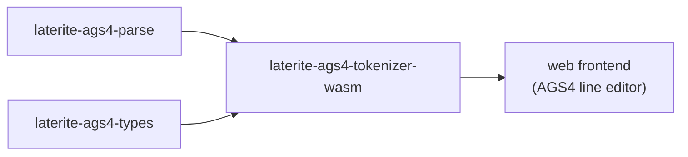

# laterite-ags4-tokenizer-wasm

<!-- BEGIN GENERATED: crate-card — DO NOT EDIT BY HAND. Regenerate: uv run --no-project python tools/gen_crate_graph.py -->
> [!note] **Not published** — `laterite-ags4-tokenizer-wasm` is a workspace crate, internal to this repo, at v0.9.0 (inherited from the workspace).
> **Used by** — nothing else in this workspace.
<!-- END GENERATED: crate-card -->

> [!note] It is the browser's line-editing primitive; the user sees its
> effect in the web app's live AGS4 editor, not the crate.

## What it is

A **tiny** browser wasm module (#533): two thin `#[wasm_bindgen]` wrappers over the
shared Rust leaves, so the browser's per-line tokenizing and quoting run off the
**same authority as every other surface** instead of a hand-maintained TypeScript
copy:

- **`tokenize_spans`** wraps `laterite_ags4_parse::scan::scan_line`
  ([[laterite-ags4-parse]]) — the offset-preserving line tokenizer.
- **`quote_field`** wraps `laterite_ags4_types::quote_field` ([[laterite-ags4-types]]) — the
  canonical AGS4 field quoter.

It is deliberately minimal: **no engine, no validator, no arrow** — just the two
line primitives, so the compiled artifact stays small (a size gate keeps that
honest, and default features leave arrow OFF so only the `&str`-only tables
compile). The old TS copy in `web/src/lib/agsline.ts` is retired against it — the
same "one authority, not a per-surface reimplementation" move as
[[laterite-ags4-censor]], which is the *other* wasm face of the #533/#527
convergence.

## Inputs / outputs

In: one AGS4 line `&str` (`tokenize_spans`) or one field value `&str`
(`quote_field`). Out: for `tokenize_spans`, an `AgsSpan` array crossing to JS as
`{text, start, end, valueStart, valueEnd}[]` (via `serde-wasm-bindgen`); for
`quote_field`, the quoted `String`. The spans are byte-offset-preserving, which is
what lets the editor map a token back to its exact position in the source line.

## Where it lives

`repo:rust-packages/laterite-ags4-tokenizer-wasm`, a `cdylib`. Deps
[[laterite-ags4-parse]] and [[laterite-ags4-types]] (the two leaves it wraps), plus
`wasm-bindgen`, `serde`, and `serde-wasm-bindgen`. It has **no in-workspace Rust
consumer** — its consumer is the web frontend, which loads the compiled wasm
directly (see [[tech-stack-wasm]]). It is a *separate*, deliberately-tiny module
from the full engine wasm [[laterite-ags4-wasm]]: the editor needs only line
tokenizing, not the rules engine.

## Relationship to other components

The full workspace graph is in [[crate-map]] (dependency form in
[[crate-dependency-graph]]):

## Related

[[crate-map]] · [[crate-dependency-graph]] · [[laterite-ags4-parse]] · [[laterite-ags4-types]] · [[laterite-ags4-wasm]] · [[laterite-ags4-censor]] · [[tech-stack-wasm]]
