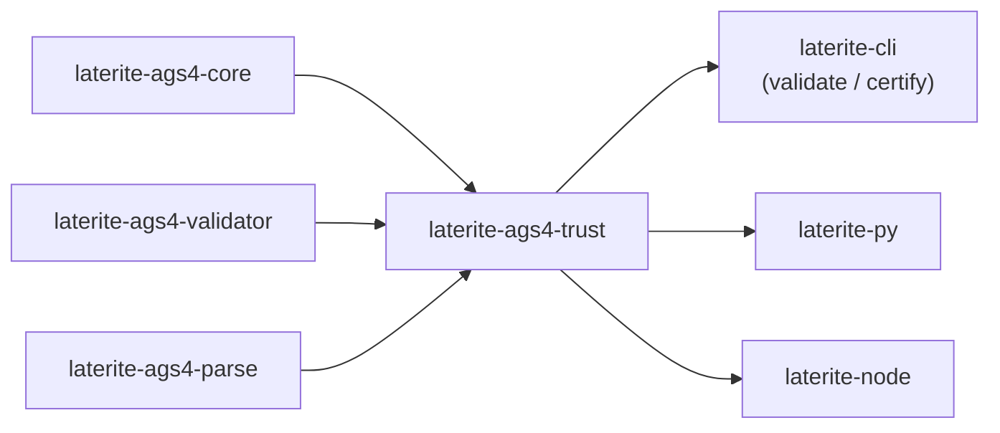

# laterite-ags4-trust

<!-- BEGIN GENERATED: crate-card — DO NOT EDIT BY HAND. Regenerate: uv run --no-project python tools/gen_crate_graph.py -->
> [!note] **Cleared for crates.io** — `laterite-ags4-trust` declares `publish = true`, so it is a public API under semver, not an internal detail. It is versioned on its own line.
> **Used by** — [[laterite]], [[laterite-ags4-wasm]], [[laterite-cli]], [[laterite-node]], [[laterite-py]].
<!-- END GENERATED: crate-card -->

> [!note] It is the single implementation behind `lat validate`/`certify`
> ([[laterite-cli]]) and every binding's validate+certify surface. The
> format is [[dec-ags-idx-certificate]]; the trust model is
> [[cert-trust-v2]].

## What it is

**The one door.** "Can I trust this `.ags.idx` enough to skip re-validating?" was
being answered in **five** places — the `lat` binary, [[laterite-py]]'s Rust half,
its *Python* half, [[laterite-node]]'s TypeScript, and the wasm surface — each
with its own hand-written conjunction of freshness, engine-identity and profile
checks. They did not agree, and four of the five would report a file clean that
was not (a cert whose `FILE/` tree was later deleted; a `warnings: 0` never
actually measured; a rule edited without a version bump). This crate is **one
door, one decision, one place to get it right**: validate a file (optionally with
a certificate) and mint a certificate for one that passes.

The whole design is a partition of every check into two kinds:

- **CONTENT** — a pure function of the certified bytes. Same bytes in, same
  findings out, forever. A certificate *may* stand in for this, because a SHA-256
  of the bytes is a complete statement about them.
- **WORLD** — reads state the bytes do not contain (today: Rule 20's sibling
  `FILE/` tree). It can change without the file changing, so **no certificate may
  ever speak for it**, and it is re-run on every call.

That partition is enforced structurally, in descending strength: (1) **no field
to lie with** — `ValidationStamp` carries no world snapshot of any kind; (2) **no
parameter to ask it with** — `WorldScope::OnDisk` cannot be constructed without a
path, so a bytes/text caller physically cannot request a world check (it gets
`WorldCheckRequiresSource`, not a spuriously-clean Rule 20).

## Inputs / outputs

In: a `Request` (bytes/text/path source, an optional certificate, the requested
`WorldScope`, options split by `split_options`). Out: an `Outcome` from `check`,
or a minted `Sidecar` from `mint` (`MintError` on failure). `engine_id` exposes
the engine identity (`ENGINE_FINGERPRINT`, optionally with a compat tag) that a
certificate's freshness is judged against.

## Where it lives

`repo:rust-packages/laterite-ags4-trust`. Deps [[laterite-ags4-core]]
(`default-features = false` — the age/zstd transport is wasm-hostile and unrelated
to trust; it consumes the `.ags.idx` `Sidecar`/`ValidationStamp` types and
`Sidecar::decide`), [[laterite-ags4-validator]] (the rule engine + `WorldScope` +
`ENGINE_FINGERPRINT`), and [[laterite-ags4-parse]] (parsing bytes/text without the
validator's path-only entry point). Consumers: [[laterite-cli]] and the
bindings.

## Relationship to other components

The full workspace graph is in [[crate-map]] (dependency form in
[[crate-dependency-graph]]):

## Related

[[crate-map]] · [[crate-dependency-graph]] · [[laterite-ags4-core]] · [[laterite-ags4-validator]] · [[laterite-ags4-parse]] · [[dec-ags-idx-certificate]] · [[cert-trust-v2]] · [[laterite-cli]] · [[laterite-py]] · [[laterite-node]]
