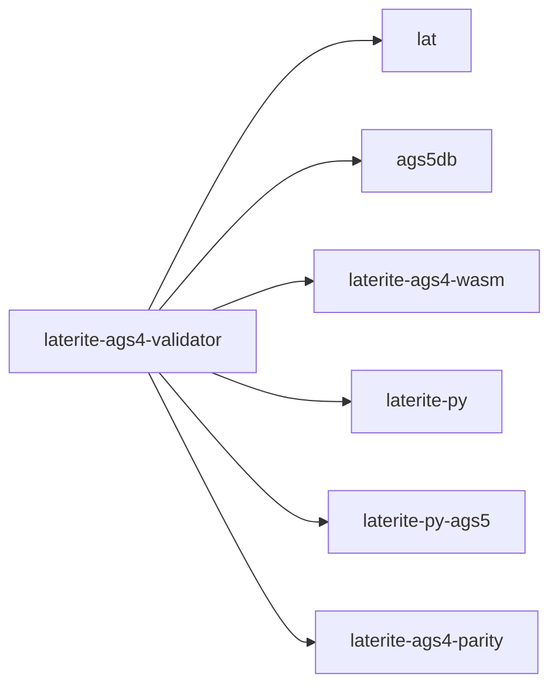

# laterite-ags4-validator

<!-- BEGIN GENERATED: crate-card — DO NOT EDIT BY HAND. Regenerate: uv run --no-project python tools/gen_crate_graph.py -->
> [!note] **Cleared for crates.io** — `laterite-ags4-validator` declares `publish = true`, so it is a public API under semver, not an internal detail. It is versioned with the workspace.
> **Used by** — [[laterite]], [[laterite-ags4-compliance]], [[laterite-ags4-corpus-qa]], [[laterite-ags4-emit]], [[laterite-ags4-forge]], [[laterite-ags4-parity]], [[laterite-ags4-perf]], [[laterite-ags4-trust]], [[laterite-ags4-wasm]], [[laterite-ags4-xcheck]], [[laterite-cli]], [[laterite-node]], [[laterite-py]].
<!-- END GENERATED: crate-card -->

## What it is

The **clean-room Rust validator engine** for the AGS4 geotechnical
transfer format — the library that every other piece of the toolchain
embeds. It implements the numbered AGS4 rules from the published spec
(not a translation of python-ags4; see the crate README and each
`src/rules/*.rs` header), with all five bundled standard dictionaries
(AGS 4.0.3 / 4.0.4 / 4.1 / 4.1.1 / 4.2) compiled in.

The compiled-in dictionaries are sourced from the **single consolidated union**
`repo:rust-packages/laterite-ags4-reference/data/ags_dictionary.json`, but this
crate no longer projects them itself: its own `build.rs` and `src/dict.rs` were
**moved into the [[laterite-ags4-reference]] leaf** (laterite-dev#475 PR2) — that leaf's
`build.rs` reads the JSON and projects each edition into its `phf` lookup
tables (headings, groups, order, the ABBR pick-list, `TRAN_AGS`), and this
crate re-exports the result as `pub use laterite_ags4_reference::dict;`, so
every existing `crate::dict::…` / `laterite_ags4_validator::dict::…` path
throughout this crate and its consumers (laterite-py, laterite-node, wasm)
keeps resolving unchanged. Neither crate parses the five `.ags` files directly
— those are the *origin*, read by the sole converter `tools/gen_dictionary.py`.
See [[dec-dictionary-single-source]].

The **rules catalogue** (`RULE_LABELS`, `rule_metadata_json()` — the inventory
`lat rules --json` serves) moved the same way, into the leaf's `catalogue.rs`
and re-exported here unchanged. The catalogue↔engine **faithfulness gate**
(does `rules_meta.json` cover exactly `RULE_LABELS`? does `fixable` match the
fix engine?) stays in this crate's own `src/catalogue.rs` — it needs
`crate::fixes::FIXABLE_RULE_LABELS`, which the leaf deliberately can't see.

This page documents the **engine library** (`laterite_ags4_validator`). It is
distinct from the [[laterite-cli]] binary, which is a thin CLI front-end
over this same library. The engine is also embedded by laterite-ags5-db,
[[laterite-ags4-wasm]], [[laterite-py]], laterite-py-ags5, and the parity
harness — see [[parity-model]].

Entry points (`repo:rust-packages/laterite-ags4-validator/src/lib.rs`):
`check_file` (parse + auto-pick dictionary + run all rules), `check_file_with_dict`
(same, for a caller that already has the source `Path` — now just
`parse_file_with_encoding` + `world_for(path)` + `check_parsed_with_dict` below),
`check_parsed_with_dict` (**the dictionary-resolving door**, added 2026-07-14 —
either the [[O-28]] custom-`--dict` overlay path (`opts.custom_dict`, if a caller
supplied one: `build_delta` + `Dictionary::layered` + `check_parsed`, then
`emit_override_warnings` surfaces every override of a STANDARD group/heading as
a loud WARNING, honour + warn, KEY demotion loudest — laterite-dev#568) or the bundled path
(`resolve_dict_version` + `guard_4_0_4`, the O-42 content guard, [[O-42]]) +
`check_parsed` + the O-42 transparency FYI, for a caller holding an
already-parsed file with no path), `check_parsed` (**the CONTENT/WORLD
door** underneath it, taking an *already-resolved* dictionary — runs CONTENT
(`rules::run_all`, now crate-private) and WORLD (`world::run`), and is the only
place that can refuse a `check_files` request with nothing to check against
rather than silently reporting clean — see [[cert-trust-v2]]), `verdict::Verdict`
(the SINGLE producer of the verdict — `exit_code()` derived from `is_valid()`, so
no surface can compute one and disagree with the other), `is_clean` (called
`is_valid` until #321, when a warning stopped failing a file and the two answers
came apart — this one is "did the run find anything", and the rename is what
stops the next caller reaching for the wrong one),
`resolve_dict_version` / `tran_ags_of` (so callers can *report* the judged
edition), and the `CheckOptions` struct (now carrying `custom_dict:
Option<overlay::CustomDict>`). The crate also re-exports `overlay::{parse_dict,
CustomDict, DictError}` (defined in [[laterite-ags4-reference]]) so every surface
builds a `CustomDict` through one function rather than each hand-rolling the
parse. See [[dec-custom-dict-overlay]] for the design — this door used to hold
a private `reject_custom_dict(opts)` that refused any custom dictionary
outright; laterite-dev#568 replaced the refusal with the honour-and-warn path above.

**Which door a modality goes through, and why it has to differ:** a **path**
goes through `check_file_with_dict`, the only modality that can answer
`--check-files` — Rule 20's on-disk half needs a sibling directory to look in,
and only a path names one. **bytes/text** go through `check_parsed_with_dict`
directly with `WorldScope::None`, so a `--check-files` request on either
refuses (`WorldCheckRequiresSource`) rather than silently reporting Rule 20
clean. Before 2026-07-14, `laterite-py`, `laterite-node`, and
`laterite-ags4-wasm` each hand-assembled "resolve `TRAN_AGS`, then run the
rules" for their bytes/text branches instead of calling one door — and every
one of them left `guard_4_0_4` out of the assembly. The result: a file whose
`TRAN_AGS` declared 4.0.3 while it used a 4.0.4-only heading (e.g.
`LOCA_NATD`) was judged against **4.0.4 from a path and 4.0.3 from bytes/text**
— same file, same flags, two dictionaries, two phantom Rule 9 findings on the
bytes/text side. `check_parsed_with_dict` fixes it by deleting the duplicated
assembly rather than patching each copy in place — see
`repo:packages/laterite/tests/test_modality_output_parity.py` and
`repo:rust-packages/laterite-node/test/modality-output-parity.test.ts`, a new
kind of cross-surface gate this bug motivated: it compares the **verdict**
each modality returns for identical bytes, not just whether each modality
offers the capability ([[modality-register]]) or spells its knobs the same
([[parity-model]]).

Two wasm call sites this reaches beyond finding counts: `certify` now stamps
the edition that actually produced its verdict (previously it resolved the
edition itself while the rules ran against a dictionary chosen elsewhere, so a
browser-minted `.ags.idx` could name 4.0.3 while its clean verdict came from
4.0.4), and `compute_fixes` now offers fixes computed against the same
dictionary `lat fix` would use on the same bytes.

Since the `cert-trust-v2` arc's PR 2 (2026-07-14) the crate also owns a
CONTENT/WORLD partition: `rules::run_all` (`repo:rust-packages/laterite-ags4-validator/src/rules/mod.rs`)
is a pure function of the parsed bytes and is `pub(crate)` — nothing outside
the crate can reach it directly any more. The on-disk half of Rule 20 (the
one rule that reads state outside the bytes) moved out of
`rules/references.rs` into a new `src/world.rs` (`WorldScope`, `world::run`),
reached only through `check_parsed`. A new build-time `ENGINE_FINGERPRINT`
(`env!("LATERITE_ENGINE_FINGERPRINT")`, computed by a new `build.rs`,
`sha2` build-dependency only) identifies the *engine that produces verdicts*
for an `.ags.idx` certificate, rather than the hand-bumped `VERSION`
(`CARGO_PKG_VERSION`), which does not change when a rule's logic does. As
shipped in PR 2 the hash covered only this crate's own rule sources plus the
reference leaf's two bundled JSON files; **laterite-dev#550** (2026-07-16) found that left
three verdict-determining paths uncovered — `laterite-ags4-types::format_nsf`
(computes Rule 8's verdict), `laterite-ags4-parse` (decides field boundaries),
and `laterite-ags4-reference`'s `build.rs` (generates the per-edition
dictionary tables the JSON projects into) — and widened `build.rs` to derive
the covered set by walking `[dependencies]` path deps transitively across
every in-workspace crate the verdict runs through (dev-/build-deps excluded,
so the `laterite-ags4-core` dev-dep stays out); coverage went 16 files → 26
across 4 crates (`repo:rust-packages/laterite-ags4-validator/build.rs`). See
[[cert-trust-v2]] for the full design.

## Inputs / outputs

In: an AGS4 file (path or bytes) and `CheckOptions`. Out: `Findings` — a
rule-keyed map of `Finding` records. By default the dictionary edition is
**auto-detected** from the file's `TRAN_AGS` (resolves OBSERVATIONS O-10);
`CheckOptions::dict_version` forces an edition. The canonical observation
catalogue lives at
`repo:OBSERVATIONS.md`.

## Where it lives

`repo:rust-packages/laterite-ags4-validator` — near the root of the
dependency graph, but not a zero-dep leaf itself: it depends on two lean,
wasm-safe leaves — [[laterite-ags4-reference]] (the compiled dictionary +
rules catalogue, laterite-dev#475) and `laterite-ags4-parse` (the shared tokenizer, #168)
— plus `thiserror` + `chrono` + `encoding_rs` + `deunicode`, and **no other
workspace crate**. That still-lean dep graph (leaf + leaf + small external
crates) is what keeps it embeddable in a CLI, a PyO3 cdylib, and a wasm
bundle alike; everything else in the toolchain depends *on* it, never the
reverse. See [[dec-rust-drives-python]].

## Where it fits

Full graph in [[crate-map]]; immediate (out-bound) edges — every arrow
points *into* this crate:

## Related

[[crate-map]] · [[laterite-ags4-reference]] · [[laterite-cli]] · [[laterite-ags4-wasm]] · [[laterite-py]] · laterite-py-ags5 · [[parity-model]] · [[dec-rust-drives-python]] · [[cert-trust-v2]] · [[O-42]] · [[modality-register]] · [[testing-strategy]] · [[dec-custom-dict-overlay]] · [[O-28]]
