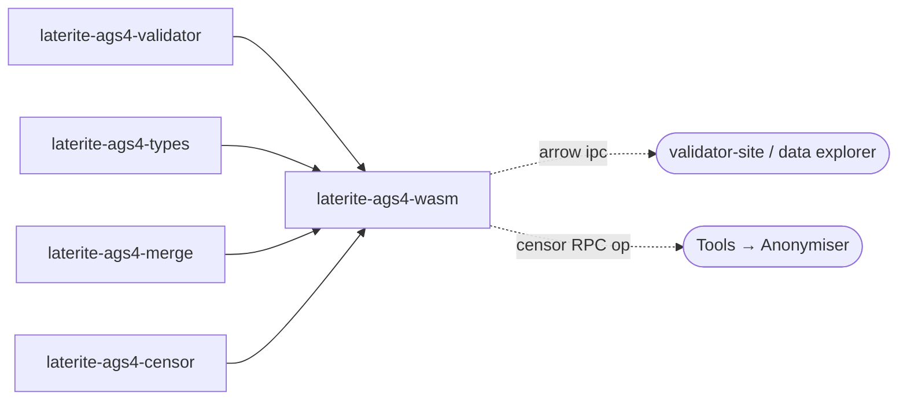

# laterite-ags4-wasm

<!-- BEGIN GENERATED: crate-card — DO NOT EDIT BY HAND. Regenerate: uv run --no-project python tools/gen_crate_graph.py -->
> [!note] **Not published** — `laterite-ags4-wasm` is a workspace crate, internal to this repo, at v0.11.0 (its own line).
> **Used by** — nothing else in this workspace.
<!-- END GENERATED: crate-card -->

> [!note] It is the wasm engine behind the validator site / data explorer
> ([[validator-site]]).

> [!important] No longer in-tree only — **published to npm as of 0.8.1 (2026-07-29)**
> This page said the crate was "consumed only by that front-end's JavaScript"
> until `@laterite/ags4-wasm@0.8.1` shipped. It now has an **external consumer**,
> which changes what a change here costs: the wasm exports are a **released
> surface**, versioned on their own `wasm-v*` tag train, and breaking one breaks
> a downstream browser consumer rather than a co-located front-end you can fix in
> the same PR.
>
> The crate stays tagged `internal` — the same convention [[laterite-node]] uses.
> The *crate* is plumbing; the *artifact* is public. See `repo:RELEASING-wasm.md`
> for the tag train and what bootstrapping the name cost.

> [!note] Not the only browser wasm module
> Since laterite-dev#533 (part of the laterite-dev#527 convergence arc) the browser also loads a
> SEPARATE, deliberately tiny sibling cdylib, `laterite-ags4-tokenizer-wasm`
> (~30 KB vs this crate's 5.1 MiB, full build) — two `#[wasm_bindgen]` wrappers over
> `laterite-ags4-parse::scan::scan_line` and `laterite-ags4-types::quote_field` for
> the inline line editor/preview, instantiated on the main thread rather than
> in this crate's Web Worker. It shares no dependency edge with this crate.
> See [[crate-map]] for its full listing.

> [!note] A seventh export: `censor` (laterite-dev#581 Phase 2, 2026-07-18)
> `censor(data, sensitiveJson, { selectedCodes, token, dropCustom,
> includeFreetext }) -> { text, tally }` wraps the shared `laterite-ags4-censor`
> scrub engine, so the browser Anonymiser's Download action drives the SAME
> anonymisation logic `laterite-ags4-corpus-qa` uses instead of a hand-written TS
> scrub. It SHA-256-hashes the input bytes for `PROJ_ID`'s filehash (the full
> 64-hex), lossily decodes them, resolves `sensitive_headings.json` into a
> `Policy` (optionally restricted to the user's selected heading codes via
> `Policy::retain_codes`), and runs the leaf. Async/batch, reached through the
> validator worker's new `censor` RPC op — reusing this crate's existing wasm
> bundle rather than a second tiny cdylib (censor has no per-keystroke
> latency constraint, unlike the tokenizer/quoter pair above); the bundle
> grew ~6.6→6.64 MB at the time. Re-measured 2026-08-16 (post-#336's
> dictionary repack and post-#342's de-duplication of it): the FULL engine wasm
> is ~5 MiB raw / ~1.7 MiB gzipped. It is **not precached at all** any more:
> since #355 the full build is tier 2, `globIgnore`d and served by its own
> `CacheFirst` rule, and `repo:web/vite.config.ts`'s
> `maximumFileSizeToCacheInBytes` deliberately sits BETWEEN the two engines so it
> cannot slip back into the install. (This line read "the 8 MiB PWA precache cap
> has ~2.9 MiB of headroom" until 2026-08-17: the cap moved to 3 MiB and the
> restated number did not — the exact rot the measured-value corollary in
> `repo:ags-wiki/AGS-WIKI.md` §1 now rules against.) `censor` is one of the six
> features #330 gates, so the slim artifact npm gets carries none of this. See [[dec-ags4-censor-leaf]] and
> "Two shapes of the same crate" in [[tech-stack-wasm]].

## What it is

The **browser wasm wrapper** around the clean-room AGS4 validator: a
`cdylib` compiled to `wasm32-unknown-unknown` via wasm-pack
(`--target web`) that runs the entire rule engine **client-side** with
nothing uploaded. The *why* and roadmap live in [[validator-site]]; the
wasm tech detail (Arrow-IPC → DuckDB-wasm, the build pipeline) is
[[tech-stack-wasm]].

The exports — one module per verb under `repo:rust-packages/laterite-ags4-wasm/src`, with the crate root
reduced to declarations and re-exports (#381). Since #330
**seven of them are feature-gated** — `certify`, `diff`, `merge`, `censor`,
`ags4_to_xlsx`/`xlsx_to_ags4` (`excel`) and `build_ags4_ipc` (`arrow`), plus
`ParsedDataset::arrow_ipc` — all ON under `default = full`, so the app sees
every one; the published npm artifact is built `--no-default-features` and sees
none. [[tech-stack-wasm]] carries the split and the measurements:
- `validate(...)` — goes through [[laterite-ags4-validator]]'s
  `check_parsed_with_dict` with `WorldScope::None` — the same dictionary-
  resolving door a path read uses, minus the on-disk half of Rule 20 (the
  browser has no filesystem to check it against). Rule violations come back
  as report data and only un-validatable inputs populate `report.error`
  (nothing throws across the boundary). **Until 2026-07-14 this was not
  true**: `run` hand-assembled `resolve_dict_version` + the rule engine
  itself and skipped the O-42 `guard_4_0_4` content guard in between, so a
  file mislabelled `TRAN_AGS=4.0.3` while using a 4.0.4-only heading was
  judged against a *different* dictionary in the browser than on `lat` for
  the same bytes — see [[O-42]] and [[cert-trust-v2]] (the same "surfaces
  reach past the door" pattern) for the fix and the new output-value gate it
  motivated.
- `compute_fixes(...)` / `apply_fixes(...)` — the fix engine behind the
  **Fix** tab (compute the `Fix` list, then apply a selected subset,
  returning new UTF-8 bytes). `compute_fixes` gained the same
  `check_parsed_with_dict` fix as `validate`, so the fixes offered are
  computed against the same dictionary `lat fix` would use on the same
  bytes. Each `Fix` carries a `risk` (`safe` | `risky`): *safe* fixes are
  bulk-applicable (fix-all-safe), *risky* ones guess intent and are opt-in.
  The risk field is what lets the engine *offer* fixes it previously
  withheld — e.g. `NormalizeTypography` substitutes smart-quotes / em-dashes
  / ellipsis (the Rule 1 non-ASCII arm, once "unfixable") with plain ASCII,
  marked risky; the duplicate-heading rename (can surface a fresh Rule 9) is
  also risky.
- `read(...)` → `ParsedDataset` (`group_codes` / `meta` / `rows_json`, plus
  `arrow_ipc` under the `arrow` feature) for the data **Explore** tab. The two
  row doors are the one place the feature split is not a plain subtraction:
  `arrow_ipc` frames a group as Arrow IPC for duckdb-wasm, `rows_json` returns
  the same values as JSON, both through the same
  `laterite_ags4_types::parse_value` cast. A slim build has only the second.
- `diff(a, b, { encoding, maxRowsPerGroup })` → a `RevisionDelta` (the
  **Tools → Revision diff**). Parses both files, matches rows by each
  group's *dictionary* KEY headings (order-independent), and compares
  matched cells type-aware through [[laterite-ags4-types]] `parse_value` — so a
  formatting-only change (`1.0`→`1.00`) is not a diff, only a genuine
  typed change is. A group with no dictionary KEYs present in both files
  falls back to whole-row matching (`keyed=false`). Counts are true
  totals; `max_rows_per_group` only caps the serialized per-row deltas.
  This is the data-model-aware diff the front-end's pure-text line diff
  (`FileDiff`, Fix tab) cannot be.
- `merge(a, b, { dictVersion, encoding, onTypeClash, tran })` → a `MergeResult`
  (the **Tools → Merge** tab, 2026-07-12; the 3-way `onTypeClash` string replaced
  the original `lenient: bool` param, before either had shipped a release). The
  five `tran_*` parameters this used to take are now the fields of one nested
  `tran` object.
  Reconciles exactly two AGS4 deliveries over the shared `laterite-ags4-merge`
  leaf — union semantics (a row in one file, absent in the other, is kept),
  `b` wins a KEY conflict, `on_type_clash` (`"error"` default / `"widen"` /
  `"promote"`) settles a TYPE disagreement — `"widen"` falls back to `X`
  instead of raising, `"promote"` keeps the greatest `nDP` precision and
  zero-pads the coarser values — and `tran_issue`+`tran_date` (both) stamp a
  synthesised merge-TRAN. The 2-file cap is a browser-UI choice; the
  CLI/Python/Node surfaces over the same leaf are N-ary. The **Tools → Merge**
  UI's checkbox is now a 3-way `<select>`
  (`repo:web/src/components/tools/MergeTool.tsx`). See
  [[dec-ags4-merge-semantics]].
- `censor(data, sensitiveJson, { selectedCodes, token, dropCustom,
  includeFreetext })` → `{ text, tally }` (the **Tools → Anonymiser** Download
  action, laterite-dev#581 Phase 2, 2026-07-18). SHA-256-hashes `data` for `PROJ_ID`'s
  filehash (full 64-hex), lossily decodes it, resolves
  `sensitive_headings.json` into a `Policy` via
  `laterite_ags4_censor::Policy::from_sensitive_json`, restricts it to
  `selected_codes` when given (`Policy::retain_codes` — `null` keeps every
  classified heading), and runs the shared `laterite-ags4-censor` engine.
  This is the SAME engine `laterite-ags4-corpus-qa`'s `censor` subcommand drives; the
  browser's former hand-written TS scrub
  (`web/src/components/tools/Anonymiser.tsx`) is deleted. See
  [[dec-ags4-censor-leaf]].

Since Phase 1.5, `validate` takes a 5th arg `max_per_rule` (a UI safety
cap on findings *serialized* per rule — totals stay true) and is called
**inside a Web Worker**, never the main thread. See [[tech-stack-wasm]]
and [[validator-site]] Phase 1.5.

## Inputs / outputs

In: AGS4 file bytes + an optional encoding label — an unrecognised label throws
(`bad_args`-equivalent `JsError`, fixed 2026-07-14; it used to fall back to UTF-8
silently, see [[tech-stack-wasm]]). Out (validate): a
JSON-compatible report mirroring the CLI's `--json` shape. Out (parse):
one typed Apache Arrow IPC stream per group, handed to DuckDB-wasm with
no per-cell JS objects and no `TRY_CAST` — the explorer casts a file
*identically* to a `.ags5db` because it calls the same
[[laterite-ags4-types]] `canonical_type` / `parse_value` / `parse_datetime`.

## Where it lives

`repo:rust-packages/laterite-ags4-wasm` — depends on [[laterite-ags4-validator]] (the
engine), [[laterite-ags4-types]] (shared casting), `laterite-ags4-censor` (the
`censor` export, laterite-dev#581 Phase 2), and `arrow` (IPC feature only). Excluded from
the host `cargo build/clippy/test --workspace` (CI's `--exclude
laterite-ags4-wasm`); built *for wasm* only via wasm-pack in the deploy
workflow.

> [!stale-risk] sizes · as-of 2026-05-30
> Notably, unlike the laterite-py-ags5 path, this crate carries **no
> DuckDB** in the wasm bundle — DuckDB-wasm is loaded separately by the
> browser front-end and fed the Arrow IPC streams `parse()` emits.

## Where it fits

Full graph in [[crate-map]]; immediate edges:

## Related

[[crate-map]] · [[laterite-ags4-validator]] · [[laterite-ags4-types]] · [[tech-stack-wasm]] · [[validator-site]] · [[dec-ags4-merge-semantics]] · [[O-42]] · [[cert-trust-v2]] · [[dec-ags4-censor-leaf]] · [[laterite-ags4-corpus-qa]]
