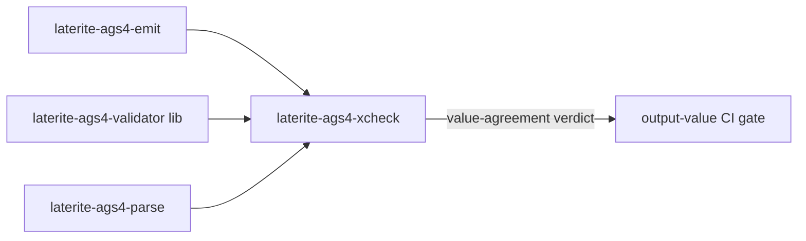

# laterite-ags4-xcheck

## What it is
> [!quote] **Implemented** (`repo:rust-packages/laterite-ags4-xcheck`). The
> cross-surface **output-value** gate: it holds every surface's *emitted
> values* (not just its findings) to a single authority, so a surface that
> parses/emits a cell differently is caught — the layer below findings
> agreement.

It's a deliberately **lean** crate — deps only `validator + emit + parse` — so
the gate builds fast and carries none of the findings-agreement harness's deps.
It was extracted out of the (larger) findings harness for exactly that reason;
see [[laterite-ags4-compliance]] for the split.

## Inputs / outputs
> [!quote] In: the shared **case manifest** (`cases/*.json` + `cases/inputs/`)
> — the single case-list SSOT this crate owns. Out: a pass/fail value-agreement
> verdict; non-zero exit on any unexplained split. **Zero normalisation** —
> JSON equality.

Two bins share one `#[path]`-included module (`xcheck_shared.rs`):
- `emit-cases` — the **authority** leg: drives the shared emit/format leaves
  directly (not through a binding), so its column is the reference every
  surface leg is held to.
- `xcheck` — the **comparator**: loads the case manifest + every leg's
  observation file, runs N-way equality + leaf authority + the spec invariants
  (`emit_reparses`), and exits non-zero on any unexplained split.

## Relationship to laterite-ags4-compliance
Separate concern, separate crate. [[laterite-ags4-compliance]] checks *findings*
agreement; this crate checks *output values*. The case-list SSOT lives here, and
compliance's harness bins never touch it — so the value gate stays slim and the
two are decoupled.

## Where it lives
`repo:rust-packages/laterite-ags4-xcheck`. Deps [[laterite-ags4-emit]] +
`laterite-ags4-validator` + `laterite-ags4-parse` — all lean leaves.

## Relationship to other components

## Related
[[laterite-ags4-compliance]] · [[laterite-ags4-emit]] · [[crate-map]]
