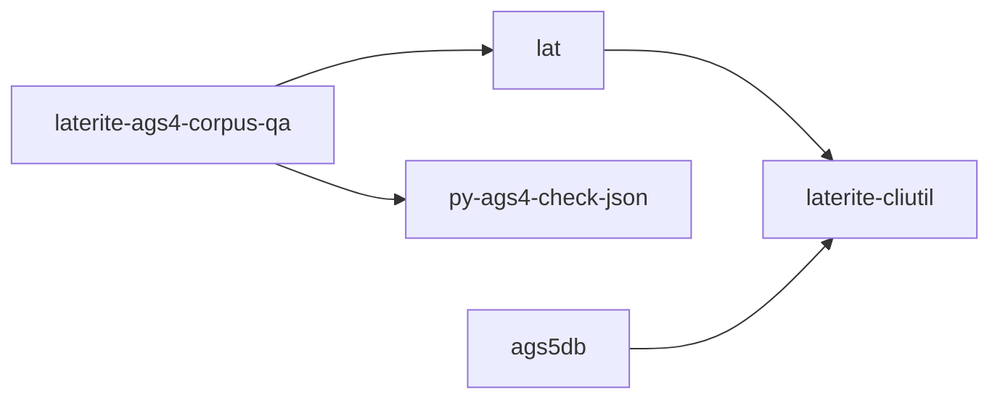

# laterite-cli

## What it is
> [!quote] The clean-room Rust AGS4 validator CLI crate; ships the `lat` binary (lib `laterite_ags4_validator` + bin). Implements Rules 1–20 from the spec PDF (clean-room: python-ags4 LGPL read only for behavioural parity, never copied). Edition auto-resolved from TRAN_AGS (lib.rs::resolve_dict_version).

## Commands

`lat` is a subcommand tool — a bare `lat <file.ags>` is shorthand for `lat validate`. Each verb owns its flags (`lat <verb> --help`); the table below is generated from the shipped guide (`lat --readme`) so it can't drift from the tool:

<!-- generated:cli-verbs — DO NOT EDIT; source repo:rust-packages/laterite-cli/README-cli.md (== `lat --readme`); regenerate: uv run --no-sync python tools/gen_wiki_cli.py -->
| Verb | Arguments | What it does |
|---|---|---|
| `validate` | `<file>` | run the numbered AGS Format Rules and report (the default) |
| `read` | `<file> [grp]` | dump a group's rows (table / --csv / --json), or list codes |
| `fix` | `<file>` | mechanically repair the file (safe fixes; --risky for more) |
| `diff` | `<a> <b>` | KEY-aware / type-aware revision delta between two files |
| `merge` | `<files...>` | reconcile 2+ deliveries of one project into one file (--out) |
| `certify` | `<file>` | mint the .ags.idx validity certificate for a clean file |
| `rules` | — | print the AGS4 rule catalogue (no input file needed) |
| `pack` | `<in> <out>` | zstd-compress any file for transport (unpack reverses it) |
| `unpack` | `<in> <out>` | restore a packed file |
| `lock` | `<in> <out>` | zstd + age passphrase-encrypt (unlock reverses it) |
| `unlock` | `<in> <out>` | decrypt + decompress a locked file |
| `excel` | `<in> <out>` | convert AGS4 ↔ Excel (direction from the output extension) |
<!-- /generated:cli-verbs -->

Global flags, valid before or after the verb: `--json` / `--ndjson` (machine-readable findings) and `--quiet`. `pack`/`unpack`/`lock`/`unlock` (transport) and `excel` are on by default and compile out under `--no-default-features`.

## Inputs / outputs
> [!quote] In: an `.ags` path plus per-verb flags — the dictionary edition (`--dict-version auto|4.0.3…4.2`, resolved from `TRAN_AGS` by default) and source `--encoding`. Out: `validate` prints a findings table (Rule·Line·Group·Description) or `--json`/`--ndjson`, with typed exit codes (0 clean · 1 findings · 3 not-found · 4 not-AGS4 · 5 bad-args · 6 schema). Since #203 errors AND WARNINGs show by default (like a compiler); `--no-warnings` is errors-only, `--show-fyi` adds the FYI tier.

`certify` mints the `.ags.idx` validity certificate for an error-clean file (`cert::mint_index`, skipped if the file still has errors) — the reason the CLI deps `laterite-ags4-core` (`default-features = false`, so no transport/age/zstd). It is the only opt-in cert-*minting* layer besides Python `.certify()`; the DuckDB extension is read-only (#446) and only *consumes* an `.ags.idx` (autodiscovery), never mints one.

`--dict-version`'s accepted set (`commands/common.rs::apply_dict_args`) asks the generated `DictVersion::from_edition`, not a hand-written `match` (fixed 2026-07-14) — until then its rejection *message* was generated from `DictVersion::ALL` while its match *arms* were not, so a newly bundled edition would have shipped a `lat` that rejects that edition with a message advertising it as valid. See [[edition-resolution]].

`--encoding`'s `resolve_encoding` (`commands/common.rs`) is now a one-line call to the shared parse leaf (`laterite_ags4_parse::resolve_encoding`, fixed 2026-07-14) — it used to keep a **private** label table wider than the leaf's (it alone accepted `latin9`/`latin-9`, so that flag worked on `lat` and was rejected by the Python library). [[surface-census]] gained a third table (`encodings`) that diffs each launcher's own resolver on a fixed probe list to prove one label means one thing everywhere. See [[data-single-source-audit]].

This binary is the census's **authority** (`census.rs::arg_json`) — every other launcher's per-verb flag table is diffed against clap's own. Its first cut asked clap for `get_num_args()`, which is `None` unless an explicit arity was set, so every valued flag (`--dict-version`, `--encoding`, `--index`, …) reported `takes_value: false` — a wrong authority answer that would have made every launcher look agreed-and-wrong rather than caught. Fixed 2026-07-14 to ask the **action** (`ArgAction::Set | Append`) instead, pinned by `census_knows_which_flags_take_a_value`.

The same census run found a divergence in this binary's own `--index` handling — `commands/cert.rs::try_certified_skip` skipped the rule engine on cert freshness + checker identity + profile coverage alone, regardless of `--no-warnings`/`--show-fyi`, where the Python/Node library refused to skip on a warnings/FYI request at all. It was invisible to a declaration-level census (both launchers declare `--index` identically), and it turned out to be the visible edge of **five** hand-written trust conjunctions, four of which could report a file clean that was not. **Closed 2026-07-14**: `try_certified_skip` is deleted and this binary calls `laterite-ags4-trust::check` like every other surface — a certificate may stand in for a tier iff it MEASURED that tier and found it EMPTY. `certify` lost `--check-files` (a certificate is a statement about bytes; the directory beside them is not one) and no longer needs a prior validate — it runs one. See [[cert-trust-v2]].

## Where it lives
`repo:rust-packages/laterite-cli`

## Relationship to other components

See [[crate-map]] for the workspace dependency graph.

See [[parity-model]] for the lat ↔ py-ags4-check-json cross-check.

## Related
[[parity-model]] · [[laterite-cli]] · [[crate-map]] · [[edition-resolution]] · [[surface-census]] · [[data-single-source-audit]] · [[dec-ags-idx-certificate]] · [[cert-trust-v2]]
