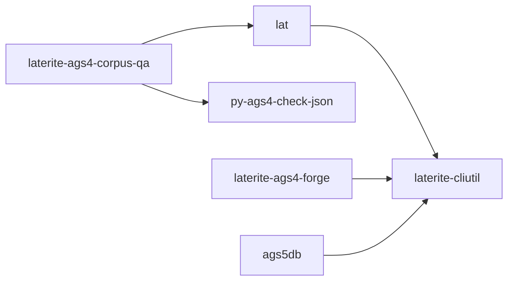

# laterite-cliutil

## What it is
> [!quote] Shared CLI crate: Spinner, progress bars, styled tables, colour gate, OutputMode, --readme. Single source for the gogcli-style UX; deliberately pulls NO walkdir/rayon/ratatui (validator lean-dep-graph guarantee).

## Inputs / outputs
> [!quote] In: used as a Rust crate dependency. Out: Spinner/progress/styled-table/colour-gate/OutputMode primitives shared by the CLIs. No I/O of its own; deliberately pulls no walkdir/rayon/ratatui. Gains a `report` module (`Ctx`/`Report`/`emit`/`Plan` lifted from `repo:rust-packages/laterite-ags4-corpus-qa/src/output.rs`) so [[laterite-ags4-forge]] and [[laterite-ags4-corpus-qa]] share one report scaffold — the [[agent-first-cli-contract]] in crate form.

## Where it lives
`repo:rust-packages/laterite-cliutil`

## Relationship to other components

See [[crate-map]] for the workspace dependency graph.

See [[parity-model]] for the lat ↔ py-ags4-check-json
cross-check, and [[agent-first-cli-contract]] for the behavioural
contract these primitives encode.

## Related
[[parity-model]] · [[laterite-ags4-check]] · [[laterite-ags4-forge]] · [[agent-first-cli-contract]] · [[crate-map]]
