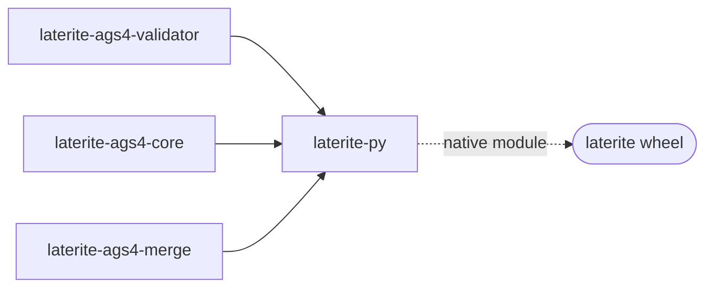

# laterite-py

<!-- BEGIN GENERATED: crate-card — DO NOT EDIT BY HAND. Regenerate: uv run --no-project python tools/gen_crate_graph.py -->
> [!note] **Not published** — `laterite-py` is a workspace crate, internal to this repo, versioned on its own line.
> **Used by** — nothing else in this workspace.
<!-- END GENERATED: crate-card -->

> [!note] External developers use the [[laterite]] wheel; this crate is the
> compiled `_laterite_native` module behind it.

## What it is

The **PyO3 bindings** exposing the clean-room [[laterite-ags4-validator]] engine
to Python. A thin boundary: every bit of AGS4 logic lives in the
validator (parity-tested) or the local `emit` module; the Python side
(`laterite/__init__.py`, `compat.py`, `_cli.py`) assembles
narwhals/polars frames and the python-ags4-shaped dict from the
primitives returned here. This is the native module behind the public
[[laterite]] base wheel (the light, no-DuckDB AGS4 surface).

The boundary shape now splits by path: the typed read door (`parse_arrow`)
and, since the 2026-07-20 compat perf pass, `compat.AGS4_to_dataframe`'s
common path (`parse_compat_arrow`) hand Python a zero-copy Arrow
`RecordBatch` — **no per-cell `PyObject` boxing**. `check_file`,
`AGS4_to_dict`, and the error/finding JSON still cross as **plain Python
primitives** (lists/dicts/str/int) via `parse_primitives`, assembled into
frames Python-side. Neither Arrow path is pyo3-polars — both use the
stable Arrow C Data Interface (capsules), which is why abi3 still holds.
Full detail (which path carries what, and why): [[pyo3-boundary]]; the
direction (Rust drives Python) is [[dec-rust-drives-python]].

## Inputs / outputs

In: AGS4 file paths / bytes + options (e.g. `dict-version`, `encoding`)
from Python. Out: validation findings and parsed primitives. Two
error-JSON shapes are preserved byte-faithfully — the Rust-CLI shape
`{file, findings:{rule:[…]}}` is built *here* with the same
`serde_json` (`preserve_order`) calls `lat` uses; the python-ags4
`check_file` dict is assembled in `laterite/compat.py`.

## Where it lives

`repo:rust-packages/laterite-py` — the **only** crate in the workspace
that links pyo3. Depends on [[laterite-ags4-validator]] (never the reverse) and
[[laterite-ags4-core]] (`ags4_codec` / `ags_types` / `error` / `index` /
`keychain` / `read_render` / `registry` / `transport` — no DuckDB; the list here
used to name `excel` and `ddl`, neither of which is a module of that crate —
Excel is the sibling `laterite-ags4-excel` named below), plus the wasm-safe leaves `laterite-ags4-diff` / `laterite-ags4-emit`
/ `laterite-ags4-merge` (the Python `diff()` / `build_ags4()` / `merge()`
surfaces — `merge_files` in `src/lib.rs` is the new 2026-07-12 addition, see
[[dec-ags4-merge-semantics]]) and [[laterite-ags4-reference]] directly (its
`build.rs`'s typed-graph codegen, below). Built **only via maturin** (`maturin develop` /
`maturin build`), never a bare `cargo build`; the cdylib loads in Python
as `laterite._laterite_native`. Its `build.rs` also emits the typed-graph
`#[pyclass]` codegen — since laterite-dev#475's follow-up (laterite-dev#493) it does so via
[[laterite-ags4-reference]]'s `union::union_groups()` as a build-dependency,
not by hand-parsing `ags_dictionary.json` itself. That retired the workspace's
**third** independent reader of the union JSON (the reference leaf's own
registry and `tools/generate_pyi.py` were the other two); the regenerated
`.pyi` verified byte-identical, so the retired reconstruction hadn't drifted.
See [[dec-dictionary-single-source]].

`registry_fns.rs` also exposes `registry_editions()` / `registry_fallback_edition()`
(2026-07-14), both projecting [[laterite-ags4-reference]]'s generated
`DictVersion::ALL`/`FALLBACK` — so `_cli.py`'s `--dict-version` choices are
`("auto", *_native.registry_editions())` rather than a fourth hand-written
tuple. The same change fixed `emit_typed.rs::parse_edition` — a *second*,
hand-written edition `match` sitting in this crate alongside `lib.rs::parse_dv`,
which already asked the authority correctly — to call `DictVersion::from_edition`
and the generated `FALLBACK` instead of its own hard-coded `V4_1_1`. See
[[edition-resolution]].

## Where it fits

Full graph in [[crate-map]]; immediate edges:

## Related

[[crate-map]] · [[laterite-ags4-validator]] · [[laterite-ags4-core]] · [[laterite-ags4-reference]] · [[laterite]] · laterite-py-ags5 · [[pyo3-boundary]] · [[dec-rust-drives-python]] · [[dec-dictionary-single-source]] · [[core-emit-layering-inversion]] · [[dec-ags4-merge-semantics]] · [[edition-resolution]]
