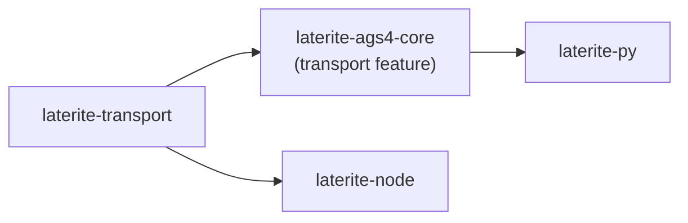

# laterite-transport

> [!note] **Internal implementation detail** — a workspace crate, not a public
> API. Its operations reach users through `lat pack`/`unpack`/`lock`/`unlock`
> ([[laterite-cli]]) and the wheel's `transport` surface ([[laterite]]),
> never as a crate a consumer names directly.

## What it is

The shared **file envelope**: zstd compression and age passphrase encryption over
raw file bytes. It was extracted (#327) from `laterite-ags4-core::transport` for
one concrete reason — the age + zstd logic previously lived as **two byte-identical
copies** (core and [[laterite-node]]), and the age `0.10 → 0.11` migration had to
touch both. One crate, one copy, one place the next crypto-dep bump lands.

The operations are deliberately **content-agnostic**: zstd/age over raw bytes, so
they work on any file (`.ags` or otherwise) — transport knows nothing about AGS4.
The `age` envelope is **interoperable with the Python-side `pyrage` library**:
same on-disk format, both linking the same Rust `age` crate underneath, so a file
locked here unlocks there and vice-versa.

## Inputs / outputs

Four verb pairs, each with a bytes-level and a path-level form:

- **`pack` / `unpack`** — zstd only. `pack` defaults to **level 9**, the AGS
  sweet spot (AGS4 is highly compressible text). Returns `PackStats` /
  `UnpackStats` (in/out sizes).
- **`lock` / `unlock`** — age passphrase (scrypt mode) *plus* zstd: compress then
  encrypt on the way in, decrypt then decompress on the way out.
- **`pack_bytes` / `unpack_bytes` / `lock_bytes` / `unlock_bytes`** — the same
  four over in-memory `Vec<u8>`, for callers that never touch the filesystem
  (the Node binding, the wheel).
- **`encrypt_with_passphrase` / `decrypt_with_passphrase`** — the bare age leg,
  exposed for callers that want encryption without the zstd step.

Errors are one `TransportError` enum; consumers map it to their own type
(`From<TransportError> for CliError` in core, `napi::Error` in the Node binding).

## Where it lives

`repo:rust-packages/laterite-transport`. Deps are `zstd`, `age`, and `thiserror`
only. The `age` envelope pulls `getrandom`, so this crate is **not wasm-clean** —
which is exactly why [[laterite-ags4-core]] gates it behind a `transport` feature
(off by default) rather than making every core consumer carry it. Direct
consumers are core (re-exporting these behind `transport`) and [[laterite-node]];
the wheel ([[laterite-py]]) reaches it by enabling core's `transport` feature.

## Relationship to other components

The full workspace graph is in [[crate-map]] (dependency form in
[[crate-dependency-graph]]):

## Related

[[crate-map]] · [[crate-dependency-graph]] · [[laterite-ags4-core]] · [[laterite-node]] · [[laterite-py]]
