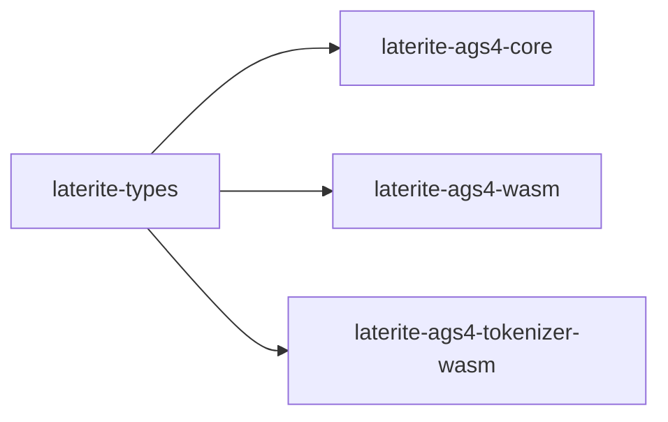

# laterite-types

> [!note] **Internal implementation detail** — a workspace leaf crate, not a
> public API. The published surface is the [[laterite]] wheel's
> `laterite.ags_types` re-export, not this crate directly.

## What it is

The AGS4 **type system** as a deliberately tiny, wasm-safe leaf crate:
the canonical-type taxonomy plus the permissive AGS4-string → typed-value
casting that both the native DuckDB engine and the browser data explorer
share. "DuckDB-free, wasm-safe" is the whole point — see the design
decision [[dec-laterite-types-leaf]] for *why* it was extracted out of
`laterite-ags4-core`, rather than restating it here.

Key API (`repo:rust-packages/laterite-types/src/lib.rs`): `CanonicalType`
(the 8-member target taxonomy + its `as_str` / `sql_type` mappings),
`canonical_type` (AGS code → canonical type), `parse_value` (raw string →
`serde_json::Value`, `Null` on unparseable), `parse_datetime`, and
`sql_type`. `decimal_places(code) -> Option<usize>` and `pad_decimals(raw, n)
-> Option<String>` are a narrower pair added for
`laterite-ags4-merge`'s `promote` TYPE-clash mode: `decimal_places` matches
only the `nDP` family — deliberately finer-grained than `canonical_type`,
which buckets `2DP`/`3SF`/`2SCI` together — and `pad_decimals` zero-pads a raw
string to `n` places *without* going through `f64` (an f64 round-trip can
perturb a value past 2^53; `pad_decimals` instead returns `None`, "cannot pad
losslessly", for anything it won't touch). See [[dec-ags4-merge-semantics]].
Read-side casting has a write-side mirror: `ags4_str` (typed value → AGS4
wire form, #528) and — since #533, part of the #527 convergence arc —
`write_quoted_field<W: Write>`/`quote_field` (wrap a raw value in `"…"`,
doubling an embedded `"`; the streaming form is the field primitive
`laterite-ags4-emit`'s byte-faithful writer streams every cell through).
`quote_field` is also this crate's browser face: the new tiny
`laterite-ags4-tokenizer-wasm` crate wraps it (alongside
`laterite-ags4-parse::tokenize_spans`) for the browser's inline line
editor/preview, retiring the hand-written TS copy that used to live in
`web/src/lib/agsline.ts`. See [[dec-laterite-types-leaf]] for the
home-of-the-quoter decision (Option C: beside `ags4_str`, zero new
dependency edges).

## Inputs / outputs

In: an AGS type code and a raw AGS4 string. The code spans the plain
string/numeric-or-text types [[ID]], [[X]], [[XN]], [[T]], [[U]] and
[[DMS]], the record-link type [[RL]], and the parametric decimal/
significant-figure/scientific-notation families [[nDP]] (`0DP`…`6DP`),
[[nSF]] and [[nSCI]] — plus the pick-list types (`PA`/`PT`/`PU`, see
[[pa-not-case-sensitive-pt-pu-are]]). Out: a `CanonicalType` and a typed
`serde_json::Value` (scalar shapes only — no Maps). Unknown codes fall
through to string storage; unparseable values return `Value::Null`
(mirrors the original Python `_types` module semantics).

## Where it lives

`repo:rust-packages/laterite-types` — a true dependency **leaf**: chrono
(no-clock, no-wasmbind) + `serde_json` only, none of `laterite-ags4-core`'s
wasm-hostile deps (age / zstd / calamine / rpassword / csv). Re-exported
by `laterite-ags4-core` as `laterite_ags4_core::ags_types`
(`repo:rust-packages/laterite-ags4-core/src/lib.rs`), and depended on directly by
[[laterite-ags4-wasm]] so the browser casts a file *identically* to a `.ags5db`.

## Where it fits

The full workspace graph is in [[crate-map]]; this crate's immediate
edges:

## Related

[[crate-map]] · [[laterite-ags4-core]] · [[laterite-ags4-wasm]] · [[dec-laterite-types-leaf]] · [[dec-ags4-merge-semantics]]
