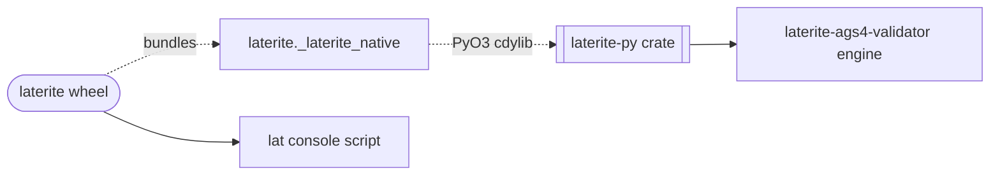

# laterite

> [!warning] **This is the PyPI wheel.** The Rust crate published to crates.io is
> also called `laterite` and is a different artifact on a different version line
> — see [[laterite-crate]]. `pip install laterite` gets this; `cargo add laterite`
> gets that.

## What it is

The **published, public-facing AGS4 wheel** — `pip install laterite`. Per
`repo:packages/laterite/pyproject.toml`: *"Rust-backed AGS4
reader/writer/validator — a fast, drop-in replacement for python-ags4 with
born-typed polars/pandas reads and a lean polars+duckdb base install"*. It is
the primary external-developer surface of this toolkit and the wheel most
callers want; the `.ags5db`/AGS5 work was decoupled to a dormant holding
folder (laterite-ags5).

It exists to **replace [[python-ags4]]**: a faster validator/parser with a
clean-room engine (so it ships MIT, not LGPL), returning born-typed polars
frames instead of carrying an unconditional pandas dependency. The
Rust↔python-ags4 behavioural-equivalence story is tracked in [[parity-model]].

> [!note] Stability
> `Development Status :: 3 - Alpha` in the pyproject classifiers
> (`repo:packages/laterite/pyproject.toml`). The AGS4 read/write/validate
> surface is the stable core; treat the API as alpha-but-converging.

## Install & dependency shape

The deliberate design choice is a **light mandatory footprint** — only
`polars` + `duckdb`, *no pandas and no pyarrow* (cite
`repo:packages/laterite/pyproject.toml dependencies`). The base returns
polars frames; a caller who wants pandas asks for it by extra rather than
paying for it unconditionally.

**DuckDB is load-bearing in the base**, not an optional nicety: it is the
pyarrow-free dataframe bridge. Dropping it would reintroduce pyarrow on the
pandas path, which is the dependency this shape exists to avoid.

| Install | Adds | For |
|---|---|---|
| `pip install laterite` | nothing beyond `polars` + `duckdb` | base AGS4 work |
| `pip install "laterite[compat]"` | `pandas<3` only — **pyarrow-free** | the [[python-ags4]] drop-in surface (returns pandas frames) |
| `pip install "laterite[pyarrow]"` | `pyarrow` | the optional accelerator, auto-detected at runtime |
| `pip install "laterite[all]"` | `pandas<3` + `pyarrow` | compat and the accelerator together |

`set_backend("polars")`
(`repo:packages/laterite/python/laterite/compat/_impl.py::set_backend`) and
`LATERITE_COMPAT_BACKEND=polars`
(`repo:packages/laterite/python/laterite/_frames.py::_DEFAULT_BACKEND`, where
the env var is actually read) drop the pandas requirement from the compat path
entirely.

> [!note] The base wheel is light — **6.0 MB** (macOS arm64) to **6.9 MB**
> (Windows), no bundled DuckDB; the sdist is 0.6 MB. Measured from the published
> 0.10.0 artifacts on PyPI, not from a local build, so it is what a user actually
> downloads. The previous figure here said ~10 MB, which overstated it by ~50%.
> The DuckDB-bundling
> `.ags5db` companion was decoupled and is no longer
> published; `[ags5]` is gone.

Requires Python ≥ 3.12 (`requires-python` in `repo:packages/laterite/pyproject.toml`) — one abi3-py312 wheel per platform, green on 3.12/3.13/3.14.

## Public import surface

The external API contract — what a developer gets after `import laterite`
(authority: `repo:packages/laterite/python/laterite/__init__.py`):

- `from laterite.groups import PROJ, LOCA, SAMP, …` — the **174 standard
  typed group classes** (one per AGS group; compile-time-generated, see
  [[laterite-py]]). They live in the `laterite.groups` submodule, **not**
  the top-level `laterite` namespace (which carries only the
  read/validate/build API) — `from laterite import PROJ` was retired.
- `from laterite.ags4 import read_typed` — AGS4 (path / file-like / bytes /
  text, `encoding=` like `read()` since #294 B/#13) → typed PROJ tree in
  one call. Pure **base** path (no DuckDB): builds the tree from
  `parse_primitives` + the registry + `parse_value`, porting the
  decoupled `.ags5db` converter's shared-keys linkage (W2, 2026-06-16; the
  byte-equality parity test moved out of this tree with the engine).
- `from laterite import compat as AGS4` — the **python-ags4-compatible
  shim** (`AGS4.AGS4_to_dataframe(...)`, etc.) for legacy callers porting
  off [[python-ags4]]; defaults to pandas frames (needs `[compat]`).
- `from laterite.registry import GROUPS, GroupDescriptor, Heading,
  child_groups` — read-only typed view over the AGS dictionary.
- `from laterite.transport import pack, unpack, lock, unlock` — zstd + age
  envelope.
- `from laterite.ags_types import canonical_type, parse_value,
  CanonicalType` — AGS type-code helpers.

It also installs an **`lat` console script**
(`repo:packages/laterite/pyproject.toml [project.scripts]`) — deliberately
byte-faithful (flags, JSON/NDJSON shape, exit codes) to the Rust
[[laterite-cli]] binary. Same CLI, Python face.

**`lat validate --index <cert>`** (`_cli.py::_with_cert`, 2026-07-14) is a door this
launcher was simply missing until the surface census's per-verb arguments table
(`CENSUS_VERSION` 3→4) diffed it against the binary and npx and found it absent — a
verb-name gate had nothing to say, since `validate` was present on all three. The
cert POLICY is the library's (`read(index=)` freshness-checks; `.validate()`
decides whether it may skip the engine), imported lazily so the common
native-only path stays fast; the CLI adds only the recovery posture (a stale cert
is a stderr note, not an error). A `_pin` helper translates `--dict-version`'s
default sentinel — the literal string `"auto"` — to the library's `None`: handing
`"auto"` straight through makes the request look like a FORCED edition, which
silently disarms the `--index` skip (it happened on the first real run of this
flag; only asserting the SKIP ITSELF — `report.certified` — and never "it exits 0",
caught it). The trust decision itself is no longer here, or in the library, or in the
binary: it is `laterite-ags4-trust`, once, for every surface ([[cert-trust-v2]]).
See `repo:packages/laterite/tests/test_cli_index.py`, [[surface-census]],
[[dec-ags-idx-certificate]].

## Backed by

The native extension module is `laterite._laterite_native` — a PyO3
cdylib. Its internals (the `#[pyclass]` codegen, the Rust↔Python frame
boundary) live in the [[laterite-py]] page; this page is the wheel
contract, not the cdylib mechanics. See [[crate-map]] for the whole
workspace graph.

## Diagram

See [[crate-map]] for the full crate↔wheel graph and [[parity-model]] for
the python-ags4 parity verdicts.

## Related

[[crate-map]] · [[laterite-py]] · laterite-ags5 · [[python-ags4]] · [[parity-model]] · [[laterite-cli]] · [[dec-rust-drives-python]] · [[surface-census]] · [[dec-ags-idx-certificate]] · [[cert-trust-v2]]
