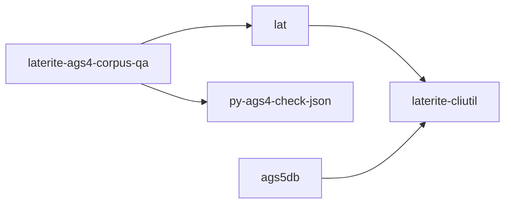

# py-ags4-check-json

## What it is
> [!quote] The parity reference wrapper: emits python-ags4 AGS4.check_file as rule-keyed JSON. Faithful passthrough of native default `ags4 check` (utf-8 errors='replace'); --encoding-fallback inert by design (O-32 no-masking audit).

## Inputs / outputs
> [!quote] In: an .ags path (+ inert --encoding-fallback). Out: rule-keyed JSON of AGS4.check_file to stdout (exit 0/1/2/3); the JSON contract parity.rs consumes. Wraps [[python-ags4]].

## Where it lives
`repo:tools/py_ags4_check_json.py`

## Relationship to other components

See [[crate-map]] for the workspace dependency graph.

See [[parity-model]] for the lat ↔ py-ags4-check-json cross-check.

## Related
[[parity-model]] · [[laterite-ags4-check]] · [[crate-map]]
