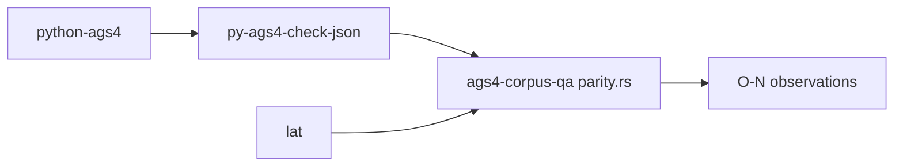

# python-ags4

## What it is
> [!quote] The AGS Data Format Working Group's official AGS4 validator/converter library (LGPL-3.0). `AGS4.py` (I/O, edition selection, dataframe model) + `check.py` (Rules 1–20). It is the **behavioural oracle** for this clean-room port: read to *understand* expected behaviour, never copied (every rule module header states this). Every OBSERVATIONS O-N is a python-ags4 ⇄ spec ⇄ Rust triangulation.

## Inputs / outputs
> [!quote] In: an .ags file via AGS4.check_file(path, encoding='utf-8'). Out: a dict keyed by 'AGS Format Rule N' / 'FYI …' / 'Metadata' → findings. The behavioural oracle; opens utf-8 errors='replace' (O-32), pandas-backed Rule 8 (O-12/O-33).

## Key behaviours (each an O-N)
- Rule 6 is a literal no-op (`return ags_errors`) — O-2.
- Rule 1 admits code points 0–255 (128–255 = FYI) — O-1; lossy U+FFFD on bad bytes — O-32.
- Rule 8 folds group-ID uniqueness in (Rule 10a's job) — O-11; pandas-bounded dates — O-33.
- rule_7_2 can IndexError on duplicate headings — O-8.
- Rule 10c parentless set hardcoded (incl. LOCA) — O-21.
- No refuse path: tab-delimited/empty files mislabelled missing-groups — O-34; AGS3 silently validated as 4.1.1 — O-30.
- `_format_SF`/`_format_DP`/`_format_SCI` compute a numeric TYPE's declared count at arbitrary Python-int precision with no upper bound, so a crafted count OOMs (MemoryError/DoS) — O-49.
- `convert_to_numeric`'s `int(float(s))` converts a `0DP` cell at arbitrary Python-int precision — never fabricates, unlike laterite's pre-#611 saturating `i64` cast — O-50.

## Relationship to other components

Wrapped by [[py-ags4-check-json]] (JSON contract for the harness); cross-checked against [[laterite-ags4-check]] by [[ags4-corpus-qa]] via [[parity-model]]; the source of [[observations-coverage-map]] and every [[O-01]]…[[O-34]]. Clean-room boundary: see [[upstream-reporting]].

Also the **root authority for the five vendored AGS4 `.ags` dictionaries** —
[[vendored-authority-faithful]] checks them byte-for-byte against this
package's own installed copies (a declared dev dependency), not just against
each other.

## Related
[[py-ags4-check-json]] · [[parity-model]] · [[ags4-corpus-qa]] · [[observations-coverage-map]] · [[upstream-reporting]] · [[crate-map]] · [[laterite]] · [[vendored-authority-faithful]] · [[O-49]] · [[O-50]] · [[numeric-type-count-uncapped-format-width]] · [[0dp-integer-conversion-precision-loss]]
