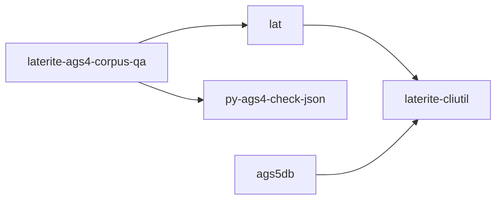

# scaffolders

## What it is
> [!quote] experiments/{scaffold_ags4_dict,merge_ags4_into_dict,backfill_dict_units}.py — infer/merge dictionary entries from sample AGS4 (or the AGS-L xlsx), and backfill empty units from python-ags4's bundled standard dicts; not production.

## Inputs / outputs
> [!quote] In: a sample AGS4 file (or `reports/AGSL4_2_*.xlsx`). Out: inferred/merged ags5_dictionary.json entries (scaffold_ags4_dict.py, merge_ags4_into_dict.py); backfill_dict_units.py fills empty `unit` fields from python-ags4's 4.0.3–4.2 dicts (version fallback) and never overwrites hand-curated units. Not production.

## Finding — empty units are mostly correct (backfill audit, 2026-05-15)
> [!note] `backfill_dict_units.py --report-numeric-gaps`: of 65 numeric-typed headings with an empty `unit`, only **9** were real gaps (contractor sieve-size + test-date headings); the other **56** are correctly unitless per the AGS4 standard (counts, ratios, pH, dimensionless coefficients). So an empty UNIT on a numeric heading is usually *correct*, not a Rule-8/Rule-15 violation — worth remembering before "fixing" one. (`--diff-versions`: AGS4 4.2 adds 257 (group,heading)→unit pairs over 4.1 and drops 28, incl. `ERES_DTIM`'s unit.)

## Where it lives
`experiments`

## Relationship to other components

See [[crate-map]] for the workspace dependency graph.

See [[parity-model]] for the lat ↔ py-ags4-check-json cross-check.

## Related
[[parity-model]] · [[laterite-ags4-check]] · [[crate-map]]
