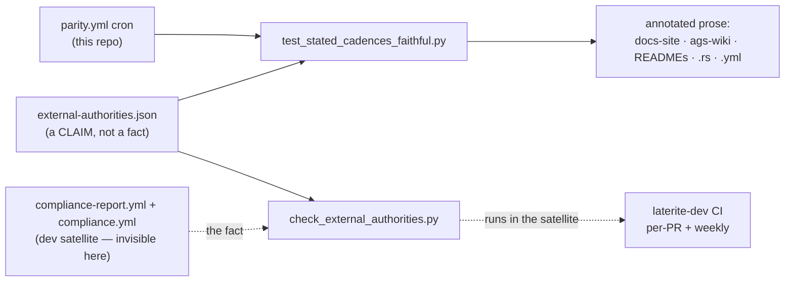

# stated-cadences-faithful

## What it is
> [!quote] The faithfulness gate for **cadence claims** — every sentence in this
> repo that states how often a workflow runs. The cron is the fact; the sentence
> is a claim about it, and until this gate nothing compared the two. Sibling to
> [[vendored-authority-faithful]], which does the same for the four hand-written
> `python-ags4` version strings.

## Two workflows that are not each other

The whole failure class here is a **conflation**, so the vocabulary comes first:

| term | workflow | where | cadence | what it does |
| --- | --- | --- | --- | --- |
| **oracle run** | `parity.yml` | this repo | weekly (Sun 03:00) | python-ags4's own suite vs `laterite.compat`. No matrix. |
| **matrix report** | `compliance-report.yml` | dev satellite | monthly (1st, 04:00) | six read surfaces over a corpus, byte-identical findings. |

They share a subject (are we still right?) and nothing else. Calling the matrix
report *weekly* — the drift this gate exists for — is reading the oracle run's
schedule off the wrong workflow.

## The measured gap (not a hypothesis)

It shipped twice, to a published page both times:

- **#311** — `cross-surface-parity.md` and `surfaces/index.md` both called the
  6-surface report *weekly*. The same PR found the reason-clause in this repo's
  own `wiki-ext-drift.yml` still describing `parity.yml`'s **retired** monthly
  slot, so a future editor would have reasoned from it.
- **#312** — the identical conflation, restated in four Rust doc comments.

Neither page named a workflow file and neither lived under `ags-wiki/`, so the
whole-vault wiki lint could not have seen either. Both are now regression
fixtures: restoring `git show 94cdefd^`'s copy of `cross-surface-parity.md`
turns this gate red, and so does flipping one word in the annotated version.

## The three checks

1. **Annotated blocks agree with their authority.** A block carrying
   `cadence: <id>` must state exactly the cadence words its markers derive — no
   more, no fewer. Both directions: a missing word means the prose dropped or
   contradicts the claim, an extra one means a second claim rode along unstated.
2. **The tripwire.** A block that names a known workflow — by filename *or* by a
   declared alias — and states a cadence, but carries no marker, is an
   unannotated claim. This is the half that catches a page written tomorrow.
3. **The far side** (`check_external_authorities.py`, running in the satellite):
   the mirrored value equals the cron in the file it claims to mirror.

The derived word is **computed from the cron**, never written beside it. A
hand-typed `"monthly"` in the mirror would be the same drift one file over.
An unclassifiable cron (`0 4 1,15 * *`) makes the gate **refuse**, not round to
the nearest word — a guess would put a wrong claim in the tree with a passing
test's name on it.

### The grammar

Payload is identical everywhere; only the comment wrapper changes, so one regex
finds all of them and Markdown renders none of them.

```
<!-- cadence: compliance-report -->      .md   (invisible; docs-site pages are product pages)
#  cadence: parity                       .py / .yml
//! cadence: compliance-report           .rs
%% cadence: compliance-report            inside a mermaid fence
```

Exemptions reuse the wiki lint's A11 (`repo:ags-wiki/.bootstrap/lint.py`) word
and both its forms, and are
**line-scoped**: `cadence: historical` exempts every cadence word on its line,
`cadence: historical=monthly` only the one named. The specific form is the one
that does the work — the two real exemptions in this tree each put the live word
and the dead one in a single sentence ("Weekly rather than monthly since the
`dropin-surface` job joined"), so a block-scoped exemption would silence the live
claim along with the narration.

## The missing half: a mirror nobody checks

`compliance-report.yml` and `compliance.yml` live in the dev satellite, which
this repo's CI cannot read. `repo:external-authorities.json` mirrors their
`cron:`/`on:` values so the gate can run offline — and a mirror with nothing
comparing it back to its subject is **#549's Shape 1** exactly: the gate
enforcing a proxy for the promise. `check_external_authorities.py` is the
comparison, and it necessarily runs *there*.

Direction was chosen, not defaulted. The satellite can read this public repo for
free (it already clones it); the reverse needs a PAT and would print a private
repo's CI structure into a world-readable Actions log. The script lives **here**
and runs from the satellite's checkout of this tree, so the two cannot drift —
that tree carries its own engine and its own copies of these tools, and a second
copy would be the bug this gate exists to catch.

Unlike `ruleset-drift.yml`, which it otherwise follows, the far side **can** be a
per-PR gate: its subject is a file on disk in the checkout, not a flaky API, so
there is no "could not read" that isn't a genuine fault. A missing record, path
or mirror **fails** — a gate that cannot read its own subject is decorative, and
a silent permanent skip is how it stays that way.

## What this does NOT prove (the honest limit)

- **The tripwire only sees claims that name their workflow.** Three real claim
  sites here state a cadence and identify nothing — `README.md` and
  `packages/laterite/README.md` say only "A weekly job compares the two public
  surfaces", `gen_doc_outputs.py` says "the dev satellite gates monthly". All
  three are annotated, but they were found by hand and a fourth like them would
  be invisible. Adding an alias is how each such gap closes.
- **`ci.yml` is resolvable but never matched**, deliberately: giving it an alias
  pulls in 10 further blocks across `ci`/`nightly`/`e2e`/`release`, all
  describing this repo's own gates. They are real claims, but a tripwire that
  arrives demanding 10 annotations unrelated to the drift it was built for is one
  people learn to exempt.
- **`nightly` is not a cadence word here** — it is also a workflow name in this
  repo, so it cannot be scanned as one without meaning the other.
- **The gate's own four files are not scanned — including this page.** They carry
  the grammar's examples, and a scanner parsing its own documentation would
  report on prose that is *about* markers. `lint.py` skips `.bootstrap/` and
  `templates/` on the same argument; `check_ext_drift.py` skips `log.md` on it.
  This one costs something real: the terminology table above states **both**
  cadences, and nothing holds it to them. Carrying this page would mean exempting
  the grammar section line by line, and an exemption block that large is
  indistinguishable from switching the gate off. Check the table by hand when you
  touch it.
- **A page is invisible until it is tracked.** The file set comes from
  `git ls-files`, so a new document full of cadence claims runs green until the
  commit that adds it — as this page did, which is how the carve-out above was
  found.
- **It proves agreement, not truth.** Between a cron edit in the satellite and
  the next far-side run, this repo is confidently consistent with a stale value.
  The far side's per-PR trigger bounds that window for anything a human edits.

## Where it lives

`repo:tests/test_stated_cadences_faithful.py` (root pytest suite —
`uv run pytest tests/ -q`), `repo:tools/check_external_authorities.py` (invoked
from the **satellite's** CI, never locally-required), and the `cadence` job in
`repo:.github/workflows/ci.yml`, which is its own job on a `prose` paths filter
rather than a step in `python`: its inputs are every `.md`/`.rs`/`.py`/`.yml` in
the tree, and folding it in would make a README typo pay for a wheel build.

## Relationship to other components



## Related
[[vendored-authority-faithful]] · [[oracle-drift-pin]] · [[docs-site]] · [[parity-model]] · [[testing-strategy]]
