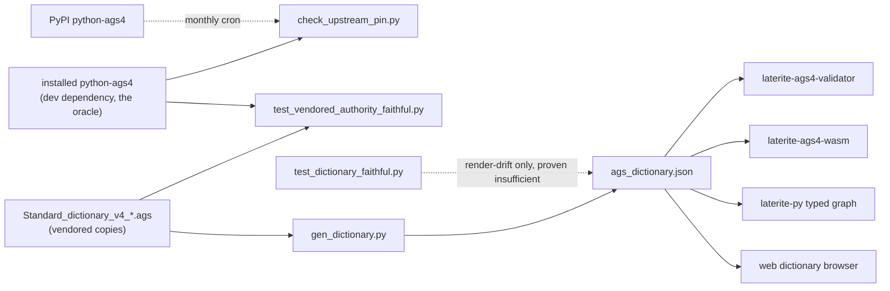

# vendored-authority-faithful

## What it is
> [!quote] The content gate for the five vendored `Standard_dictionary_v4_*.ags`
> files (`repo:rust-packages/laterite-ags4-validator/data`) — the root
> authority every dictionary in the product descends from (#558):
> `tools/gen_dictionary.py` projects them into
> `rust-packages/laterite-ags4-reference/data/ags_dictionary.json`, and the
> validator, the wasm build, the typed-graph codegen, and the web all read
> that union. `repo:tests/test_dictionary_faithful.py` (the "Faithfulness
> gates" table's row 2 on [[testing-strategy]]) already proved the union is a
> faithful *render* of these five files. It never proved the five files
> themselves are faithful to what `data/PROVENANCE.md` claims they are — the
> render-drift gate and the content gate are different questions, and only
> the first had a test.

## The measured gap (not a hypothesis)

Appending a fabricated group to `Standard_dictionary_v4_2.ags` and
regenerating took the union from **174 → 175 groups**, and
`test_dictionary_faithful.py` still reported **`5 passed`** — it re-runs
`gen_dictionary.py` and asserts the committed union matches, which only
proves the union agrees with *whatever the files currently say*. The
invented group would have compiled into the validator, the wasm build, and
the typed graph with every existing gate green. This is #549's Shape 1 (the
gate enforces a proxy for the promise, and nothing compares the proxy back
to the promise) sitting at the dictionary's root.

## The four checks (`repo:tests/test_vendored_authority_faithful.py`)

Cheap to close because the source is **already installed** — `python-ags4`
is a declared dev dependency (it is the parity oracle, see
[[oracle-drift-pin]]), so every check below runs offline, no clone, no
network:

1. `test_the_vendored_dictionaries_are_byte_identical_to_their_stated_source`
   — the five files, byte-for-byte, against the copies inside the installed
   `python_ags4` package.
2. `test_the_vendored_set_is_exactly_what_upstream_ships` — the vendored file
   **set** equals upstream's `STANDARD_DICT_FILES` map, both directions: an
   edition upstream publishes that we never took, and a file we vendor that
   upstream doesn't ship (one we invented).
3. `test_the_fallback_edition_mirrors_upstreams_latest` — the union's
   `fallback_edition` equals upstream's `LATEST_DICT_VERSION`. Not
   documentation: it decides which dictionary validates a file whose
   `TRAN_AGS` is absent or unparsable, and `tools/gen_dictionary.py`'s
   `FALLBACK_EDITION` constant states plainly it is set to upstream's value
   *deliberately* — that rationale only holds while the two agree.
4. `test_every_stated_python_ags4_version_matches_the_installed_one` — the
   four hand-written `"1.2.0"` occurrences (`pyproject.toml`,
   `.github/workflows/parity.yml`'s `PYTHON_AGS4_VERSION`,
   `parity-known-failures.json`'s `python_ags4_version`, and
   `PROVENANCE.md`'s retrieval note) all equal `importlib.metadata.version
   ("python-ags4")`. They agreed today by coincidence — each was typed by
   someone who knew the value at the time — and nothing compared them.

A fifth test (`test_the_upstream_source_is_actually_present`) guards the
guard: if `python-ags4` were missing, an over-forgiving comparison could
report green for the wrong reason (nothing to disagree with), so this one
fails loud instead.

## The missing half: noticing when upstream moves

`data/PROVENANCE.md` documents the refresh path (`tools/sync-standard-dicts.sh`
/ `.ps1`) but nothing ever ran it proactively. `parity.yml`'s header claims
the monthly cron exists "so an upstream silent behavioural drift surfaces
before it bites a user" — thirty lines above `PYTHON_AGS4_VERSION: "1.2.0"`,
which pins the cron to one frozen oracle forever and makes that sentence
structurally false. Unpinning is the wrong fix (the pin is what makes
`parity-known-failures.json` a reproducible contract); `tools/check_upstream_pin.py`
adds the missing half instead — it compares the version **actually
installed** (not a constant scraped from a file) against PyPI's latest, and
is wired into `parity.yml` as a new `upstream-pin` job, **scheduled/dispatch
only, never on a PR** (upstream releasing while a PR is open isn't that PR's
fault, and a check that fails for reasons its author can't act on is one
people learn to click past). An unreachable PyPI exits `0` — "no opinion",
not "the pin is fine"; a genuine version mismatch exits `1` with the four
files to move together.

## What this does NOT prove (the honest limit)

That `python-ags4`'s dictionaries match the AGS4 specification itself. Our
dictionary is projected from our own parity oracle, so **the parity suite
is structurally incapable of catching a divergence the two of us share** —
both sides read the same bytes. `PROVENANCE.md`'s argument for the
source — that `python-ags4` is the AGS Data Format Working Group's own
reference implementation, so its dictionary is authoritative — is a
*position*, not a proof. This gate pins us to the source we chose; it does
not audit that source.

## Correcting the record

Issue #558's own framing claimed the five `.ags` sources "have no
provenance" and carry less metadata than
`repo:tools/vendor/laterite-duckdb-functions.json`. That is false —
`data/PROVENANCE.md` predates this gate and was already thorough: source,
retrieval date (2026-05-16), version, upstream URL, a reasoned licence
position, a refresh recipe, and both a `.sh` and `.ps1` sync script. The
real gap was never *absence* of provenance; it was that the provenance was
**prose nothing verified**.

## Where it lives

`repo:tests/test_vendored_authority_faithful.py` (root pytest suite —
`uv run pytest tests/ -q`) and `repo:tools/check_upstream_pin.py` (invoked
only from `.github/workflows/parity.yml`'s `upstream-pin` job, never
locally-required, never on a PR).

## Relationship to other components

## Related
[[dec-dictionary-single-source]] · [[oracle-drift-pin]] · [[parity-model]] · [[laterite-ags4-reference]] · [[laterite-ags4-validator]] · [[testing-strategy]] · [[python-ags4]] · [[ags-dictionary-json]]
